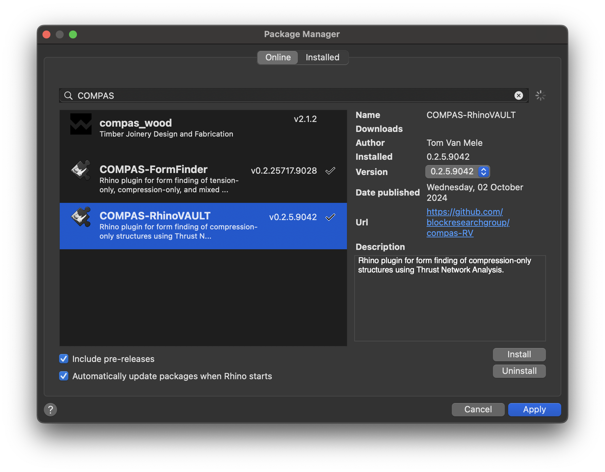

# COMPAS RhinoVAULT

RhinoVAULT is a plugin for Rhino for form finding of funicular force networks with vertical loads using Thurst Network Analysis. The current version of this plugin is based on COMPAS 2 and is available for Rhino 8.

> [!WARNING]
> This plugin is under active development,
> and uses the still somewhat unstable CPython infrastructure
> of Rhino 8 through the new ScriptEditor.
> Therefore, unexpected errors may occur here and there.
> Please let us know via the [Issue Tracker](https://github.com/BlockResearchGroup/compas-RV/issues) if you have problems.

## Installation

To install RhinoVAULT, use Rhino's package manager Yak.

## COMPAS Packages

RhinoVAULT uses the following COMPAS packages:

* [compas](https://github.com/compas-dev/compas)
* [compas_ags](https://github.com/blockresearchgroup/compas_fd)
* [compas_fd](https://github.com/blockresearchgroup/compas_fd)
* [compas_rui](https://github.com/blockresearchgroup/compas_rui)
* [compas_session](https://github.com/blockresearchgroup/compas_session)
* [compas_tna](https://github.com/blockresearchgroup/compas_dr)

After installing RhinoVAULT with Yak, you can check if all requirements are installed using the command `RV_reqs_check`.

### Basic Users

Missing requirements can be installed automatically using the command `RV_reqs_install`.
This command uses Rhino's built in installation mechanism for Python packages (`# r: ...`).

### Advanced Users

If you use Rhino for scripting, and if you have other COMPAS packages installed, or plan to install them in the future, we recommend to install RhinoVAULT's requirements manually using `pip`.

> [!WARNING]
> `pip` based installations and `# r: ...` based installations should not be mixed,
> since this will create conflicts between packages and package versions.

## User Interface

RhinoVAULT defines the following commands:

* `RV`
* `RV_pattern`
* `RV_pattern_modify`
* `RV_pattern_relax`
* `RV_pattern_supports`
* `RV_pattern_boundaries`
* `RV_form`
* `RV_force`
* `RV_tna_horizontal`
* `RV_tna_vertical`
* `RV_form_modify`
* `RV_force_modify`
* `RV_thrust_modify`
* `RV_scene_clear`
* `RV_scene_redraw`
* `RV_session_undo`
* `RV_session_redo`
* `RV_session_open`
* `RV_session_save`
* `RV_settings`
* `RV_reqs_check`
* `RV_reqs_install`

These commands can be executed at the Rhino Command Prompt (simply start typing the command name),
or using the RhinoVAULT toolbar.

## Documentation

For further "getting started" instructions, a tutorial, examples, and an detailed description of the individual commands and the user interface, please check out the online documentation here: [RhinoVAULT Gitbook](https://blockresearchgroup.gitbook.io/RhinoVAULT)

## Issue Tracker

If you find a bug or if you have a problem with running the code, please file an issue on the [Issue Tracker](https://github.com/blockresearchgroup/compas-RV/issues).
