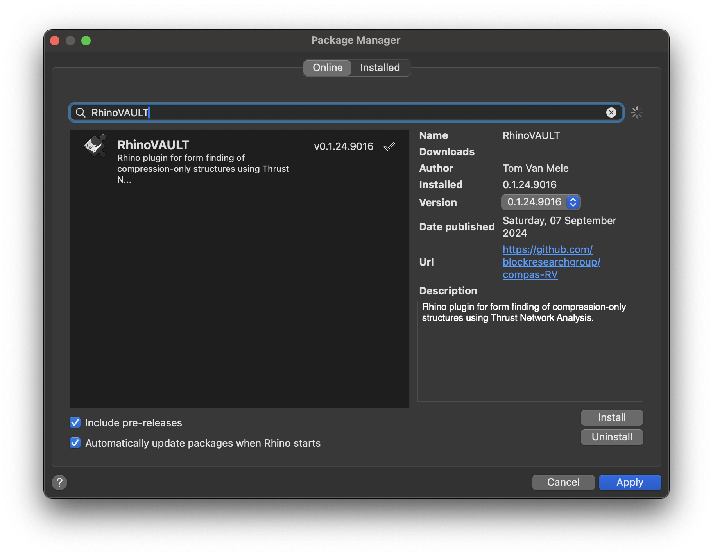

# COMPAS RhinoVAULT

Implementation of RhinoVAULT using COMPAS

> [!NOTE]  
> This package contains the source code of the Rhino plugin RhinoVAULT.
> Its functionality is meant to be used inside Rhino 8 only.
> In any other environment it will simply not work.

> [!WARNING]  
> This plugin is under active development,
> and uses the still somewhat unstable CPython infrastructure
> of Rhino 8 through the new ScriptEditor.
> Therefore, unexpected errors may occur here and there.
> Please let us know via the [Issue Tracker](https://github.com/BlockResearchGroup/compas-RV/issues) if you have problems.

## Installation

To install RhinoVAULT, use Rhino's package manager Yak.

After installing the package, install RhinoVAULT's requirements by running the command `RV_install` inside Rhino. Just type `RV_install` at Rhino's command prompt...
This will install the requirements using Rhino's built in installation mechanism for Python packages (`# r: ...`).

Advanced users may prefer to install the requirements manually,
using `pip`, or may even hem them installed already.

> [!WARNING]  
> `pip` based installations and `# r: ...` based installations should not be mixed, since this will create conflicts between packages and package versions.

## Documentation

For further "getting started" instructions, a tutorial, examples, and an API reference,
please check out the online documentation here: [RhinoVAULT Gitbook](https://blockresearchgroup.gitbook.io/RhinoVAULT)

## Issue Tracker

If you find a bug or if you have a problem with running the code, please file an issue on the [Issue Tracker](https://github.com/blockresearchgroup/compas-RV/issues).
