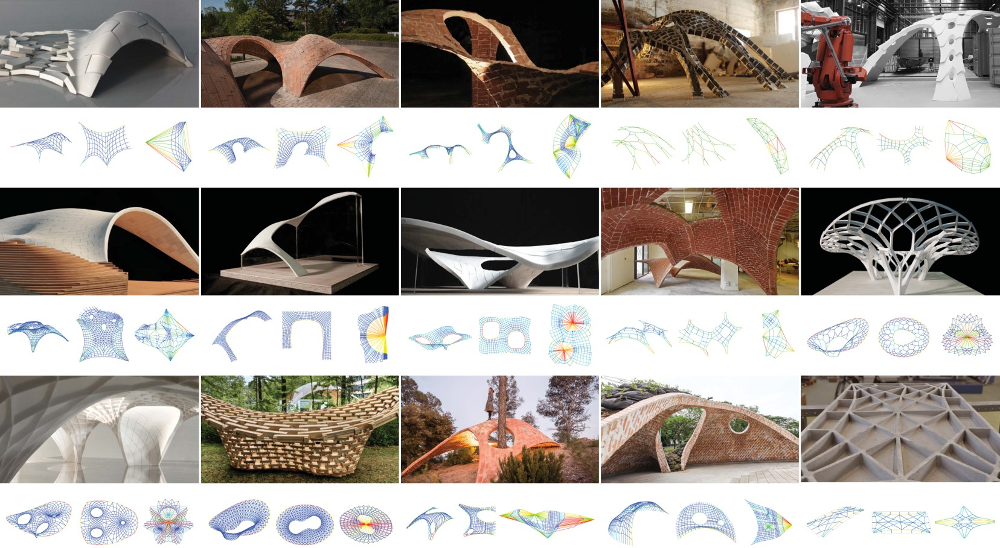
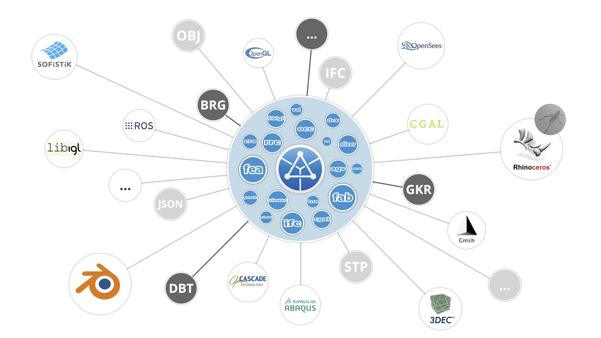

---
layout:
  title:
    visible: false
  description:
    visible: false
  tableOfContents:
    visible: true
  outline:
    visible: true
  pagination:
    visible: true
---

# About

<figure><figcaption></figcaption></figure>

## Welcome to RhinoVAULT

RhinoVAULT is a Rhino plugin for the form-finding of funicular shell structures using the _Thrust Network Analysis_ (TNA) method. Integrating principles of _graphic statics_, RhinoVAULT provides an intuitive and uniquely interactive approach to funicular form-finding, enabling the creation of structurally efficient and expressive shapes while offering insights into the underlying structural behavior.

Originally developed by Dr. Matthias Rippmann at the Block Research Group at ETH Zurich, RhinoVAULT’s current development leverages [COMPAS](https://compas-dev.github.io/), a Python-based framework for computational research and collaboration in architecture, engineering, and digital fabrication. Built with open-source packages from the COMPAS ecosystem, the core functionalities of RhinoVAULT is available not only for Rhino but also any other CAD software or browser with a Python scripting interface.

As a fully open-source tool, RhinoVAULT is accessible to all, supporting students, researchers and design professionals globally in realizing innovative projects. Learning about your projects is invaluable for software development and serves as an inspiration to the structural design community. We invite you to connect with us to share projects created with RhinoVAULT or to explore opportunities for collaborations and workshops.

Happy form finding!

<figure><figcaption><p>Early examples of RhinoVAULT (Rippmann, ca. 2010s.)</p></figcaption></figure>

***

### Open-source Research Platform <a href="#research-platform" id="research-platform"></a>

RhinoVAULT is a plugin that is specifically developed for Rhino 8 and above, built entirely with open-source packages from the rich COMPAS ecosystem. The [source codes of RhinoVAULT](https://github.com/BlockResearchGroup/compas-RV) is hosted on and accessible via GitHub, and we very much welcome your feedback. Please use the RhinoVAULT [issue tracker](https://github.com/BlockResearchGroup/compas-RV/issues) or the [COMPAS forum](https://forum.compas-framework.org/c/rhinovault/47) to submit information about any bugs, technical problems, or feature requests. You can also contribute to the source code by following the [developer guide](https://github.com/BlockResearchGroup/compas-RV/wiki/Developer-Guide).

RhinoVAULT uses the following COMPAS packages:

* [compas](https://github.com/compas-dev/compas)
* [compas\_fd](https://github.com/blockresearchgroup/compas_fd)
* [compas\_rui](https://github.com/blockresearchgroup/compas_rui)
* [compas\_session](https://github.com/blockresearchgroup/compas_session)
* [compas\_tna](https://github.com/blockresearchgroup/compas_dr)

<figure><figcaption><p>The COMPAS ecosystem</p></figcaption></figure>

***

### Citing RhinoVAULT

RhinoVAULT is freely available under the MIT License in the hope that you will enjoy it and use it for original and creative work. It can be shared and used for academic and commercial purposes, but with proper attribution. If you use RhinoVAULT for any projects, publications or other applications, please cite:

```
@misc{compas-RV,
    title = {{COMPAS RhinoVAULT}: Funicular Form Finding for Rhinoceros},
    author = {Tom Van Mele and Juney Lee},
    year = {2024},
    doi = {},
    url = {https://github.com/BlockResearchGroup/compas-RV},
}
```

***

### Disclaimer

Although being developed and tested thoroughly, RhinoVAULT may contains errors – therefore no guarantee can be given that RhinoVAULT always computes correct results. Use of RhinoVAULT is entirely at your own risk, and please read the [legal terms](additional-information/legal.md) carefully before using RhinoVAULT.
