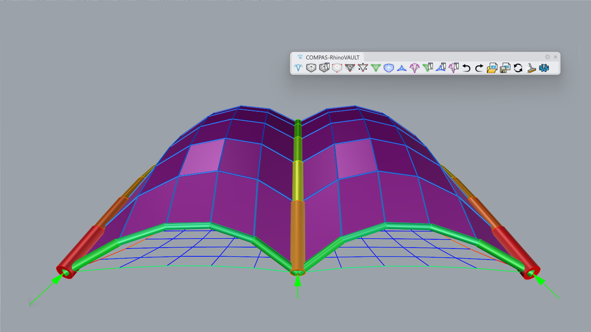
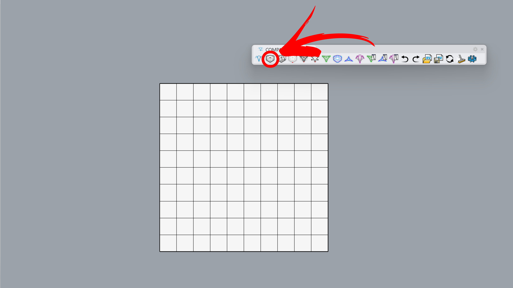
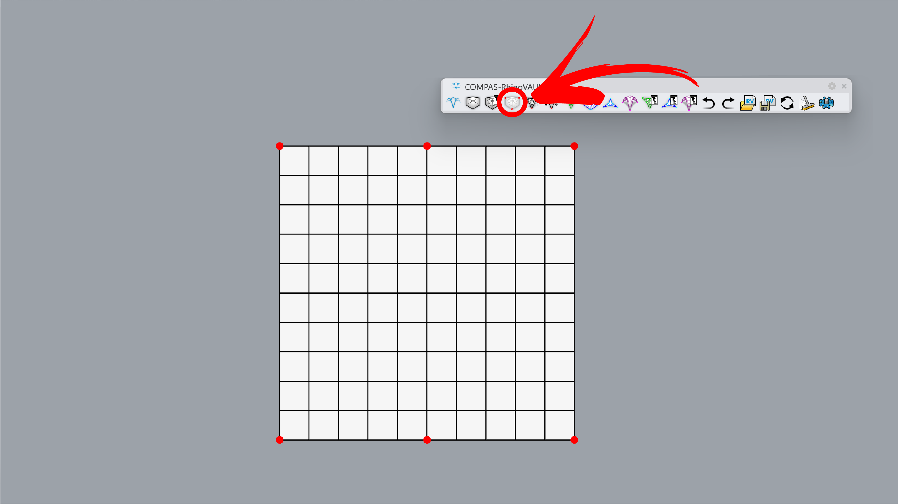
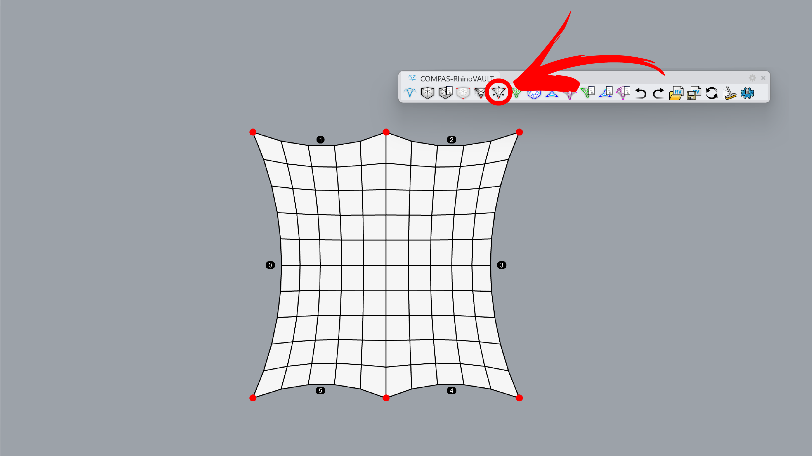
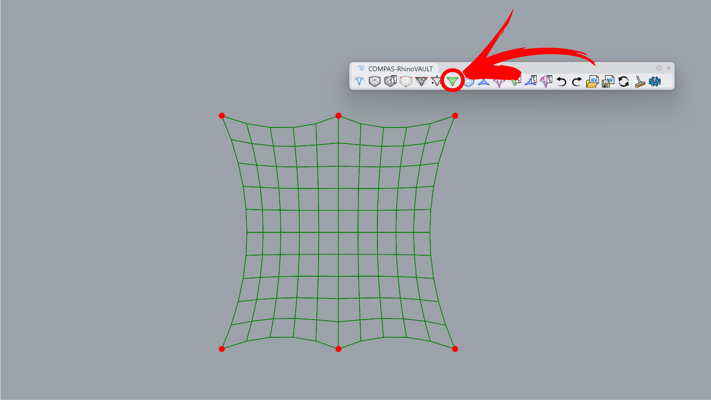
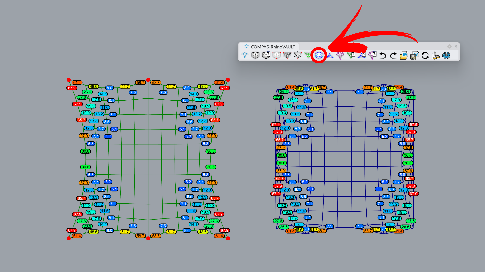
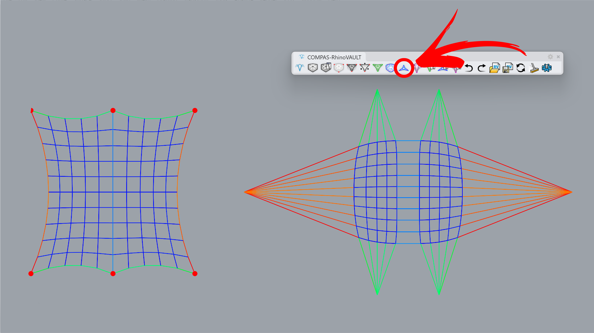
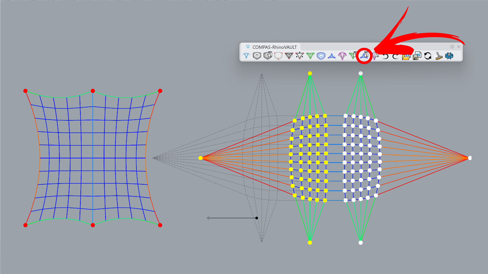
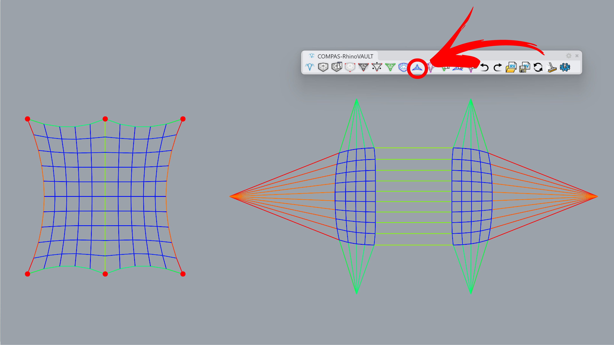
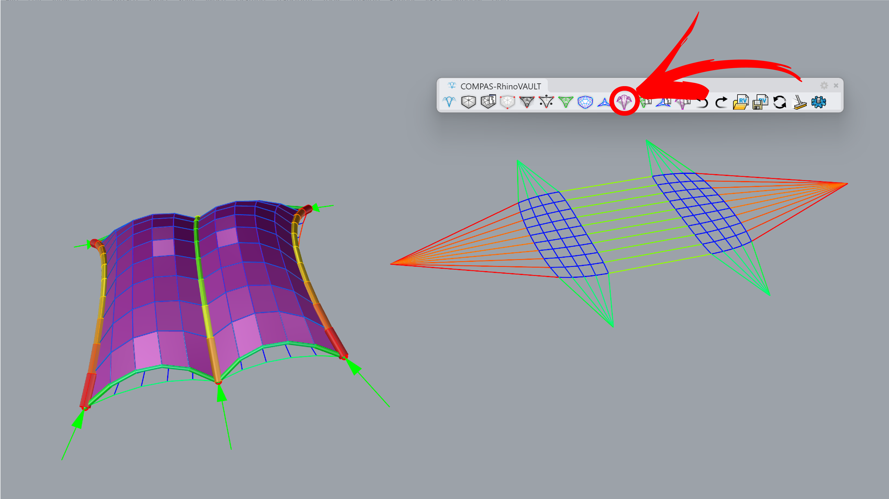

---
layout:
  title:
    visible: true
  description:
    visible: false
  tableOfContents:
    visible: true
  outline:
    visible: true
  pagination:
    visible: true
---

# Creases

<figure><figcaption></figcaption></figure>

This example demonstrates how to attract forces in the Thrust Diagram by adjusting the vertices of the Force Diagram. This adjustment increases the magnitude of forces in the corresponding members of the Thrust Diagram, as their edges become elongated. By extending the edges in the Force Diagram, we replicate the effect of stiffened members in the vault.



***

## 1. Create Pattern

**Command:** `RV_pattern` > `RhinoMesh`

Create a pattern from a mesh. You can start with the attached Rhino file or a session file.

<figure><figcaption></figcaption></figure>



***

## 2. Identify Supports

**Command:** `RV_pattern_supports` > `Add`> `Manual`> `Select Vertices`

Manually set six boundary points. The middle points mark the start and end positions of the stiffened edges.

<figure><figcaption></figcaption></figure>



***

## 3. Pattern Boundaries

**Command:** `RV_pattern_boundaries`

A sequence of edges in a form diagram, between two boundary points, cannot be straight in plan unless there are no internal forces in the non-boundary edges at the openings (e.g., barrel vault or cross vault). Therefore, we will introduce a slight curvature by applying the force density method.

<figure><figcaption></figcaption></figure>



***

## 4. Form Diagram

**Command:** `RV_form`

The mesh geometry is converted into a line preview, marked with green lines.

<figure><figcaption></figcaption></figure>



***

## 5. Force Diagram

**Command:** `RV_force`

Create a force diagram that shows the angle differences between the form and force diagrams. Ideally, they should become orthogonal to each other to achieve a compression-only shell.

<figure><figcaption></figcaption></figure>



***

## 6. Horizontal Equilibrium

**Command:** `RV_tna_horizontal`

Run the command as is wihthout changing default parameters. Horizontal equilibrium is reached when no TextDot is visible, indicating that the angles between the force and form diagrams are orthogonal within the defined tolerance.

<figure><figcaption>
.
</figcaption></figure>



***

## 7. Modify Force Diagram

**Command:** `RV_force_modify`> `MoveVertices` > `Manual`

Move half of the force diagram vertices on X axis to increase the length of the edges.

<figure><figcaption></figcaption></figure>



***

## 8. Horizontal Equilibrium

**Command:** `RV_tna_horizontal`

Rerun the horizontal equilibrium with default parameters.

<figure><figcaption></figcaption></figure>



***

## 9. Vertical Equilibrium

**Command:** `RV_tna_vertical`&#x20;

The final geometry is computed by running the vertical equilibrium command, keeping the z-height unchanged. For preview, we use the following options:`RV_settings > Drawing > show_pipes` and `show_forces`.

<figure><figcaption></figcaption></figure>


