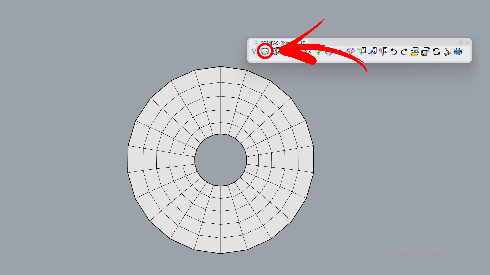
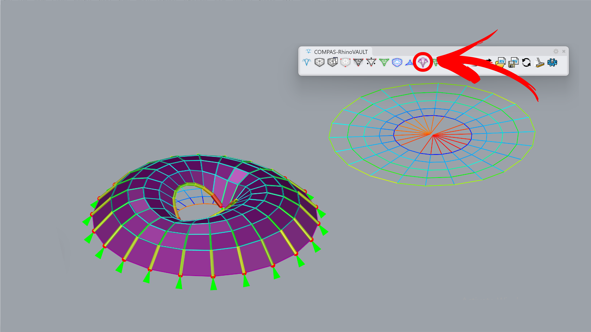

---
layout:
  title:
    visible: true
  description:
    visible: false
  tableOfContents:
    visible: true
  outline:
    visible: true
  pagination:
    visible: true
---

# Drop downs

<figure><figcaption></figcaption></figure>

Frei Otto designed lightweight shell-like forms that feature "drop-down" elements. These drop-down features are extensions of the shell that descend toward the ground, acting like inverted columns. Instead of traditional columns supporting the shell from below, these hanging forms help distribute loads efficiently while maintaining the fluid, natural aesthetic typical of Otto’s work. They create a balance between tensile and compressive forces, often seen in his pneumatic and membrane structures. In this example, we will set boundary points to facilitate a smooth transition between boundary support and point supports.



***

## 1. Create Pattern

**Command:** `RV_pattern` > `RhinoMesh`

Create a pattern from a mesh. You can start with the attached Rhino file or a session file.

<figure><figcaption></figcaption></figure>



***

## 2. Identify Supports

**Command:** `RV_pattern_supports` > `Add`> `Manual`> `Select Vertices`

Manually set the boundary for the full outer ring of the mesh and a few points inside the hole.

<figure><figcaption></figcaption></figure>



***

## 3. Form Diagram

**Command:** `RV_form`

The mesh geometry is converted into a line preview, marked with green lines.

<figure><figcaption></figcaption></figure>



***

## 4. Force Diagram

**Command:** `RV_force`

On the right side, the force diagram is created with TextDots marking the angle deviation between the form edge and its 90-degree rotated force edge. In the next step, horizontal equilibrium will be applied to reduce this deviation to zero.

<figure><figcaption>
.
</figcaption></figure>



***

## 5. Horizontal Equilibrium

**Command:** `RV_tna_horizontal`

Leave default parameters as is to reach the horizontal equilibrium. Since horizontal segments have almost no force, the force diagram collapses to a line.

<figure><figcaption></figcaption></figure>



***

## 6. Vertical Equilibrium

**Command:** `RV_tna_vertical` > `1.5`

The final geometry is computed by running the vertical equilibrium command, change the height to match the preview. For preview, we use the following options:`RV_settings > Drawing > show_pipes` and `show_forces`.

<figure><figcaption></figcaption></figure>


