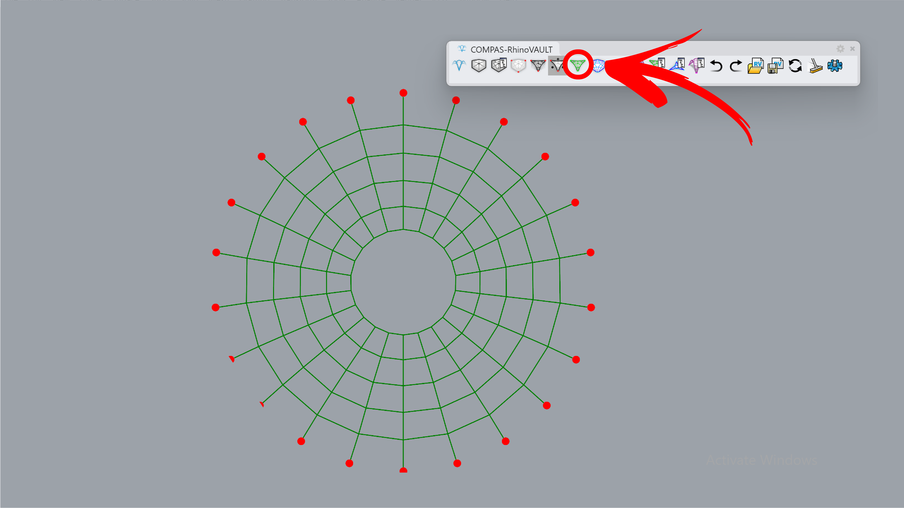
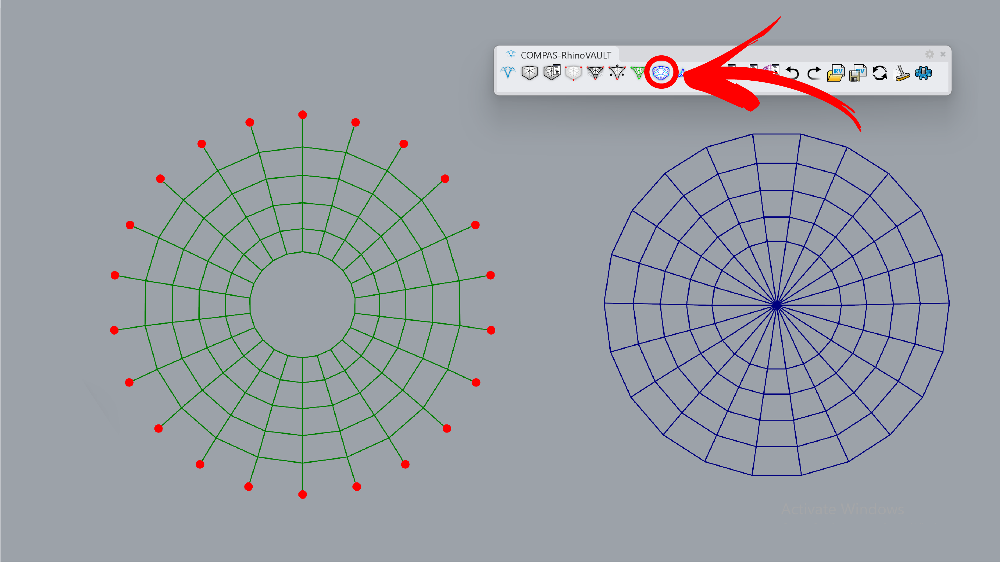
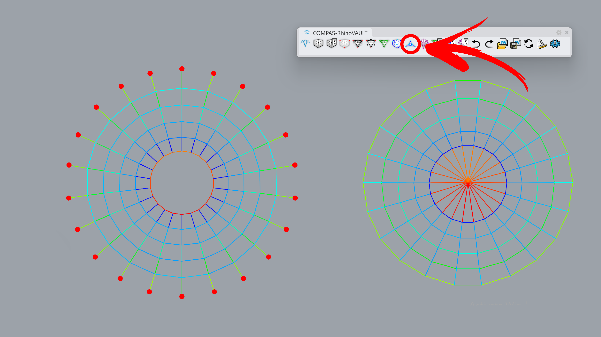
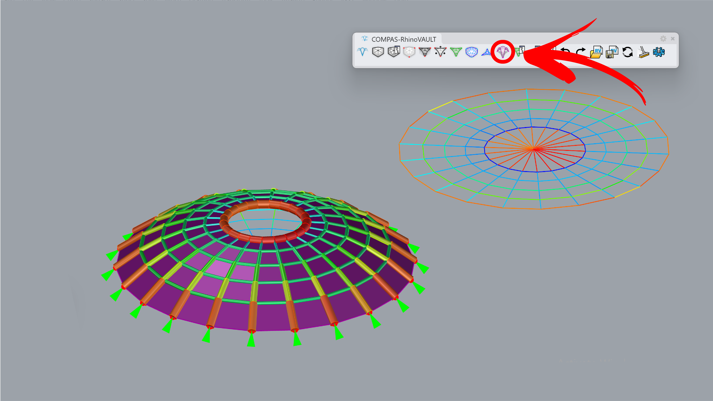

---
layout:
  title:
    visible: true
  description:
    visible: false
  tableOfContents:
    visible: true
  outline:
    visible: true
  pagination:
    visible: true
---

# Holes

<figure><figcaption></figcaption></figure>

This feature is also commonly found in historical shell structures, where it is used to introduce skylights or other functional and structural elements. RhinoVault treats mesh openings as part of the overall network, often featuring a central node interconnected with the boundary hole vertices. This example demonstrates the detection of holes within user-provided input, such as a mesh. 



***

## 1. Create Pattern

**Command:** `RV_pattern` > `RhinoMesh`

Create a pattern from a mesh. You can start with the attached Rhino file or a session file.

<figure><figcaption></figcaption></figure>



***

## 2. Identify Supports

**Command:** `RV_pattern_supports` > `Add`> `Boundary`

Manually set the boundary for the full outer ring of the mesh.

<figure><figcaption></figcaption></figure>



***

## 3. Form Diagram

**Command:** `RV_form`

The mesh geometry is converted into a line preview, marked with green lines.

<figure><figcaption></figcaption></figure>



***

## 4. Force Diagram

**Command:** `RV_force`

On the right side, the force diagram is created with TextDots marking the angle deviation between the form edge and its 90-degree rotated force edge. In the next step, horizontal equilibrium will be applied to reduce this deviation to zero.

<figure><figcaption>
.
</figcaption></figure>



***

## 5. Horizontal Equilibrium

**Command:** `RV_tna_horizontal`

Leave default parameters as is to reach the horizontal equilibrium. Since horizontal segments have almost no force, the force diagram collapses to a line.

<figure><figcaption></figcaption></figure>



***

## 6. Vertical Equilibrium

**Command:** `RV_tna_vertical` > `1.5`

The final geometry is computed by running the vertical equilibrium command, change the height to match the preview. For preview, we use the following options:`RV_settings > Drawing > show_pipes` and `show_forces`.

<figure><figcaption></figcaption></figure>


