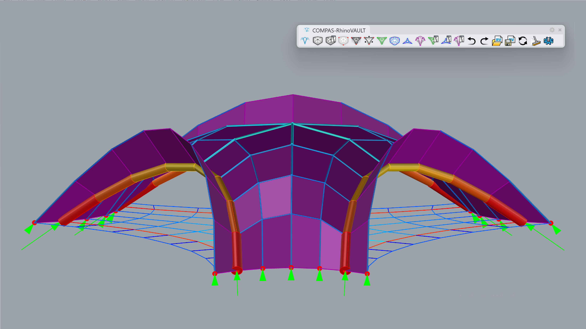
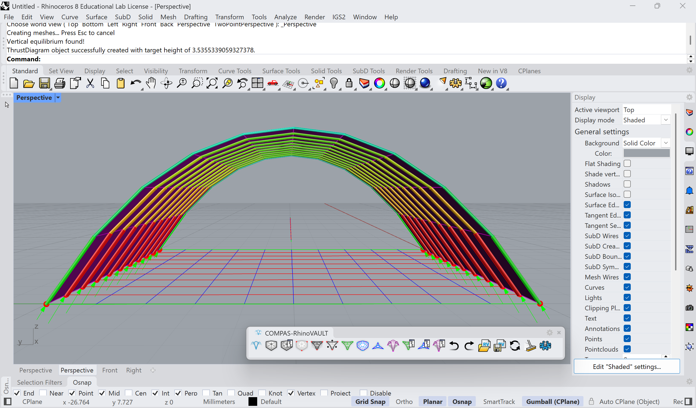
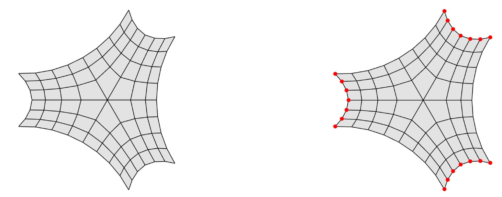
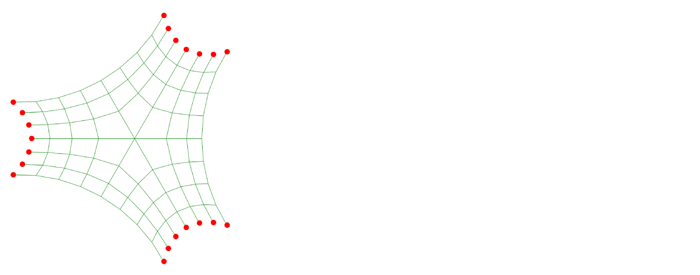
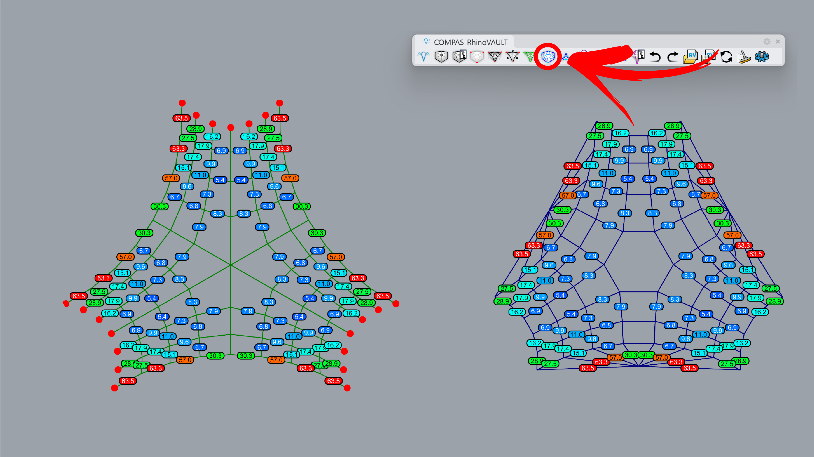
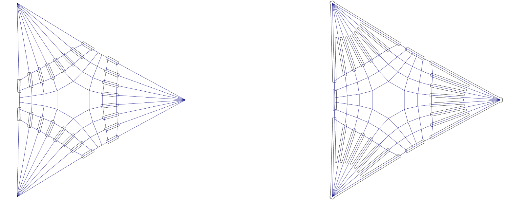
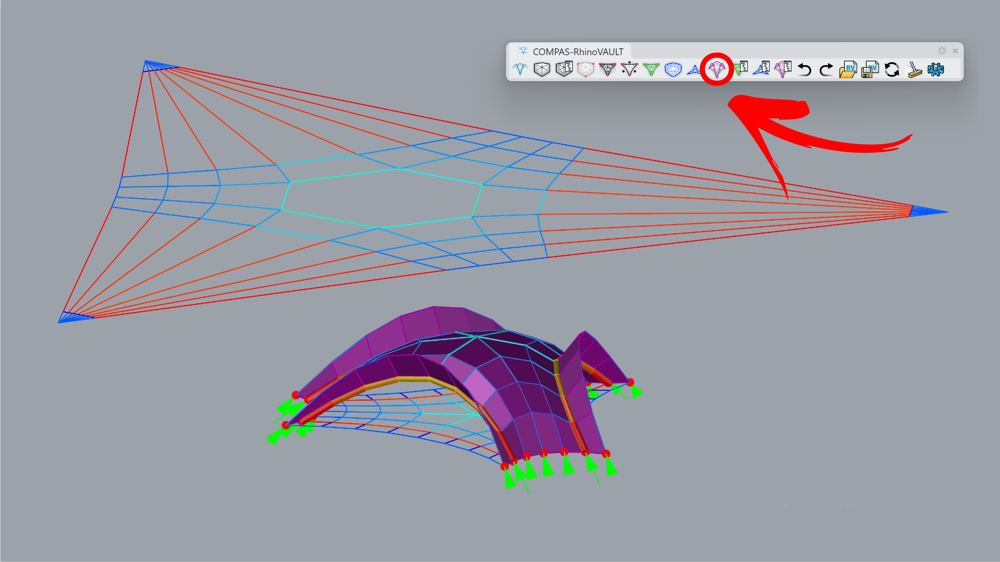
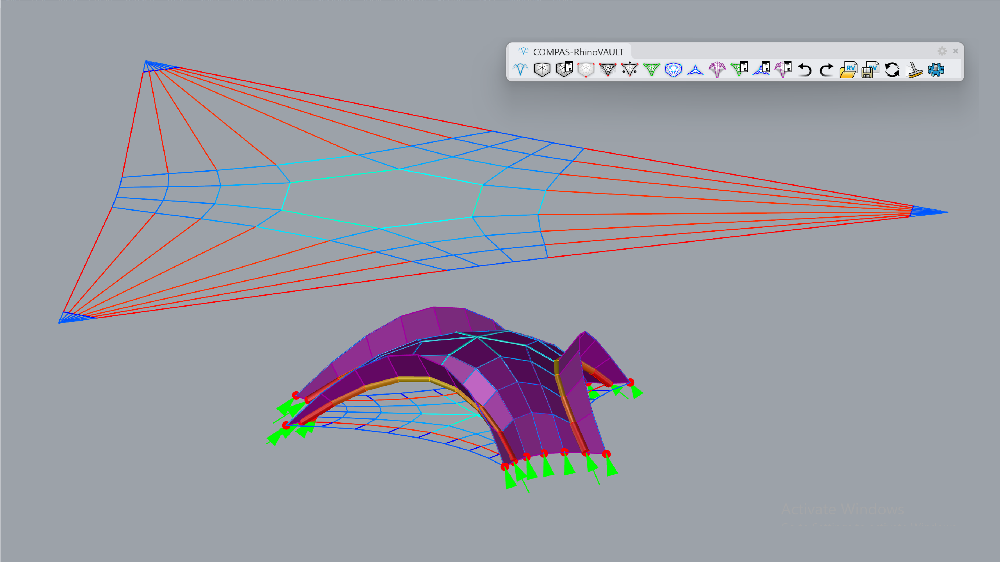

---
layout:
  title:
    visible: true
  description:
    visible: false
  tableOfContents:
    visible: true
  outline:
    visible: true
  pagination:
    visible: true
---

# Lips

<figure><figcaption></figcaption></figure>

In this tutorial, we modify the force diagram to create a lip at the edge of the shell. By "lip," we refer to historical examples such as Heinz Isler's _Wyss Garten Haus_. These folds at the boundary play a key structural role in stiffening the edges of a shell.

To achieve this modification, we must redirect the flow of the greatest forces. Typically, in our shell form-finding process, the greatest forces have been concentrated along the outermost edge of the shell, flowing down to the support points at the corners. However, in this case, we aim to direct these forces through an edge that is not at the very perimeter of the shell.

To accomplish this, we will set the force diagram edge length parameters [**lmin**](../../manual/7.-modify-diagrams/supports-1.md) and [**lmax**](../../manual/7.-modify-diagrams/supports-1.md) to 1 and 3, respectively, for all boundary edges. For the inner loop of edges, we will use a range of 10–15. These values are arbitrary and serve to illustrate the principle.



***

## 1. Create Pattern

**Command:** `RV_pattern` > `RhinoMesh`

Create a pattern from a mesh. You can start with the attached Rhino file or a session file.

<figure><figcaption></figcaption></figure>



***

## 2. Identify Supports

**Command:** `RV_pattern_supports` > `Add`> `Manual`> `Select Vertices`

Manually set the boundary points from the three boundary arches.

<figure><figcaption></figcaption></figure>



***

## 3. Form Diagram

**Command:** `RV_form`

The mesh geometry is converted into a line preview, marked with green lines.

<figure><figcaption></figcaption></figure>



***

## 4. Force Diagram

**Command:** `RV_force`

Create a force diagram that shows the angle differences between the form and force diagrams. Ideally, they should become orthogonal to each other to achieve a compression-only shell.

<figure><figcaption></figcaption></figure>



***

## 5. Horizontal Equilibrium

**Command:** `RV_tna_horizontal` > `Iterations` > `1000`

Set the iteration to 1000 to achieve horizontal equilibrium. Horizontal equilibrium is reached when no TextDot is visible, indicating that the angles between the force and form diagrams are orthogonal within the defined tolerance.

<figure><figcaption>
.
</figcaption></figure>



***

## 6. Modify Force Diagram

**Command:** `RV_force_modify`> `EdgeAttributes` > `Manual`

Set the boundary edge length range ([lmin](../../manual/7.-modify-diagrams/supports-1.md) and [lmax](../../manual/7.-modify-diagrams/supports-1.md)) to \[1, 3], and the mesh edges representing the lip to \[10, 15].

<figure><figcaption></figcaption></figure>

<figure><figcaption></figcaption></figure>



***

## 7. Horizontal Equilibrium

**Command:** `RV_tna_horizontal` > `Iterations` > `1000`

Rerun the horizontal equilibrium.

<figure><figcaption></figcaption></figure>



***

## 8. Vertical Equilibrium

**Command:** `RV_tna_vertical`

The final geometry is computed by running the vertical equilibrium command, keeping the z-height unchanged. For preview, we use the following options:`RV_settings > Drawing > show_pipes` and `show_forces`.

<figure><figcaption></figcaption></figure>


