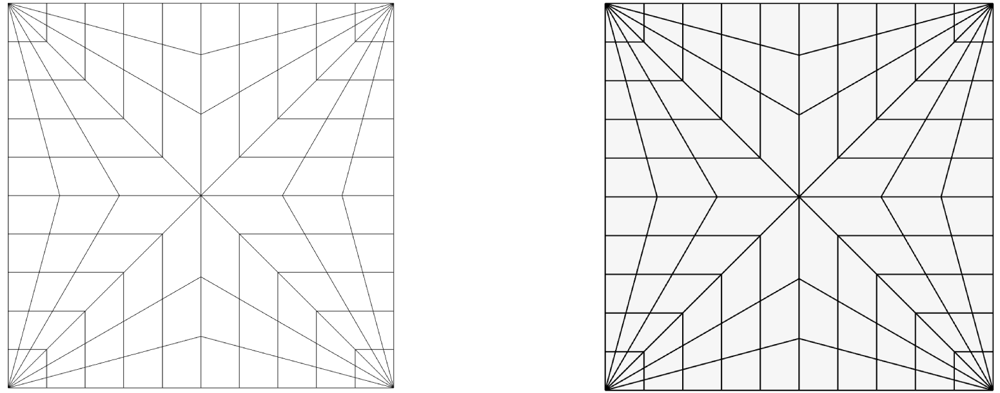
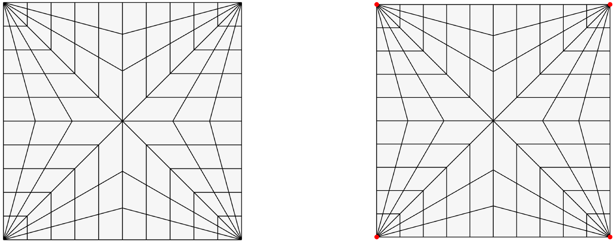
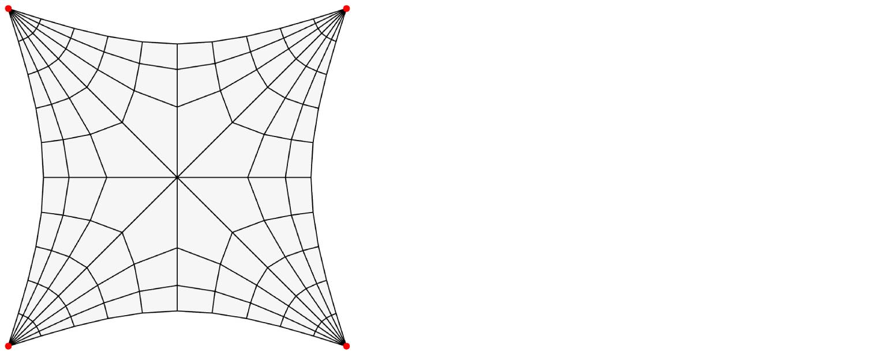
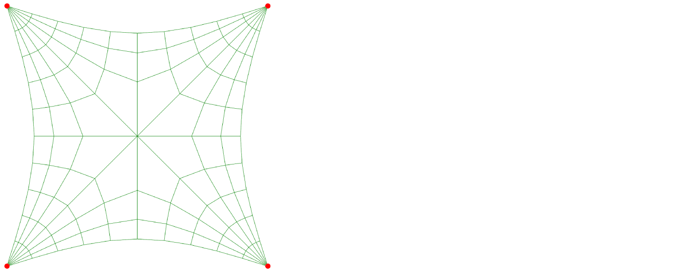
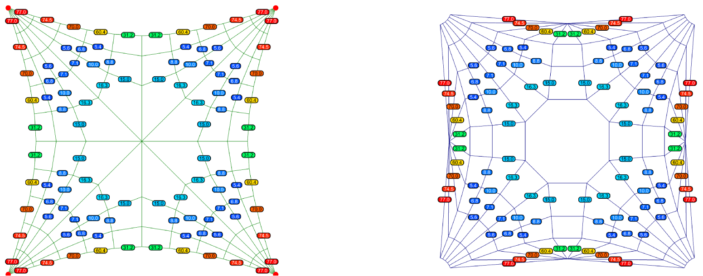
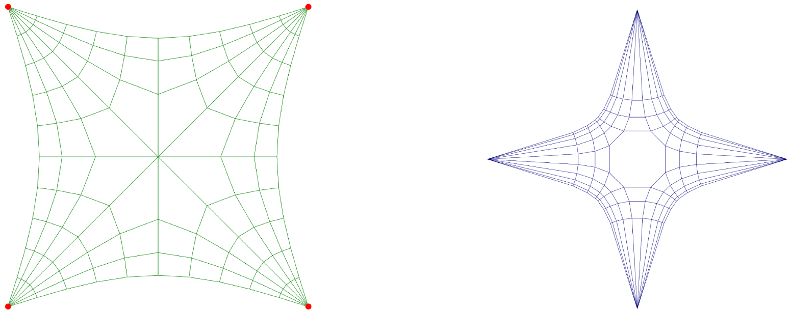
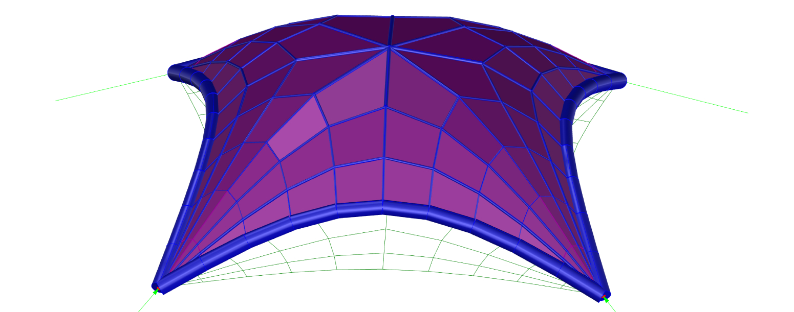

# Fan Vault

## Rhino Geometry

Download Rhino3D File:



## Create Pattern

|                                                                                  |                                                                          |                                                                                                                  |
| -------------------------------------------------------------------------------- | ------------------------------------------------------------------------ | ---------------------------------------------------------------------------------------------------------------- |
|  | 
<strong>Rhino command name</strong>

<code>RV_pattern</code>
 | 
<strong>source file</strong>

<a href="../../../plugin/RV_pattern.py"><code>RV_pattern.py</code></a>
 |

**Command:** `RV_pattern` > `RhinoLines` > `Select lines`

<figure><figcaption>
The display of the Mesh input changes when the <code>RV_pattern</code> command is initiated.
</figcaption></figure>

## Identify Supports

<table><thead><tr><th></th><th width="228"></th><th></th></tr></thead><tbody><tr><td> </td><td>
<strong>Rhino command name</strong>

<code>RV_pattern_supports</code>
</td><td>
<strong>source file</strong>

<a href="../../../plugin/RV_pattern_supports.py"><code>RV_pattern_supports.py</code></a>
</td></tr></tbody></table>

**Command:** `RV_pattern_supports` > `Add`> `Manual`> `Select Vertices`> `Enter`

<figure><figcaption>
Select the strips of vertices on the two opposite sides of the Mesh.
</figcaption></figure>

## Pattern Relax

<table><thead><tr><th width="221"></th><th width="253"></th><th></th></tr></thead><tbody><tr><td></td><td>
<strong>Rhino command name</strong>

<code>RV_pattern_bnoundaries</code>
</td><td>
<strong>source file</strong>

<a href="../../../plugin/RV_pattern_boundaries.py"><code>RV_pattern_boundaries.py</code></a>
</td></tr></tbody></table>

**Command:** `RV_pattern_boundaries > Enter`

<figure><figcaption>
To avoid straight edges, the patter is relax using fd solver, with default value q=1.
</figcaption></figure>

## Form Diagram

|                                                                                      |                                                                       |                                                                                                            |
| ------------------------------------------------------------------------------------ | --------------------------------------------------------------------- | ---------------------------------------------------------------------------------------------------------- |
|  | 
<strong>Rhino command name</strong>

<code>RV_form</code>
 | 
<strong>source file</strong>

<a href="../../../plugin/RV_form.py"><code>RV_form.py</code></a>
 |

**Command:** `RV_form`\

<figure><figcaption>
The mesh geometry is converted to a line preview.
</figcaption></figure>

## Force Diagram

|                                                                                       |                                                                        |                                                                                                              |
| ------------------------------------------------------------------------------------- | ---------------------------------------------------------------------- | ------------------------------------------------------------------------------------------------------------ |
|  | 
<strong>Rhino command name</strong>

<code>RV_force</code>
 | 
<strong>source file</strong>

<a href="../../../plugin/RV_force.py"><code>RV_force.py</code></a>
 |

**Command:** `RV_force`

<figure><figcaption>
On the right side, the force diagram is created with TextDots marking the angle deviation between the form edge and its 90-degree rotated force edge. The next step, horizontal equilibrium, will aim to reduce this deviation to zero.
</figcaption></figure>

## Horizontal Equilibrium

|                                                                                        |                                                                                 |                                                                                                                                |
| -------------------------------------------------------------------------------------- | ------------------------------------------------------------------------------- | ------------------------------------------------------------------------------------------------------------------------------ |
|  | 
<strong>Rhino command name</strong>

<code>RV_tna_horizontal</code>
 | 
<strong>source file</strong>

<a href="../../../plugin/RV_tna_horizontal.py"><code>RV_tna_horizontal.py</code></a>
 |

**Command:** `RV_tna_horizontal` > `Iterations` > `1000`

<figure><figcaption>
The horizontal equilibrium minimizes the angles as much as possible, aiming to bring them close to zero.
</figcaption></figure>

## Vertical Equilibrium

|                                                                                      |                                                                               |                                                                                                                            |
| ------------------------------------------------------------------------------------ | ----------------------------------------------------------------------------- | -------------------------------------------------------------------------------------------------------------------------- |
|  | 
<strong>Rhino command name</strong>

<code>RV_tna_vertical</code>
 | 
<strong>source file</strong>

<a href="../../../plugin/RV_tna_vertical.py"><code>RV_tna_vertical.py</code></a>
 |

**Command:** `RV_tna_vertical`&#x20;

<figure><figcaption>
Vertical projection to get 3D geometry.
</figcaption></figure>
