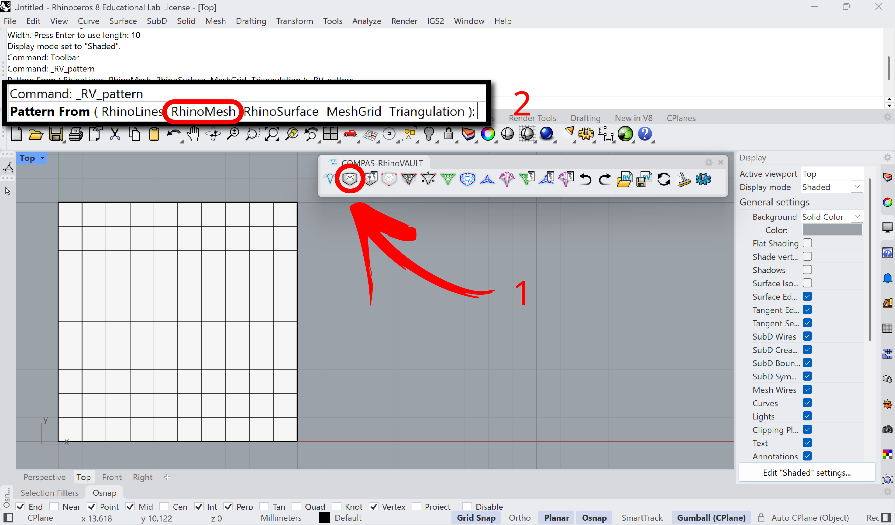
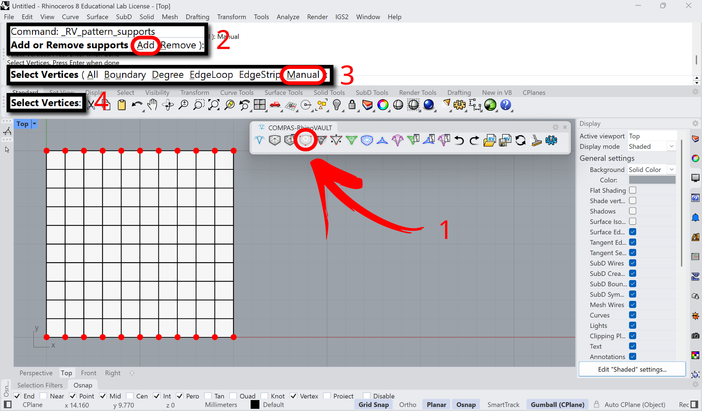
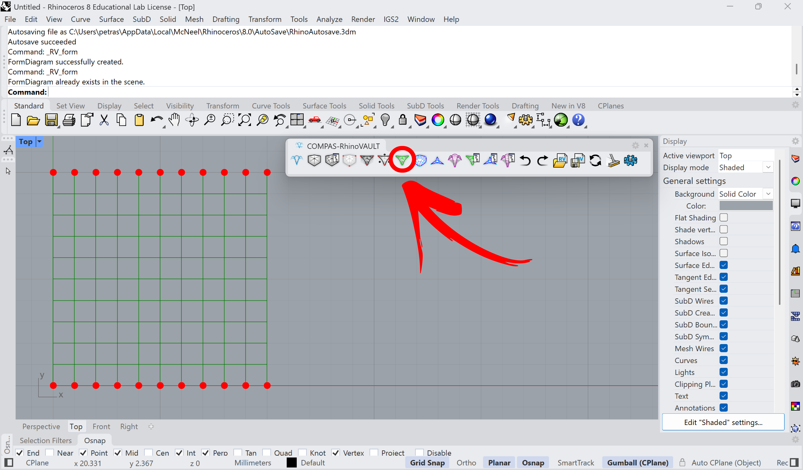
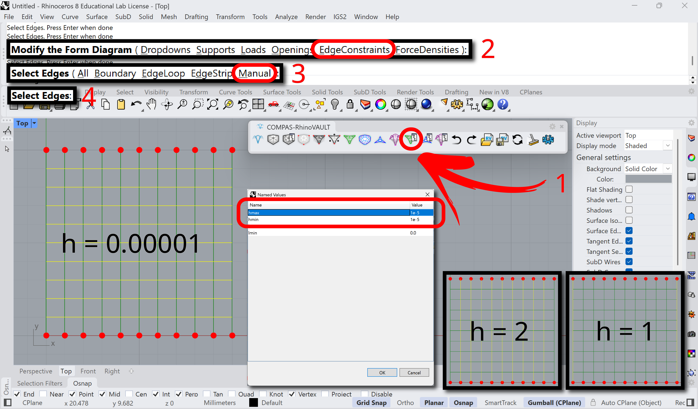
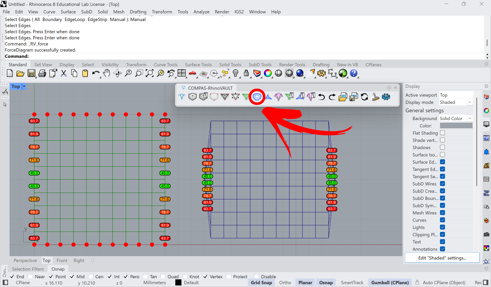
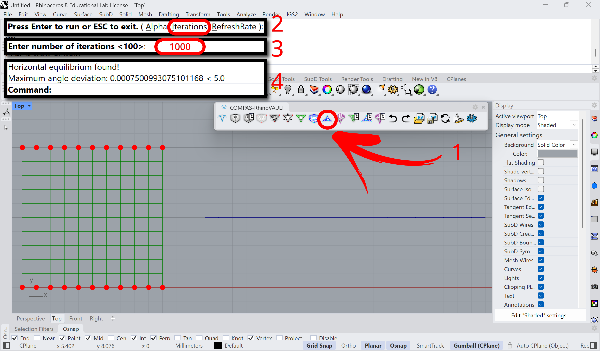
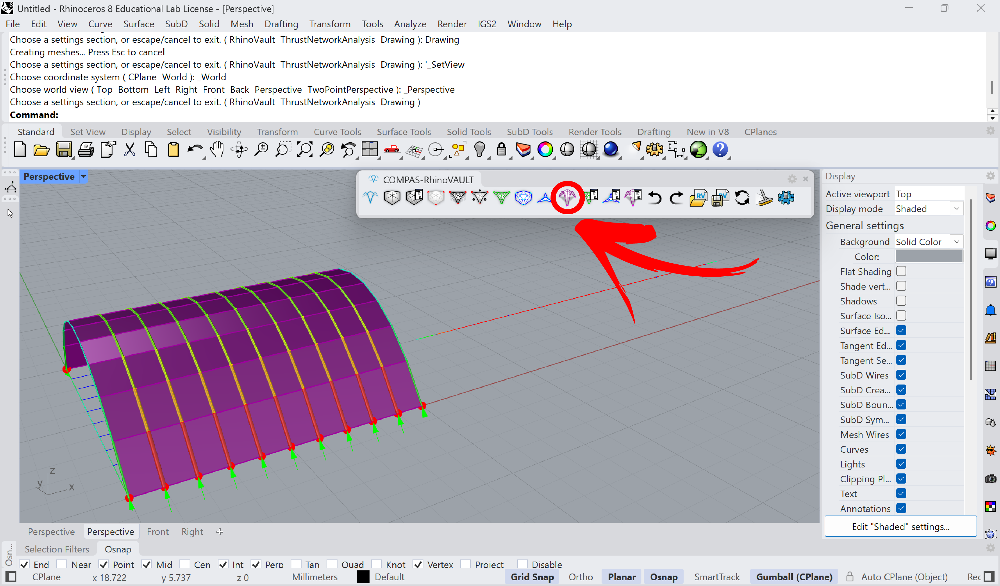

# Barrel Vault

<figure><figcaption></figcaption></figure>

In this tutorial, we will explore the basic features of RhinoVAULT to determine the equilibrium shape of a barrel vault with two boundary supports. To form-find the barrel vault, we will adjust the form diagram parameters for the allowable internal horizontal force limits: [**hmax** ](../../manual/7.-modify-diagrams/supports.md)(upper limit) and [**hmin** ](../../manual/7.-modify-diagrams/supports.md)(lower limit).

A barrel vault is unique because its edges orthogonal to the arches carry almost no load (e.g., **1e-5**), while the edges along the arches share the same internal horizontal force (e.g., **2**). The exception occurs at the boundary, where half of the horizontal force is used (e.g., **1**) for the small tributary area. Due to this special force distribution, the force diagram collapses into a single line.\
\
Table of Contents:

1. [Create Pattern](barrel-vault.md#create-pattern)
2. [Identify Supports](barrel-vault.md#identify-supports)
3. [Form Diagram](barrel-vault.md#form-diagram)
4. [Modify Form Diagram](barrel-vault.md#modify-form-diagram)
5. [Force Diagram](barrel-vault.md#force-diagram)
6. [Horizontal Equilibrium](barrel-vault.md#horizontal-equilibrium)
7. [Vertical Equilibrium](barrel-vault.md#vertical-equilibrium)

## Create Pattern

**Command:** `RV_pattern` > `RhinoMesh`

Create a pattern from the Rhino mesh. You can open either of the session file at each individual step or start from the attached Rhino file.





<figure><figcaption></figcaption></figure>

## Identify Supports

**Command:** `RV_pattern_supports` > `Add`> `Manual`> `Select Vertices`

Manually set the boundary points on the top and bottom edges of the mesh.



<figure><figcaption></figcaption></figure>

## Form Diagram

**Command:** `RV_form`

The mesh geometry is converted into a line preview, marked with green lines.



<figure><figcaption></figcaption></figure>

## Modify Form Diagram

**Command:** `RV_form_modify`> `Edge Constraints` > `Manual`\
Set the horizontal edge constraints (h\_min and h\_max) to: a) 0.00001, b) vertical edges to 2, and c) vertical boundary edges to 1. This is done because horizontal edges ideally carry no load, and boundary arches have a tributary area twice as large as the outer ones.



<figure><figcaption></figcaption></figure>

## Force Diagram

**Command:** `RV_force`

On the right side, the force diagram is created with TextDots marking the angle deviation between the form edge and its 90-degree rotated force edge. In the next step, horizontal equilibrium will be applied to reduce this deviation to zero.



<figure><figcaption>
.
</figcaption></figure>

## Horizontal Equilibrium

**Command:** `RV_tna_horizontal` > `Iterations` > `1000`

Since horizontal segments have almost no force, the force diagram collapses to a line.



<figure><figcaption></figcaption></figure>

## Vertical Equilibrium

**Command:** `RV_tna_vertical`&#x20;

The final geometry is computed by running the vertical equilibrium command, keeping the z-height unchanged. For preview, we use the following options:`RV_settings > Drawing > show_pipes` and `show_forces`.



<figure><figcaption></figcaption></figure>
