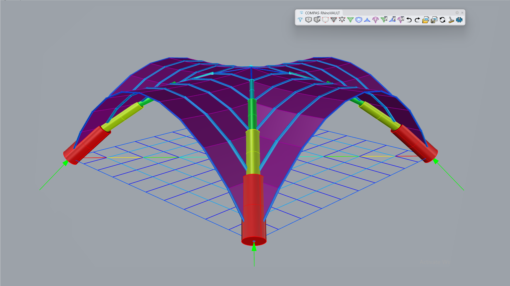
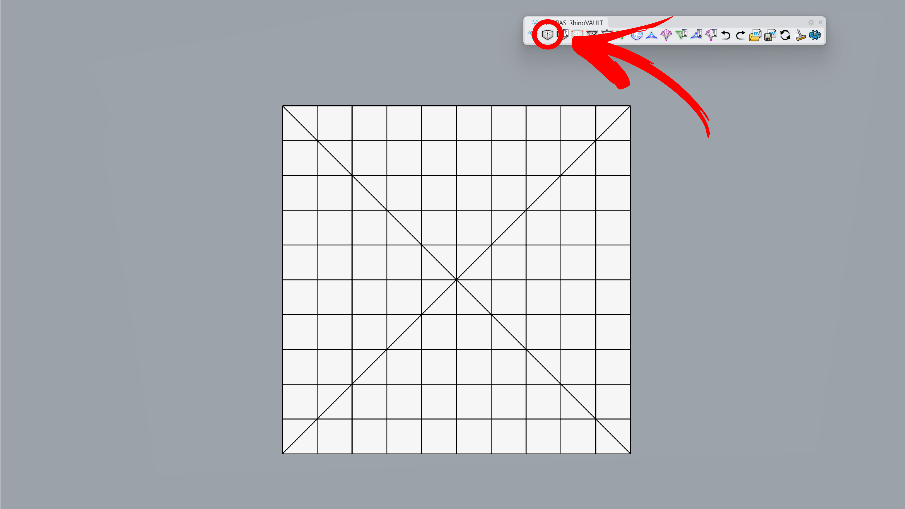
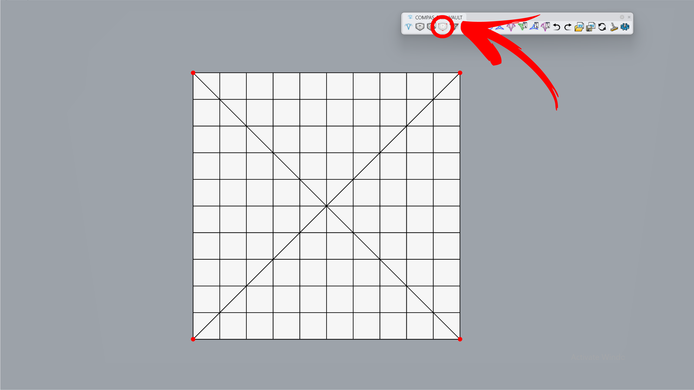
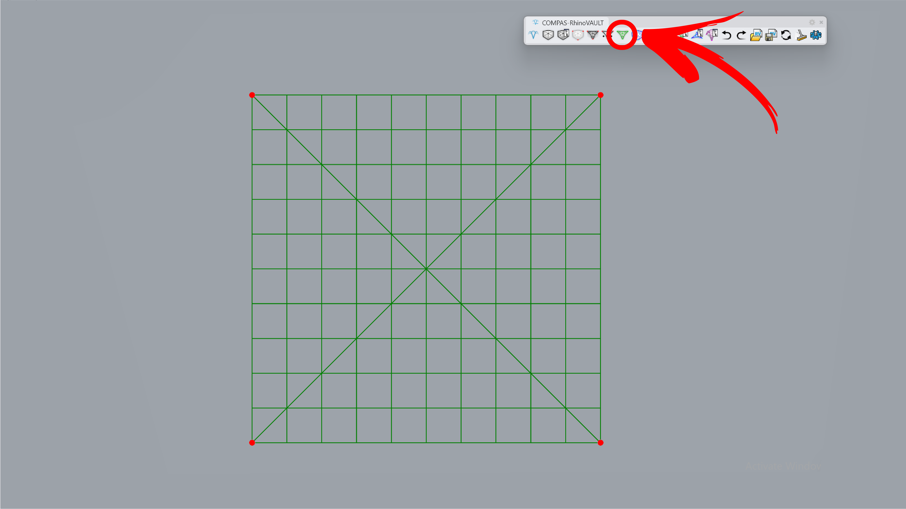
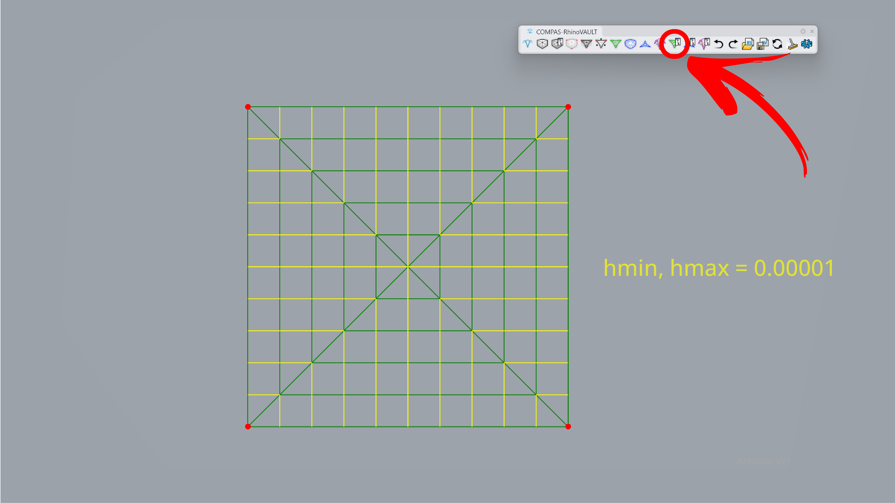
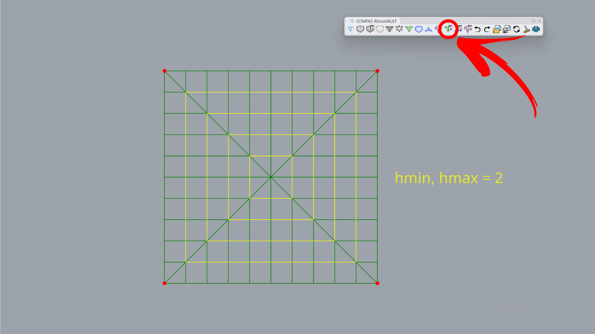
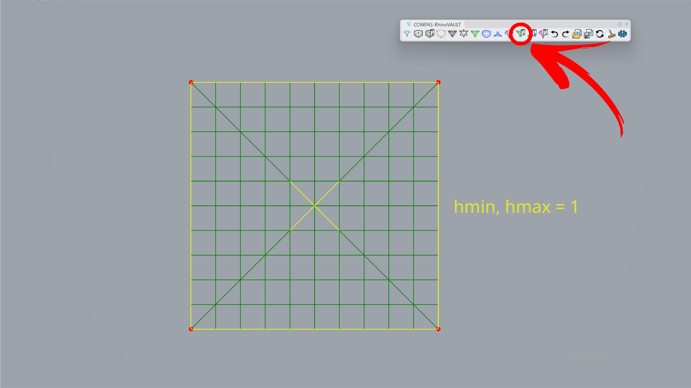
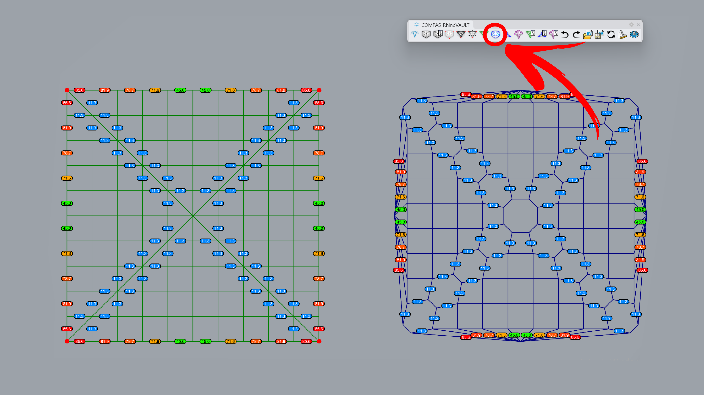
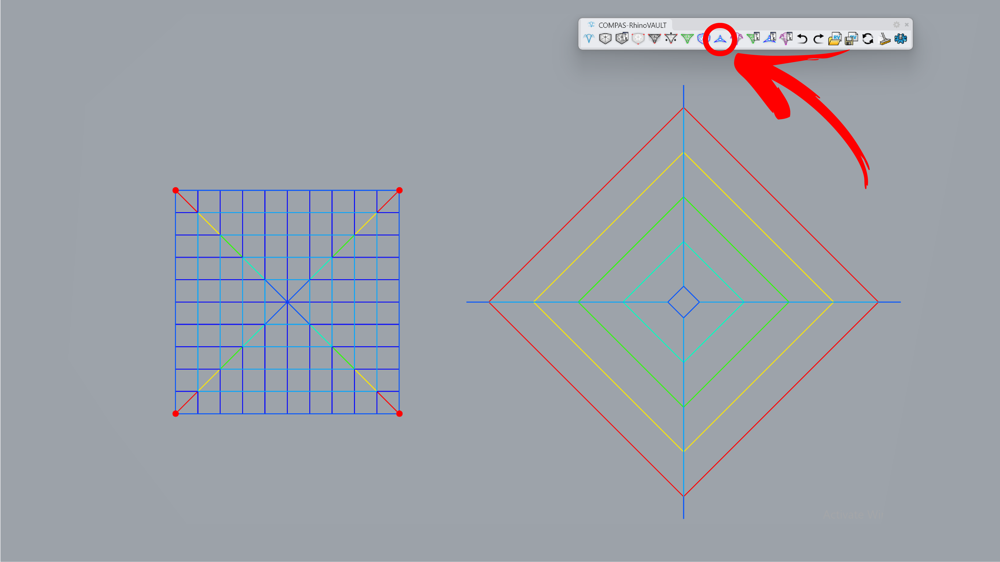
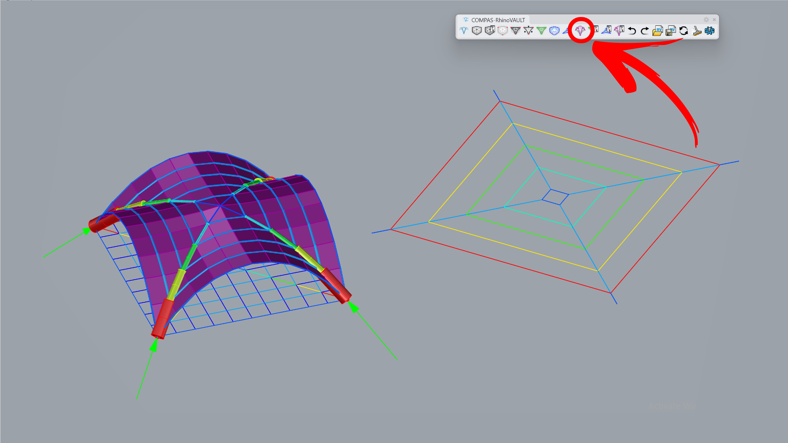

---
layout:
  title:
    visible: true
  description:
    visible: false
  tableOfContents:
    visible: true
  outline:
    visible: true
  pagination:
    visible: true
---

# Cross Vault

<figure><figcaption></figcaption></figure>

In this tutorial, we will explore the features of RhinoVAULT to determine the equilibrium shape of a cross vault with four boundary supports. To form-find the cross vault, we will adjust the form diagram parameters for the allowable internal horizontal force limits: [**hmax**](../../manual/7.-modify-diagrams/supports.md) (upper limit) and [**hmin**](../../manual/7.-modify-diagrams/supports.md) (lower limit).

A cross vault is unique because its edges orthogonal to the four boundaries carry almost no load (e.g., **1e-5**), while the edges along the boundaries (main arches) share the same internal horizontal force (e.g., **2**). The exception occurs at the boundary, where half of the horizontal force is used (e.g., **1**) for the smaller tributary area. Due to this special force distribution, the force diagram collapses into a single line.



***

## 1. Create Pattern

**Command:** `RV_pattern` > `RhinoMesh`

Create a pattern from a mesh. You can start with the attached Rhino file or a session file.

<figure><figcaption></figcaption></figure>



***

## 2. Identify Supports

**Command:** `RV_pattern_supports` > `Add`> `Manual`> `Select Vertices`

Manually set the boundary points on the top and bottom edges of the mesh.

<figure><figcaption></figcaption></figure>



***

## 3. Form Diagram

**Command:** `RV_form`

The mesh geometry is converted into a line preview, marked with green lines.

<figure><figcaption></figcaption></figure>



***

## 4. Modify Form Diagram

**Command:** `RV_form_modify`> `Edge Constraints` > `Manual`\
Set the horizontal edge constraints (h\_min and h\_max) to: a) 0.00001, b) main load transvering arch edges to 2, and c) vertical boundary edges and the four central diagonals to 1. This is done because horizontal edges ideally carry no load, and boundary arches have a tributary area twice as large as the outer ones.

<figure><figcaption></figcaption></figure>

<figure><figcaption></figcaption></figure>

<figure><figcaption></figcaption></figure>



***

## 5. Force Diagram

**Command:** `RV_force`

On the right side, the force diagram is created with TextDots marking the angle deviation between the form edge and its 90-degree rotated force edge. In the next step, horizontal equilibrium will be applied to reduce this deviation to zero.

<figure><figcaption>
.
</figcaption></figure>



***

## 6. Horizontal Equilibrium

**Command:** `RV_tna_horizontal` > `Iterations` > `3000`

Set the iteration to 3000 to reach the horizontal equilibrium. Traversal edges collapses and only diagonal and perpendicular to the squares edges are visible.

<figure><figcaption></figcaption></figure>



***

## 7. Vertical Equilibrium

**Command:** `RV_tna_vertical`

The final geometry is computed by running the vertical equilibrium command, keeping the z-height unchanged. For preview, we use the following options:`RV_settings > Drawing > show_pipes` and `show_forces`.

<figure><figcaption></figcaption></figure>


