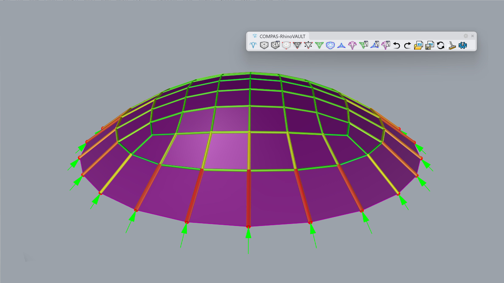
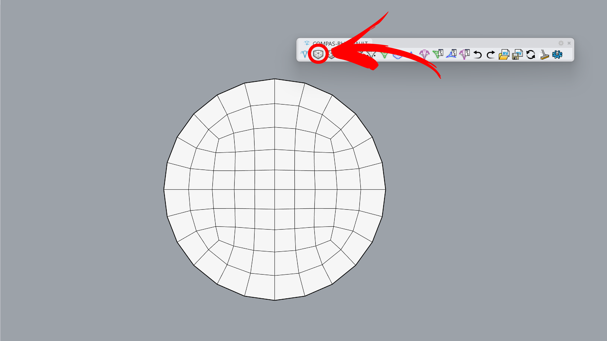
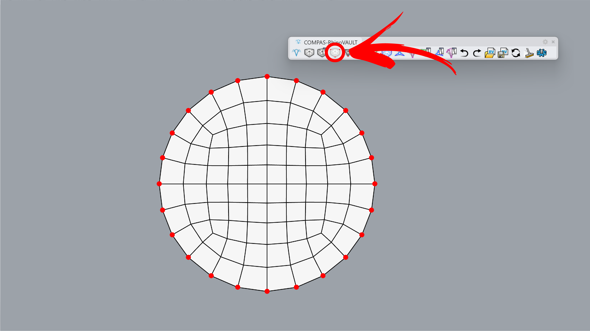
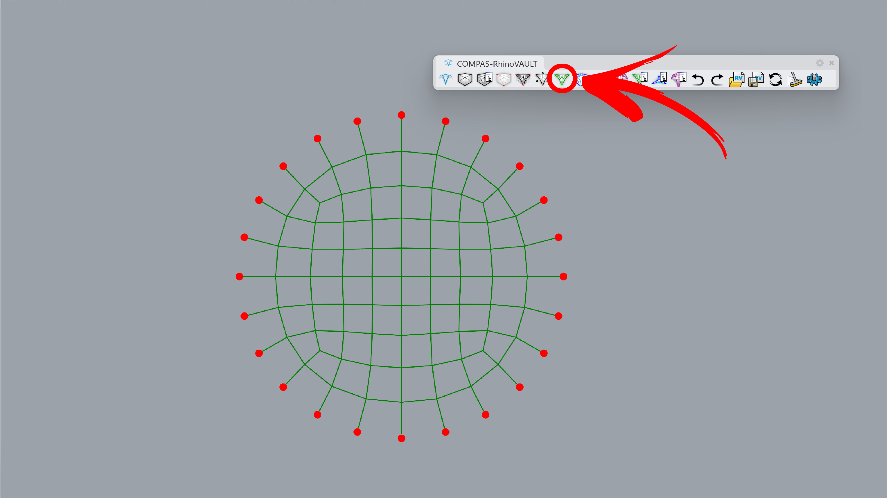
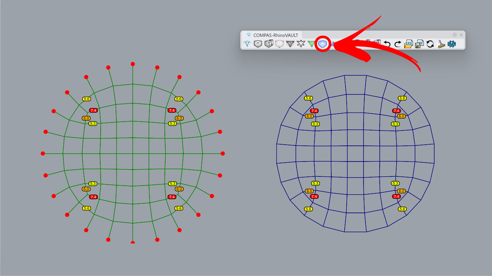
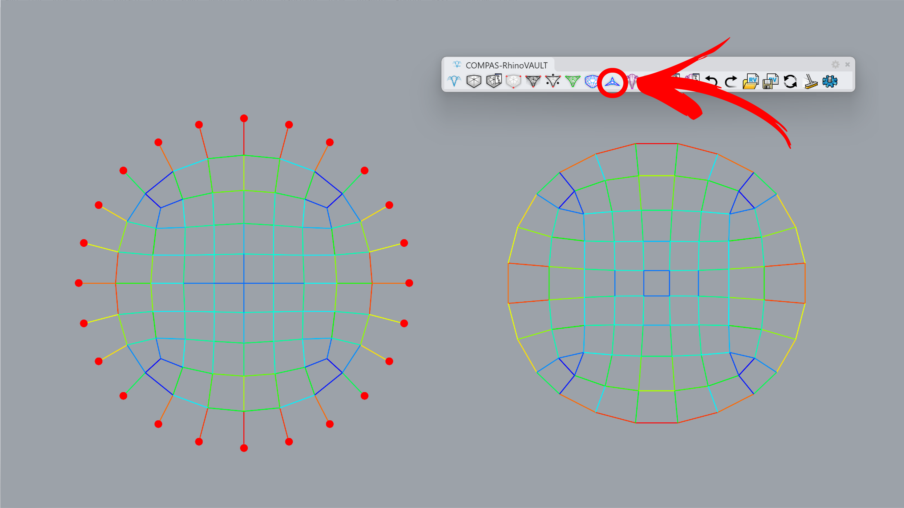
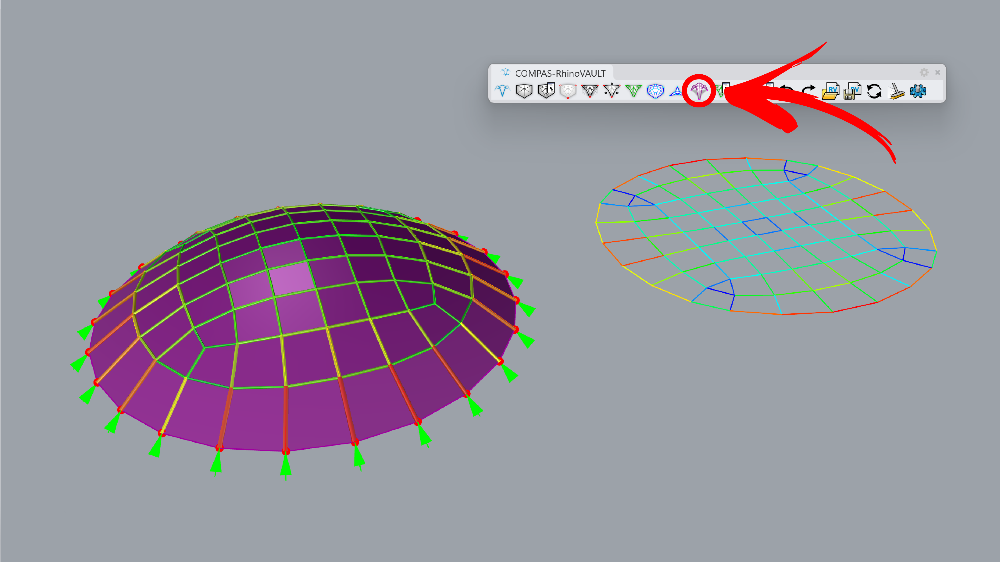

---
layout:
  title:
    visible: true
  description:
    visible: false
  tableOfContents:
    visible: true
  outline:
    visible: true
  pagination:
    visible: true
---

# Barrel Vault

<figure><figcaption></figcaption></figure>

A pillow vault is a type of vaulted ceiling with convex, pillow-like sections, often formed by intersecting barrel vaults or domes, creating a smooth, rounded appearance. It is a simplest example where all mesh boundary vertices are set as supports.



***

## 1. Create Pattern

**Command:** `RV_pattern` > `RhinoMesh`

Create a pattern from a mesh. You can start with the attached Rhino file or a session file.

<figure><figcaption></figcaption></figure>



***

## 2. Identify Supports

**Command:** `RV_pattern_supports` > `Add`> `Manual`> `Select Vertices`

Manually set the boundary points on the top and bottom edges of the mesh.

<figure><figcaption></figcaption></figure>



***

## 3. Form Diagram

**Command:** `RV_form`

The mesh geometry is converted into a line preview, marked with green lines.

<figure><figcaption></figcaption></figure>



***

## 4. Force Diagram

**Command:** `RV_force`

On the right side, the force diagram is created with TextDots marking the angle deviation between the form edge and its 90-degree rotated force edge. In the next step, horizontal equilibrium will be applied to reduce this deviation to zero.

<figure><figcaption>
.
</figcaption></figure>



***

## 5. Horizontal Equilibrium

**Command:** `RV_tna_horizontal`

Leave default parameters as is to reach the horizontal equilibrium. Since horizontal segments have almost no force, the force diagram collapses to a line.

<figure><figcaption></figcaption></figure>



***

## 6. Vertical Equilibrium

**Command:** `RV_tna_vertical` > `2`

The final geometry is computed by running the vertical equilibrium command, change the height to 2 to match the preview. For preview, we use the following options:`RV_settings > Drawing > show_pipes` and `show_forces`.

<figure><figcaption></figcaption></figure>


