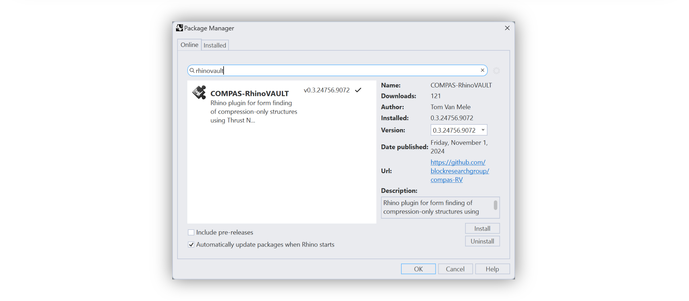

# Getting Started

COMPAS RhinoVAULT is a plugin for Rhino 8 and uses the new CPython runtime. It can be installed using Yak, Rhino's package manager.


COMPAS Masonry is **only available for Rhino 8.**


***

## Requirements

* [Rhino 8](https://www.rhino3d.com/)

***

## Installation

* Start Rhino 8 and launch Yak by typing `PackageManager` on the Rhino command line.
* Search the online packages for "RhinoVAULT".
* Select "COMPAS RhinoVAULT" from the list.
* Install.

<figure><figcaption>
Rhino package manager
</figcaption></figure>

***

After the installation, you should see the RhinoVAULT toolbar in the Rhino workspace.&#x20;

<figure><figcaption>
RhinoVAULT toolbar
</figcaption></figure>

If the toolbar is not visible after installing RhinoVAULT, you can load it from the "Toolbars" page. To open the "Toolbars" page, type `Toolbars` on the Rhino command line.

<figure><figcaption>
Load the toolbar using the "Toolbars" page.
</figcaption></figure>

***

## Check the Installation

To check the installation, simply press the left-most button on the toolbar. This will install any missing COMPAS packages and display a "Splash" screen when the installation is completed. Close the screen by agreeing to the [legal terms](../additional-information/legal-terms.md) of using COMPAS-RhinoVAULT.

<figure><figcaption>
RhinoVAULT splash screen
</figcaption></figure>

RhinoVAULT uses the following COMPAS packages. After installing RhinoVAULT with Yak, these requirements will be installed automatically if they are not yet available. Note that the tool ,ight be unresponsive for a few seconds while this happens. The packages are installed in a separate virtual environment named `rhinovault`.

* [compas](https://github.com/compas-dev/compas)
* [compas\_fd](https://github.com/blockresearchgroup/compas\_fd)
* [compas\_rui](https://github.com/blockresearchgroup/compas\_rui)
* [compas\_session](https://github.com/blockresearchgroup/compas\_session)
* [compas\_tna](https://github.com/blockresearchgroup/compas\_dr)


Note that installing the packages (and the dependencies of the packages) may take some time, so don't worry if the the dialog doesn't pop up immediately. Be patient!


***

##
