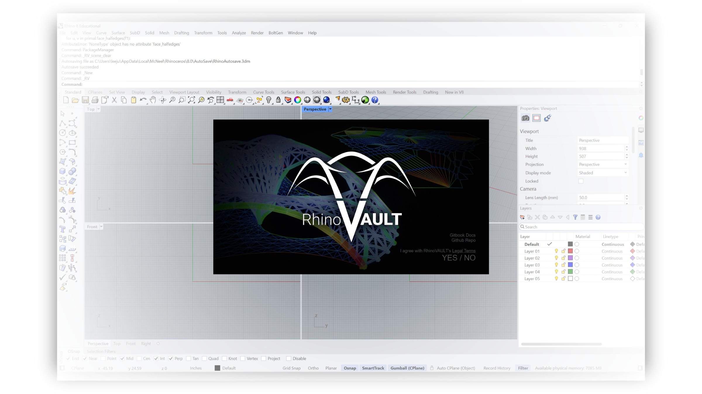

# Getting Started

RhinoVAULT is a plugin for Rhino 8 and uses the new CPython runtime. It can be installed using Yak, Rhino's package manager. This page will guide you through the installation process for RhinoVAULT.

***

## Requirements

The following are the prerequisites for installing RhinoVAULT.

* [Rhino 8](https://www.rhino3d.com/)
* Windows 10 or above / macOS 12 or above

In case you do not possess [Rhino](https://www.rhino3d.com/), download a fully featured, free trial version.


RhinoVAULT is available for Rhino 8 **only.**


***

## 1. Installation

1. Start Rhino 8 and launch Yak by typing `PackageManager` in the Rhino command line.
2. Search the online packages for "RhinoVAULT".
3. Select "COMPAS RhinoVAULT" from the list.
4. Make sure the latest version is selected, then click Install.

<figure><figcaption>
Rhino package manager
</figcaption></figure>

***

## 2. RhinoVAULT Toolbar

After the installation, you should see the RhinoVAULT toolbar in the Rhino workspace.&#x20;

<figure><figcaption>
RhinoVAULT toolbar
</figcaption></figure>

If the toolbar is not visible after installing RhinoVAULT, you can load it from the "Toolbars" tab in Rhino options. To open the "Toolbars" page, type `Toolbars` on the Rhino command line.

<figure><figcaption>
Load the toolbar using the "Toolbars" tab in Rhino options.
</figcaption></figure>

***

## 3. Check the Installation

To check the installation, simply press the left-most button on the toolbar, or run the command `RV` in the Rhino command prompt.&#x20;

<table data-full-width="false"><thead><tr><th></th><th></th><th></th></tr></thead><tbody><tr><td></td><td>
<strong>Rhino command name</strong>

<code>rv</code>
</td><td>
<strong>source fil</strong>e

<a href="../../plugin/RV.py"><code>RV.py</code></a>
</td></tr></tbody></table>

Formerly known as "initialisation," this function simply displays the RhinoVAULT splash screen. It provides URLs to the RhinoVAULT GitHub repository and the GitBook manual. You will also need to read and agree to the [legal terms](../additional-information/legal-terms.md) of using RhinoVAULT.

RhinoVAULT uses the following COMPAS packages, which will be installed automatically when `RV` command is triggered, if they are not yet available. The packages are installed in a separate virtual environment named `rhinovault`.

<figure><figcaption>
RhinoVAULT splash screen
</figcaption></figure>


Note that installing the packages (and the dependencies of the packages) may take some time, so don't worry if the the dialog doesn't pop up immediately. Be patient!

