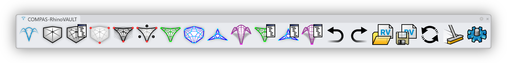

# Getting Started

COMPAS RhinoVAULT is a plugin for Rhino 8 and uses the new CPython runtime. It can be installed using Yak, Rhino's package manager.


COMPAS Masonry is **only available for Rhino 8.**


***

## Requirements

* [Rhino 8](https://www.rhino3d.com/)

***

## Installation

* Start Rhino 8 and launch Yak by typing `PackageManager` on the Rhino command line.
* Search the online packages for "RhinoVAULT".
* Select "COMPAS RhinoVAULT" from the list.
* Install.

<figure><figcaption>
COMPAS RhinoVAULT can be installed using Yak, the package manager of Rhino.
</figcaption></figure>

***

## Toolbar

COMPAS RhinoVAULT defines the following Rhino commands:

* `RV`
* `RV_pattern`
* `RV_pattern_modify`
* `RV_pattern_relax`
* `RV_pattern_supports`
* `RV_pattern_boundaries`
* `RV_form`
* `RV_force`
* `RV_tna_horizontal`
* `RV_tna_vertical`
* `RV_form_modify`
* `RV_force_modify`
* `RV_thrust_modify`
* `RV_scene_clear`
* `RV_scene_redraw`
* `RV_session_undo`
* `RV_session_redo`
* `RV_session_open`
* `RV_session_save`
* `RV_settings`

These commands can be executed at the Rhino Command Prompt (simply start typing the command name), or using the RhinoVAULT toolbar.

<figure><figcaption>
Accessing RhinoVAULT commands from the command line.
</figcaption></figure>

<figure><figcaption>
RhinoVAULT toolbar
</figcaption></figure>

If the toolbar is not visible after installing RhinoVAULT, you can load it from the "Toolbars" page. To open the "Toolbars" page, type `Toolbars` on the Rhino command line.

<figure><figcaption>
Load the toolbar using the "Toolbars" page.
</figcaption></figure>

***

## Check the Installation

To check the installation, simply press the left-most button on the toolbar. This will install any missing COMPAS packages and display a "Splash" screen when the installation is completed. Close the screen by agreeing to the [legal terms](../additional-information/legal-terms.md) of using COMPAS-RhinoVAULT.

Note that installing the packages (and the dependencies of the packages) may take some time, so don't worry if the the dialog doesn't pop up immediately.

<figure><figcaption></figcaption></figure>

***

## Issue Tracker

If you have any issues with the installation, please submit an issue or question on the RhinoVAULT [Issue Tracker](https://github.com/blockresearchgroup/compas-RV/issues).
