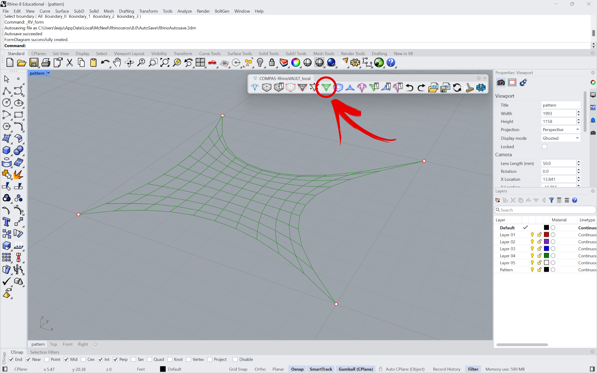
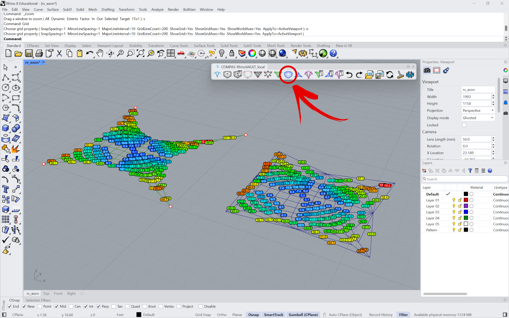
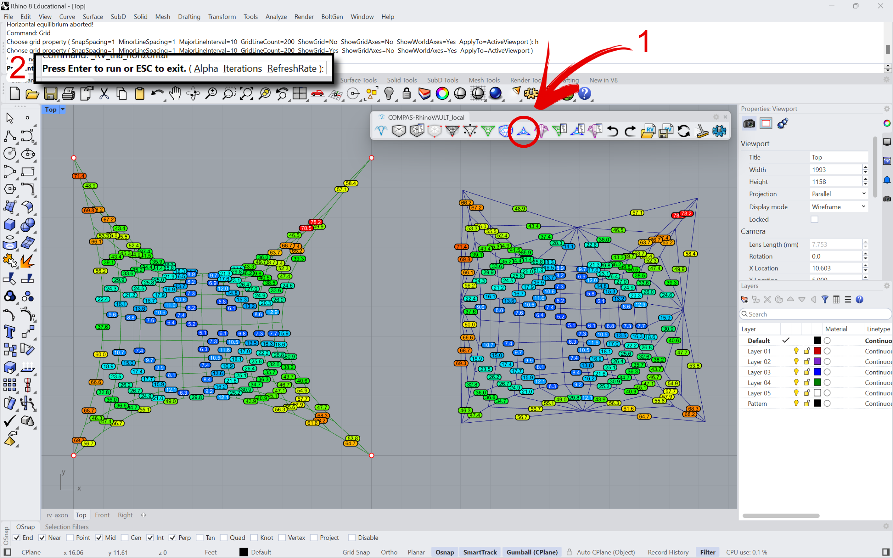
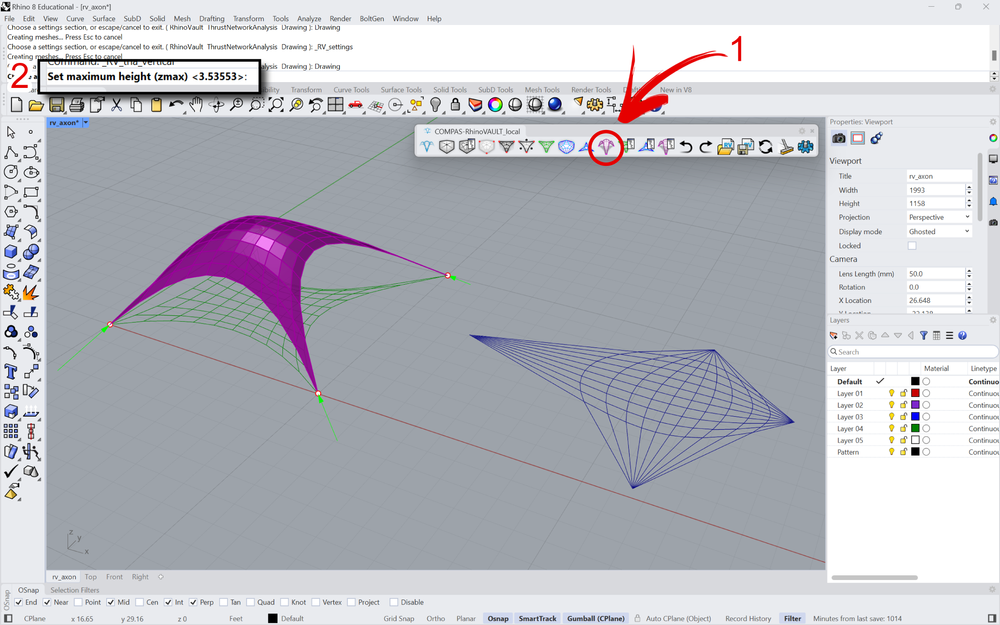
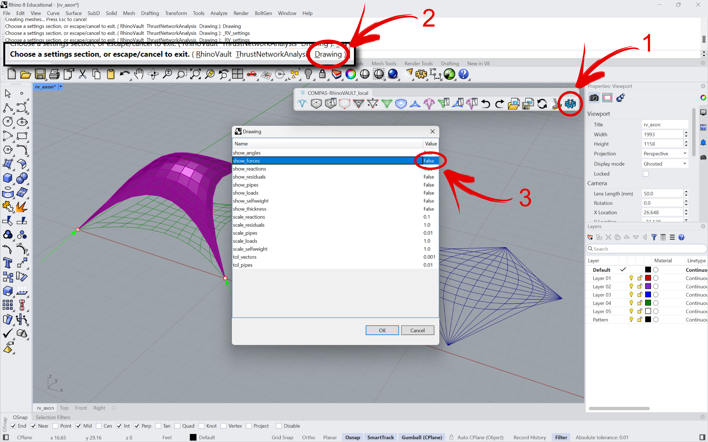
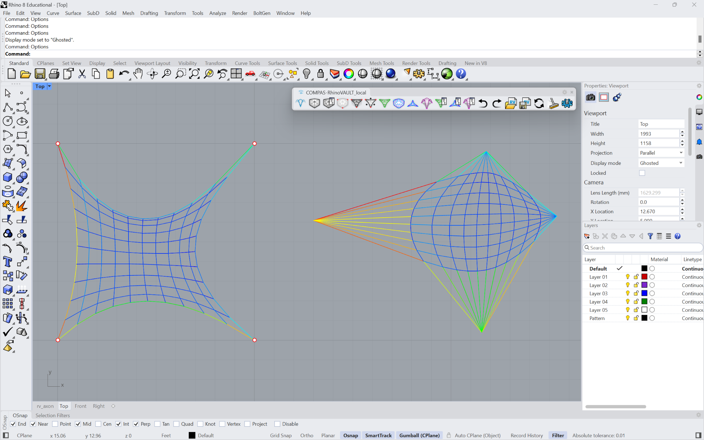
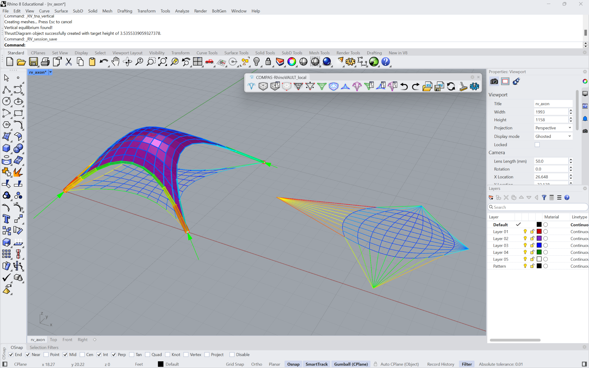

# Tutorial

<figure><figcaption></figcaption></figure>

In this tutorial, we will use all of the basic RhinoVAULT features to find the equilibrium shape of a simple compression shell with 4 corner supports and unsupported, open boundaries. This tutorial is intended to be a “quick start” guide of the main steps and procedures of the RhinoVAULT workflow. Specific parameters and optional features will not be addressed in detail. We will go through the following steps:

1. Create & Modify Pattern
2. Define Boundary Conditions.
3. Form Diagram
4. Force Diagram
5. Horizontal Equilibrium
6. Vertical Equilibrium
7. Modify Diagrams
8. Settings
9. Utilities

***

## 1. Create & Modify Pattern

### 1a. Create Pattern

A `Pattern` is a collection of lines that define the topology of the form diagram. In this tutorial, we will use the `MeshGrid` option to generate a simple 10x10 orthogonal grid. You have the option to choose the size of the mesh and the number of division in x and y axis.

From the RhinoVAULT toolbar, click  or type `RV_pattern` in the command line. From the sub-commands, select `MeshGrid`. From the option prompts that follow, enter through them to keep the default settings. The default settings will create an orthogonal grid that has a dimension of 10 (in current Rhino units) in X and Y directions, with 10 subdivisions in X and Y directions.

<figure><figcaption></figcaption></figure>

<figure><figcaption></figcaption></figure>

### 1b. Modify Pattern

RhinoVAULT provides various mechanisms for modifying the geometry of the `Pattern`, such as moving vertices, changing attributes of vertices and edges, and relaxing. These features will not be covered in this tutorial.&#x20;

***

## 2. Define  Boundary Conditions

Once a `Pattern` object has been generated, the boundary conditions will need to be defined. In RhinoVAULT, the boundary conditions include:&#x20;

1. identifying the supports (vertices of the structure where reactions are allowed); and
2. updating the geometry of the openings.

### 2a. Identify Supports

From the RhinoVAULT toolbar, click on  or type `RV_pattern_supports` in the command line. Two sub-commands are available, one for adding new supports or removing existing supports. Select `Add`. The following prompt will provide various methods of selecting vertices. For this tutorial, we will use `Degree`. Then enter 2, which means that any vertices in the `Pattern` with a vertex degree of 2 (vertices that have two edges, therefore the four corner vertices in this particular `Pattern`) will be selected and defined as supports.

<figure><figcaption></figcaption></figure>

<figure><figcaption>
The four corners (vertices with degree 2), should now be displayed as red points.
</figcaption></figure>

### 2b. Relax Pattern

The second step of defining boundary conditions involves updating the geometry of the openings. In this particular Pattern, there are four boundaries, one on each side of the `Pattern`. Clicking  or typing `RV_pattern_relax` in the command line will relax or smoothen the `Pattern` using the _force density method_ (FDM). This function uses default force density values of 1 for all edges, unless they have been manually overridden by the user.

<figure><figcaption></figcaption></figure>

### 2c. Update Boundaries

RhinoVAULT also provides a function for smoothing the Pattern by controlling the `sag` or curvature of each boundary. From the RhinoVAULT toolbar, click  or type `RV_pattern_bnoundaries` in the command line, then each boundary will be labeled with a number.&#x20;

If the `Pattern` has not been relaxed in the previous step, `RV_pattern_bnoundaries` will add a default sag (depth to span ratio) of 10%. If the `Pattern` has already been relaxed, as in this case, the boundaries will not be automatically updated. The user can iteratively select a boundary, and impose different sag values until a desired geometry of the `Pattern` is obtained.

<figure><figcaption></figcaption></figure>

<figure><figcaption>
Different sag values applied to each of the four boundaries.
</figcaption></figure>

***

## 3. Form Diagram

Once the boundary conditions have been defined, the `Pattern` can now be converted into a `FormDiagram`. In the RhinoVAULT toolbar, click  or type `RV_form` in the command line. If the creation of `FormDiagram` is successful, the Pattern will no longer be displayed and the FormDiagram will be displayed with green edges. The support vertices will still be displayed as red points.

<figure><figcaption></figcaption></figure>

***

## 4. Force Diagram

Once the `FormDiagram` has been created, the `ForceDiagram` can now be created. In the RhinoVAULT toolbar, click  or type `RV_force` in the command line. The `ForceDiagram` will be automatically drawn with blue edges to the right (+x) of the `FormDiagram`. The initial `ForceDiagram` is the topological dual of the `FormDiagram`. The two diagrams are not yet reciprocal, meaning that the corresponding edges in the diagrams are not perpendicular to the other.

When the diagrams are not yet reciprocal (in other words, not perpendicular-ised or “equilibrated”), the edges with angle deviations above the defined angle tolerance will be displayed. The dots displaying the angle deviations are visual cues for the user, indicating that horizontal equilibrium has not yet been resolved.

<figure><figcaption></figcaption></figure>

***

## 5. Horizontal Equilibrium&#x20;

Once the `FormDiagram` and `ForceDiagram` have been created, the horizontal equilibrium algorithm perpendicular-ises either or both diagrams, which converts them from dual to reciprocal diagrams. In the Rhino toolbar, click  or type `RV_tna_horizontal` in the command line.&#x20;

<figure><figcaption></figcaption></figure>

Under “Alpha” option, the user will be able to select a value that determine which of the two diagrams will have more weight during the perpendicular-isation process. Default is “form100,” which only allows the `ForceDiagram` to update in its geometry. User can also enter the number of iterations as well as the display refreshrate for the algorithm. Default number of iterations is 100. For this tutorial, we will change the iteration number to 300.&#x20;

Upon completion, the `ForceDiagram` will be automatically relocated to a new position (for clarity and to avoid overlapping with the `FormDiagram`) in the workspace.&#x20;

<figure><figcaption></figcaption></figure>

***

## 6. Vertical Equilibrium

With the `FormDiagram` and `ForceDiagram` now reciprocal, the coordinates of the `ThrustDiagram` can be iteratively computed based on a desired `zmax` (target maximum height) value. In the Rhino toolbar, click  or type `RV_tna_vertical` in the command line.&#x20;

The user can manually enter a desired value for the target height of the vault. Default height is calculated as 25% of the longest diagonal distance of the bounding box of the current `FormDiagram`. For this tutorial, we will use the default, automatically calculated `zmax`.

<figure><figcaption></figcaption></figure>

***

## 7. Modify Diagrams (skip)

In this tutorial, we will skip the Modify Diagram functionalities.&#x20;

***

## 8. Settings

RhinoVAULT provides several settings options to modify various parameters for the plugin, the solving algorithms and viusalization. In the Rhino toolbar, click  or type `RV_settings` in the command line. In this tutorial, we will explore a few options under `Display` settings.

In `Display` settings, set `show_forces` attribute to `True`. The corresponding edges of the `FormDiagram` and `ForceDiagram` will be displayed in matching colors. The color gradient is determined based on the relative magnitudes of the internal horizontal forces (Red is higher, blue is lower; the color is independent of whether or not the force is in compression or tension).&#x20;

<figure><figcaption></figcaption></figure>

<figure><figcaption></figcaption></figure>

If `show_pipes` is set to `True`,  pipes will be displayed for the edges of the `ThrustDiagram`. The radius of the pipes are proportional to the magnitude of the internal force in the edge.&#x20;

<figure><figcaption></figcaption></figure>

***

## 9. Utilities

During the RhinoVAULT workflow, there may have been unintended modifications to the geometry of the diagrams, such as accidentally moving the vertices. In such cases, running the `RV_scene_redraw`  command will simply redraw the three diagrams without executing any command. When a work session has ended, and the user wishes to start a new file/design, `RV_scene_clear` command will delete all existing diagrams in the work session.&#x20;

At any point during the workflow, the RhinoVAULT session can be saved as a JSON file. These files can be opened in the future, and the user can resume working with existing diagrams and resuming work where the user left off during the last session.&#x20;
