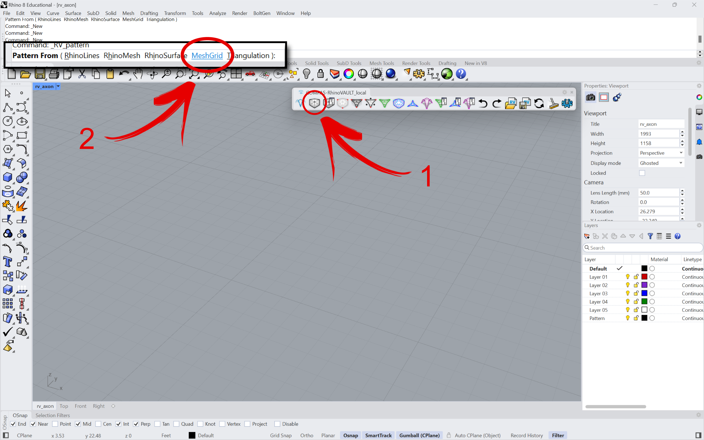
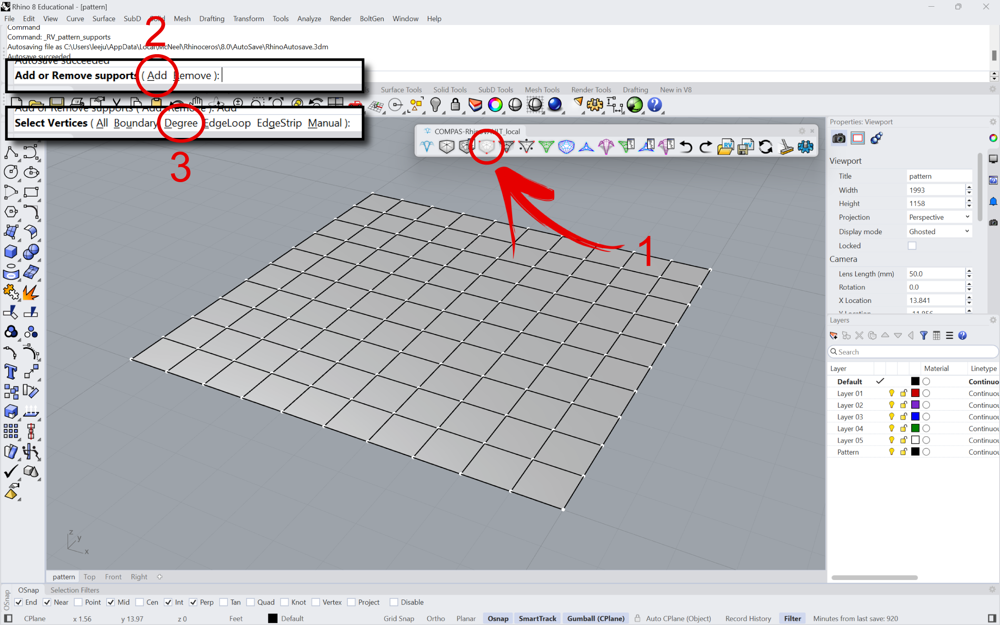
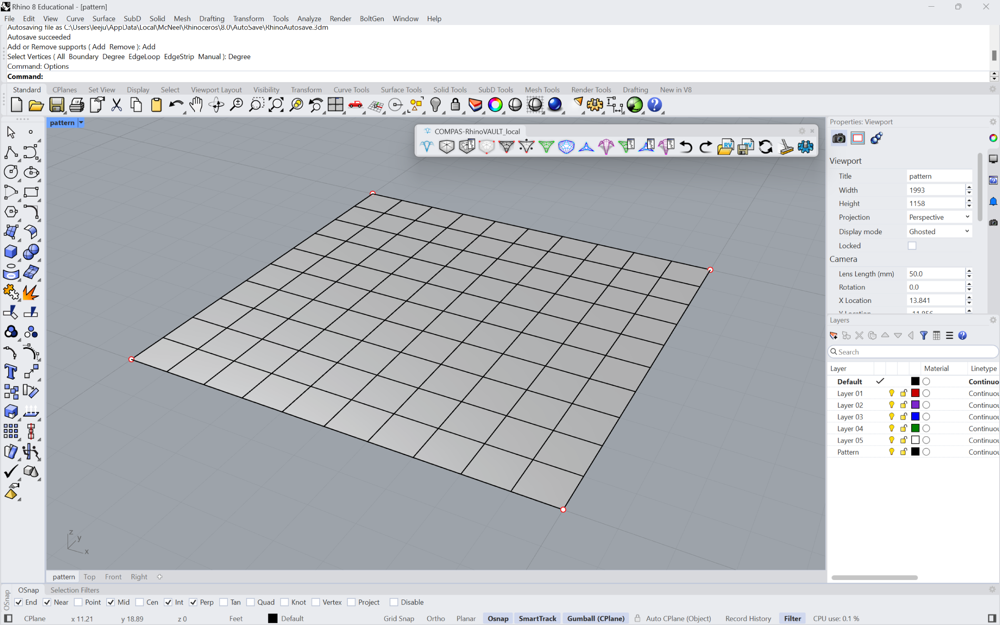
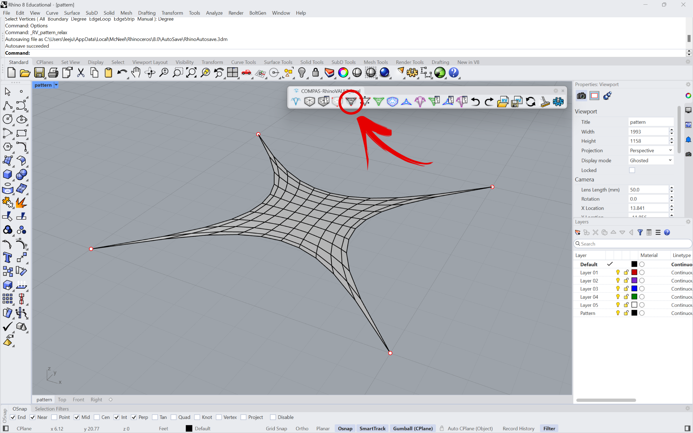
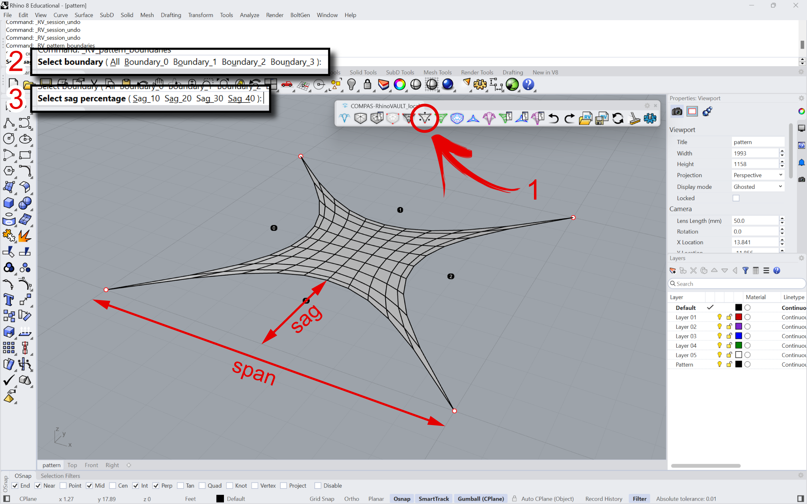
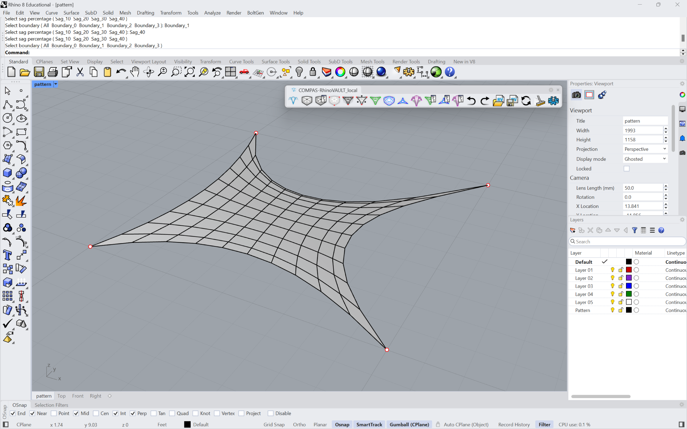

# Tutorial

<figure><figcaption></figcaption></figure>

In this tutorial, we will use all of the basic RhinoVAULT features to find the equilibrium shape of a simple compression shell with 4 corner supports and unsupported, open boundaries. This tutorial is intended to be a “quick start” guide of the main steps and procedures of the RhinoVAULT workflow. Specific parameters and optional features will not be addressed in detail. We will go through the following steps:

1. Create & Modify Pattern
2. Define Boundary Conditions.
3. Form Diagram
4. Force Diagram
5. Horizontal Equilibrium
6. Vertical Equilibrium
7. Modify Diagrams
8. Settings
9. Utilities

***

## 1. Create & Modify Pattern

### 1a. Create Pattern

A `Pattern` is a collection of lines that define the topology of the form diagram. In this tutorial, we will use the `MeshGrid` option to generate a simple 10x10 orthogonal grid. You have the option to choose the size of the mesh and the number of division in x and y axis.

From the RhinoVAULT toolbar, click  or type `RV_pattern` in the command line. From the sub-commands, select `MeshGrid`. From the option prompts that follow, enter through them to keep the default settings. The default settings will create an orthogonal grid that has a dimension of 10 (in current Rhino units) in X and Y directions, with 10 subdivisions in X and Y directions.

<figure><figcaption></figcaption></figure>

<figure><figcaption></figcaption></figure>

### 1b. Modify Pattern

RhinoVAULT provides various mechanisms for modifying the geometry of the `Pattern`, such as moving vertices, changing attributes of vertices and edges, and relaxing. These features will not be covered in this tutorial.&#x20;

***

## 2. Define  Boundary Conditions

Once a `Pattern` object has been generated, the boundary conditions will need to be defined. In RhinoVAULT, the boundary conditions include:&#x20;

1. identifying the supports (vertices of the structure where reactions are allowed); and
2. updating the geometry of the openings.

### 2a. Identify Supports

From the RhinoVAULT toolbar, click on  or type `RV_pattern_supports` in the command line. Two sub-commands are available, one for adding new supports or removing existing supports. Select `Add`. The following prompt will provide various methods of selecting vertices. For this tutorial, we will use `Degree`. Then enter 2, which means that any vertices in the `Pattern` with a vertex degree of 2 (vertices that have two edges, therefore the four corner vertices in this particular `Pattern`) will be selected and defined as supports.

<figure><figcaption></figcaption></figure>

<figure><figcaption>
The four corners (vertices with degree 2), should now be displayed as red points.
</figcaption></figure>

### 2b. Relax Pattern

The second step of defining boundary conditions involves updating the geometry of the openings. In this particular Pattern, there are four boundaries, one on each side of the `Pattern`. Clicking  or typing `RV_pattern_relax` in the command line will relax or smoothen the `Pattern` using the _force density method_ (FDM). This function uses default force density values of 1 for all edges, unless they have been manually overridden by the user.

<figure><figcaption></figcaption></figure>

### 2c. Update Boundaries

RhinoVAULT also provides a function for smoothing the Pattern by controlling the `sag` or curvature of each boundary. From the RhinoVAULT toolbar, click  or type `RV_pattern_bnoundaries` in the command line, then each boundary will be labeled with a number.&#x20;

If the `Pattern` has not been relaxed in the previous step, `RV_pattern_bnoundaries` will add a default sag (depth to span ratio) of 10%. If the `Pattern` has already been relaxed, as in this case, the boundaries will not be automatically updated. The user can iteratively select a boundary, and impose different sag values until a desired geometry of the `Pattern` is obtained.

<figure><figcaption></figcaption></figure>

<figure><figcaption>
Different sag values applied to each of the four boundaries.
</figcaption></figure>

***

## 3. Form Diagram

***

## 4. Force Diagram

***

## 5. Horizontal Equilibrium&#x20;

***

## 6. Boundary conditions

***

## 7. Modify Diagrams (skip)

***

## 8. Settings

***

## 9. Utilities

