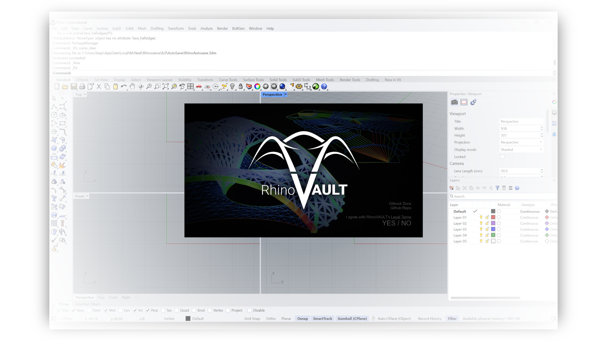

# 0. RV

<table data-full-width="false"><thead><tr><th></th><th></th><th></th></tr></thead><tbody><tr><td></td><td>
<strong>Rhino command name</strong>

<code>rv</code>

<strong>source fil</strong>e

<code>RV.py</code>
</td><td></td></tr></tbody></table>

Formerly known as "initialisation," this function simply displays the RhinoVAULT splash screen. It provides URLs to the RhinoVAULT GitHub repository and the GitBook manual. You can also view and read the "Terms and Conditions" and "User Agreement."

<figure><figcaption>
RhinoVAULT splash popup window.
</figcaption></figure>

