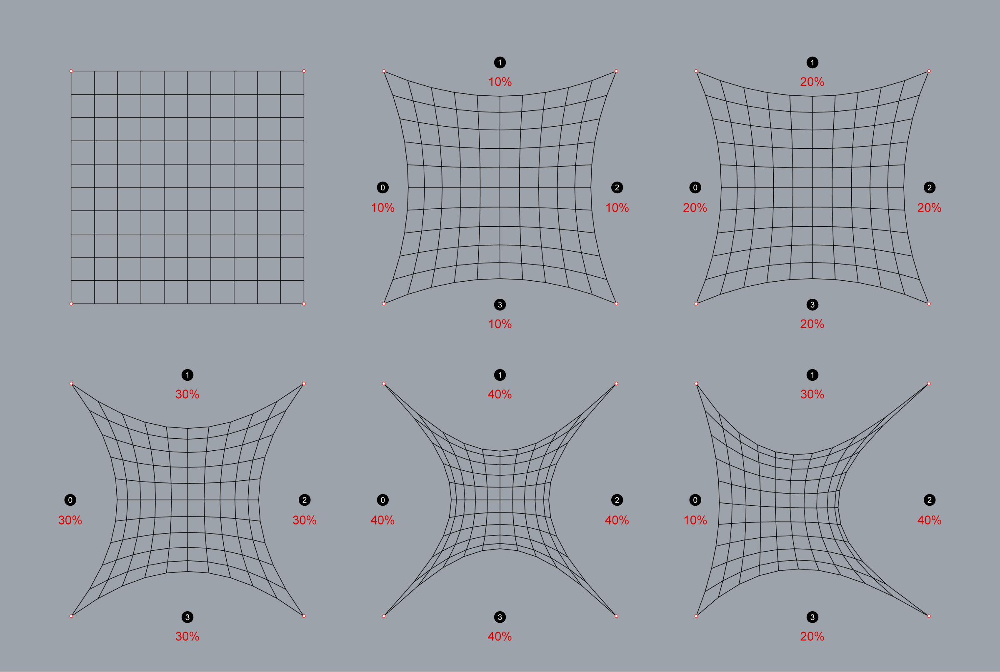

# 2c. Update Boundaries

<table><thead><tr><th width="221"></th><th width="253"></th><th></th></tr></thead><tbody><tr><td></td><td>
<strong>Rhino command name</strong>

<code>RV_pattern_bnoundaries</code>
</td><td>
<strong>source file</strong>

<a href="../../../plugin/RV_pattern_boundaries.py"><code>RV_pattern_boundaries.py</code></a>
</td></tr></tbody></table>

The treatment of the openings are very much dependent on the type of vault that is being investigated.  `RV_pattern_bnoundaries` enables users to relax the Pattern in a much more controlled way by defining the `sag` value for each opening, which is calculated based on the percentage of the length of the opening. The $$q$$s for the boundary edges are automatically calculated based on the target `sag` values, which are then used for the relaxation using the same force density method used in `RV_pattern_relax`. Default `sag` value of 10 is applied to each opening.&#x20;

***

### Sag

Below are variations of a simple 10x10 grid pattern with different sag values applied to each opening. The `sag` values can be adjusted uniformly across all openings or varied individually for each one.

<figure><figcaption></figcaption></figure>
