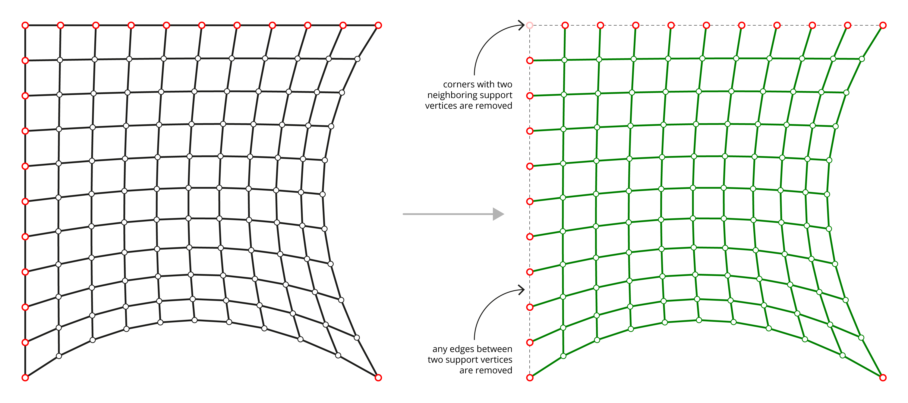
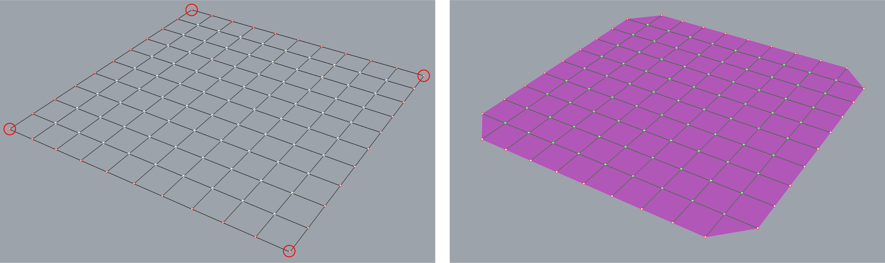
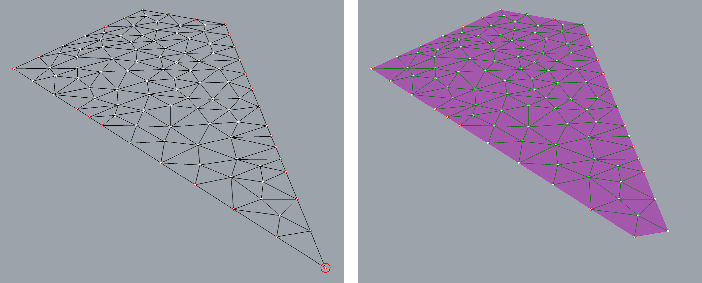

# 3. Form diagram

|                                                                                   |                                                                       |                                                                                                         |
| --------------------------------------------------------------------------------- | --------------------------------------------------------------------- | ------------------------------------------------------------------------------------------------------- |
|  | 
<strong>Rhino command name</strong>

<code>RV_form</code>
 | 
<strong>source file</strong>

<a href="../../plugin/RV_form.py"><code>RV_form.py</code></a>
 |

`FormDiagram` is the 2D projection of the `ThrustDiagram`. The boundary condition information, such as the support locations and loading conditions, is automatically inherited from the `Pattern`. Any edges of the pattern, of which both endpoints are supports are removed from the `FormDiagram`.&#x20;

A `FormDiagram` is represented by the [COMPAS mesh datastructure](https://compas.dev/compas/latest/api/compas.datastructures.Mesh.html).

<figure><figcaption>
Depending on how the support vertices are defined, corners of the Pattern are automatically processed during the creation of the <code>FormDiagram</code>.
</figcaption></figure>

<figure><figcaption>
Automatic removal of the corner supports of a quad grid mesh, which have edges at that support that are fully constrained.
</figcaption></figure>

<figure><figcaption>
Automatic removal of the corner supports in a tri mesh, which have edges at that support that are fully constrained.
</figcaption></figure>
