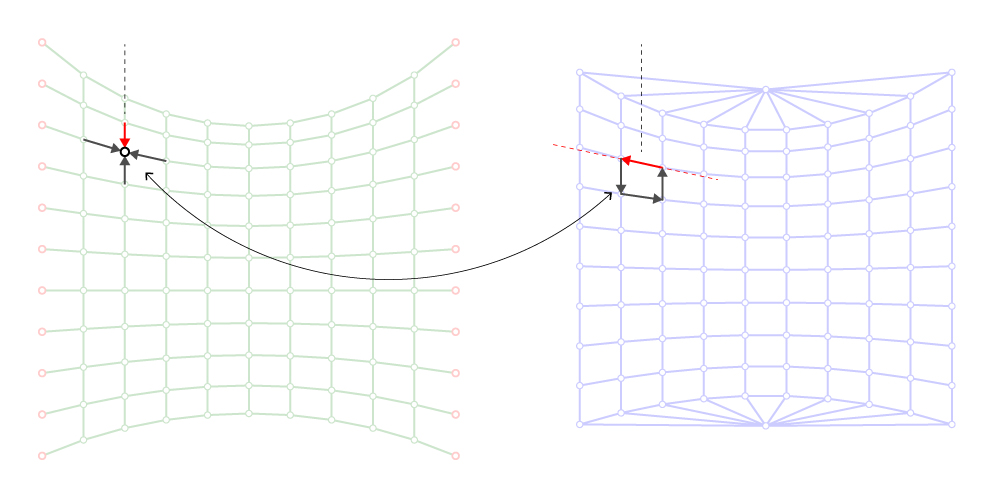
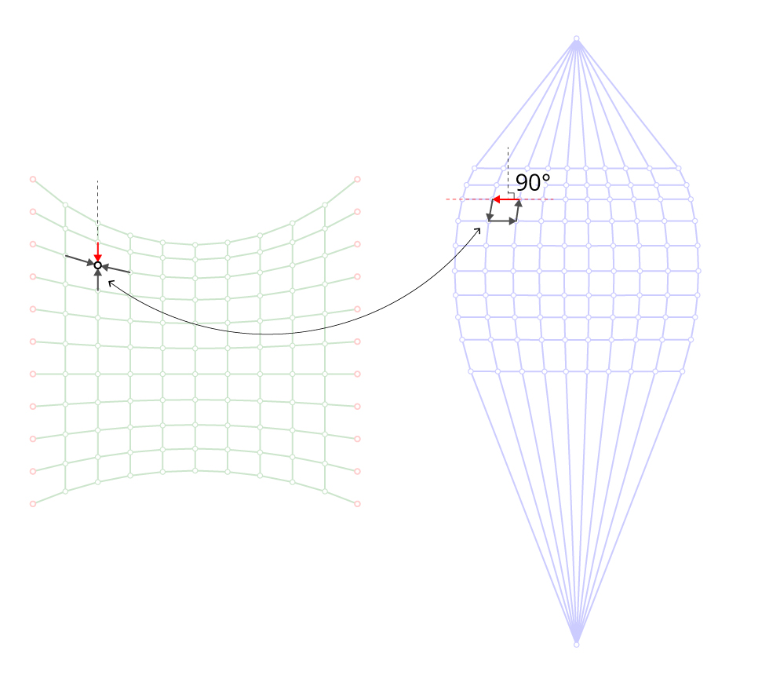

# 4. Force diagram

|                                                                                    |                                                                                                                                                                                          |
| ---------------------------------------------------------------------------------- | ---------------------------------------------------------------------------------------------------------------------------------------------------------------------------------------- |
|  | 
<strong>Rhino command name</strong>

<code>RV_force</code>

<strong>source file</strong>

<a href="../../plugin/RV_force.py"><code>RV_pattern.py</code></a>
 |

Once the `FormDiagram` has been successfully created, the `ForceDiagram` can be created. When it is first created, the `ForceDiagram` is the dual diagram of the `FormDiagram`.&#x20;

A `ForceDiagram` is represented by the mesh datastructure.&#x20;

***

## Centroidal Dual

The Force Diagram is the dual of the Form Diagram, in the sense that both diagrams have the same number of edges and that vertices in one diagram correspond to faces in the other, and vice versa.

Initially, the Force Diagram is created as the "centroidal dual" of the Form Diagram. This means that the geometry of the Force Diagram is defined by placing its vertices at the centroids of their corresponding faces in the Form Diagram.

<figure><figcaption></figcaption></figure>

***

## Reciprocal Diagrams

In order for the Form and Force Diagram to describe the distribution of horizontal thrust in a three-dimensional network of compression forces in equilibrium with vertical loads applied to its nodes, they need to be not only dual, but also reciprocal.&#x20;

Two diagrams are reciprocal if they are dual, and if their corresponding edges are at a constant angle with each other. Typically, corresponding edges are required to be parallel, or perpendicular, but any other constant angle is sufficient as well.

In RhinoVAULT, the Form and Force Diagram are considered reciprocal if corresponding edges are perpendicular.

<figure><figcaption></figcaption></figure>

***

## Horizontal Forces

Once the Form and Force Diagram are reciprocal they describe the horizontal equilibrium of the corresponding three-dimensional force network. The edges of the Form Diagram define the directions and points of application of the forces, whereas the edges of the Force Diagram define the distribution of force magnitudes along those directions.

The magnitudes of horizontal forces are equal to the lengths of the edges in the Force Diagram, multiplied with a scaling factor.&#x20;
