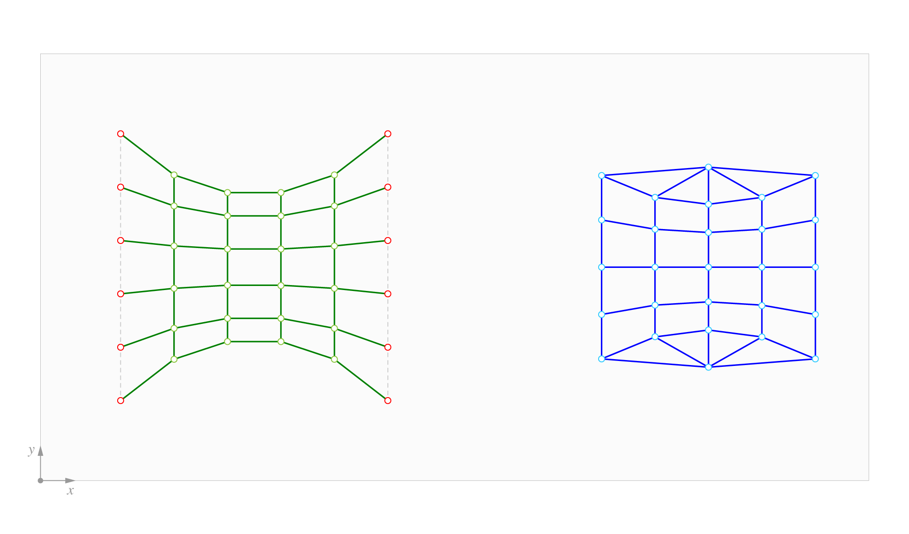
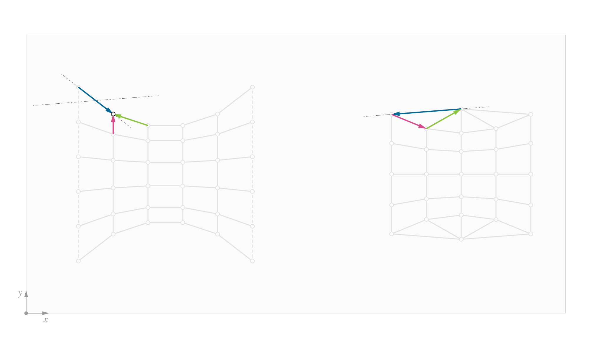

# 4. Force diagram

|                                                                                    |                                                                        |                                                                                                           |
| ---------------------------------------------------------------------------------- | ---------------------------------------------------------------------- | --------------------------------------------------------------------------------------------------------- |
|  | 
<strong>Rhino command name</strong>

<code>RV_force</code>
 | 
<strong>source file</strong>

<a href="../../plugin/RV_force.py"><code>RV_force.py</code></a>
 |

Once the `FormDiagram` has been successfully created, the `ForceDiagram` can be created. When it is first created, the `ForceDiagram` is the dual diagram of the `FormDiagram`.&#x20;

A `ForceDiagram` is represented by the [COMPAS mesh datastructure](https://compas.dev/compas/latest/api/compas.datastructures.Mesh.html).&#x20;

***

## Centroidal Dual

The `ForceDiagram` is the topological dual of the `FormDiagram`, in the sense that both diagrams have the same number of edges and that vertices in one diagram correspond to faces in the other, and vice versa.

Initially, the `ForceDiagram` is created as the "centroidal dual" of the `FormDiagram`. This means that the geometry of the Force Diagram is defined by placing its vertices at the centroids of their corresponding faces in the `FormDiagram`.

<figure><figcaption>
<code>ForceDiagram</code> (rigiht) is created as the "centroidal dual" of the <code>FormDiagram</code> (left).
</figcaption></figure>

<figure><figcaption>
The initial form and force diagrams are topologically dual, but not yet reciprocal. Here, the corresponding dual edges are highlighted for an arbitrary node.
</figcaption></figure>
