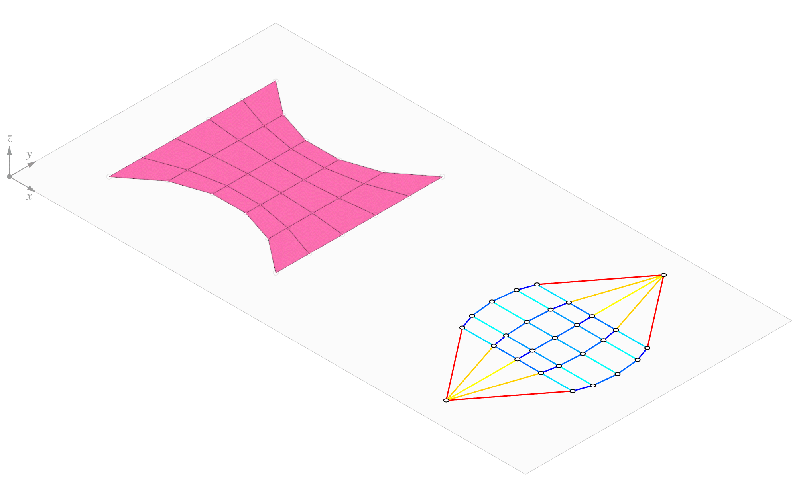

# 6. Vertical Equilibrium

|                                                                               |                                                                               |                                                                                                                         |
| ----------------------------------------------------------------------------- | ----------------------------------------------------------------------------- | ----------------------------------------------------------------------------------------------------------------------- |
|  | 
<strong>Rhino command name</strong>

<code>RV_tna_vertical</code>
 | 
<strong>source file</strong>

<a href="../../plugin/RV_tna_vertical.py"><code>RV_tna_vertical.py</code></a>
 |

In RhinoVAULT, the `ThrustDiagram` representing the thrust network, is an instance of the `FormDiagram`, with the only difference being the $$z$$ coordinates. A `ThrustDiagram` is simply an alternate visualisation of the `FormDiagram` with updated $$z$$ coordinates. When a `FormDiagram` is successfully created, the `ThrustDiagram` is automatically created.&#x20;

A `ThrustDiagram` is represented by the mesh datastructure.&#x20;

***

## Algorithm Parameter

### Target Height

Once the Form and Force Diagrams have been created and horizontal equilibrium has been established through parallelisation, the distribution of horizontal forces in the system is fixed. The actual magnitude of the horizontal forces depends on a _scale factor_ and will determine the _target height_ of the final thrust diagram. A higher scale factor results in higher horizontal forces and therefore a shallower three-dimensional shape. Vice versa, a lower scale factor results in lower horizontal thrust and thus a deeper solution.

The meaning of the scale factor and the magnitude of horizontal forces is related to the magnitude of the loads, which in turn are related to the self-weight of the resulting three-dimensional geometry. Rather than asking you to "guess" the scale factor to get the three-dimensional shape you want, RhinoVAULT will determine the scale for you based on the desired height of the final solution. The default value for the target height is 25% of the length of the diagonal of the bounding box of the Form Diagram (essentially of the bounding box of the footprint of your shell). This value tends to produce well-proportioned geometries.

<figure><figcaption></figcaption></figure>
