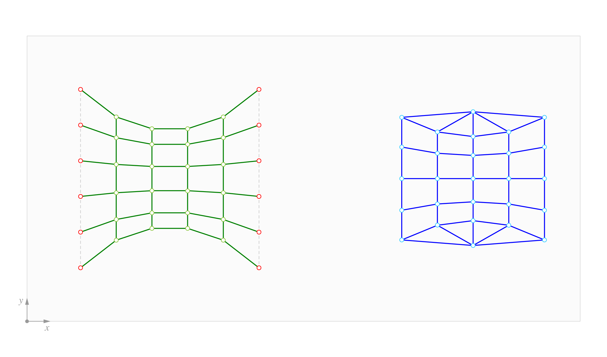
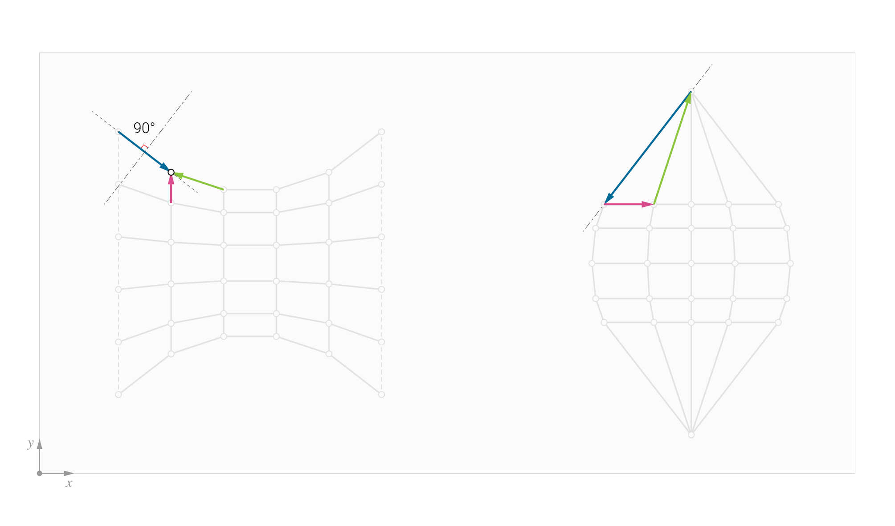
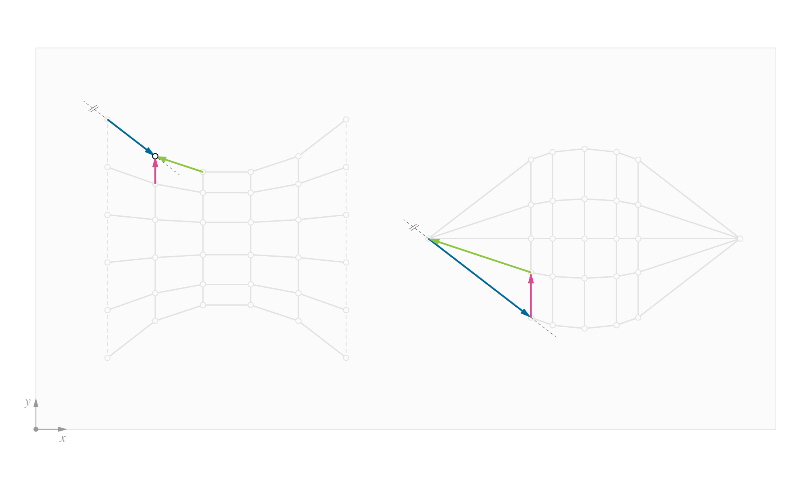
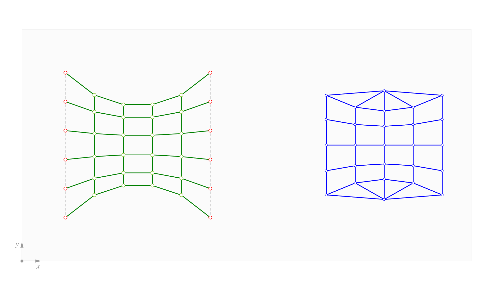

# 5. Horizontal Equilibrium

|                                                                                     |                                                                                 |                                                                                                                             |
| ----------------------------------------------------------------------------------- | ------------------------------------------------------------------------------- | --------------------------------------------------------------------------------------------------------------------------- |
|  | 
<strong>Rhino command name</strong>

<code>RV_tna_horizontal</code>
 | 
<strong>source file</strong>

<a href="../../plugin/RV_tna_horizontal.py"><code>RV_tna_horizontal.py</code></a>
 |

`RV_tna_horizontal` geometrically reconfigures the the edges of the `ForceDiagram`, such that the corresponding edges of the `FormDiagram` and `ForceDiagram` become parallel to each another (in the conventional graphic statics sense), or perpendicular (the 90° rotated, RhinoVAULT convention). The resulting `ForceDiagram` and `FormDiagram` are _reciprocal_ when the two diagrams are topological duals of the other and all pairs of corresponding edges are parallel (within tolerance).

<figure><figcaption>
Dual <code>FormDiagram</code> and ForceDiagram
</figcaption></figure>

<figure><figcaption>
After horizontal equilibrium has been found, the form and force diagrams are now reciprocal. The perpendicular representation of the force diagram is the convention used in RhinoVAULT. This convention is also known as the Maxwell convention.
</figcaption></figure>

<figure><figcaption>
The same force diagram can be rotated 90 degrees, after which the corresponding edges are now parallel to each other. This is the standard convention used in most graphic statics literature and applications, and is also knowns as the Cremona convention or diagrams.
</figcaption></figure>

***

## Horizontal Forces

Once the `FormDiagram` and `ForceDiagram` are reciprocal, they describe the horizontal equilibrium of the corresponding three-dimensional force network. The edges of the `FormDiagram` define the directions and points of application of the forces, whereas the edges of the `ForceDiagram` define the distribution of force magnitudes along those directions. The magnitudes of horizontal forces are equal to the lengths of the edges in the `ForceDiagram`, multiplied with a scaling factor.&#x20;

***

## Algorithm Parameters

### Alpha

In RhinoVAULT, horizontal equilibrium is computed by parallelising the edges of the Form and Force Diagram to corresponding target vectors. These target vectors are defined as the weighted average of the vectors of corresponding edge pairs. Therefore, the most important parameter for the calculation of horizontal equilibrium in RhinoVAULT is `alpha`, which is the weighting factor for the calculation of the target vectors.

If `alpha = 100`, the target vectors are completely defined by the vectors of the edges of the `FormDiagram`. This means that only the geometry of the `ForceDiagram` will be updated to achieve horizontal equilibrium. This is the default. If `alpha = 0`, the target vectors are completely defined by the edges of the `ForceDiagram`. Therefore only the `FormDiagram` will be updated. For all other values, the target vectors are calculated using the following formula:

$$
t_i = \alpha \cdot \hat{e}_{i, form} + (1 - \alpha) \cdot \hat{e}_{i, force}
$$

Note that using different values of `alpha` requires a bit of practice and experience. Since the `FormDiagram` defines the intended  layout of horizontal forces and RhinoVAULT has many functionalities for designing force layouts that provide a good starting point for form finding explorations, it is usually a good idea to start with `alpha = 100`. However, once you have the horizontal equilibrium under control, playing around with lower `alpha` values can have a significant influence on finding nicely balanced force distributions.

### Iterations

Computing horizontal equilibrium is an iterative process. The default number of `iterations` is 100. For sensible force layouts, a horizontal equilibrium can be found in less `iterations`. However, there are many cases in which more `iterations` are required. For example, if the `FormDiagram` has multiple open/unsupported edges, and especially if those edges have a high `sag` value, more `iterations` will typically be required to reduce all angle deviations between corresponding edges to less than the default tolerance of 5 degrees.

Computing horizontal equilibrium is quite fast. Therefore, don't hesitate to set the number of `iterations` to 1000 or more if the need arises. However, don't go completely overboard either (10000 `iterations` is quite excessive in most cases), because the calculation has no stoppage criterion, since it tends to be more computationally expensive to check for convergence than to just run all the requested `iterations`.

Furthermore, resolving all angle deviations is not an absolute requirement, and is in many cases unnecessary. For example, the angle deviations between very short edges tend to be quite persistent as they are dominated by edges with (much) longer lengths during the calculation process. Since short edges in the Force Diagram also represent (relatively) small horizontal forces, these deviations can often be ignored.


`RV_tna_horizontal` does not have a termination criteria. It will always run the number of `iterations` that has been defined.


### Refreshrate

The `iterations` of the horizontal equilibrium calculation process is dynamically visualized. The rate at which the `iterations` are visualized is controlled by the `refreshrate`. The default value is 5, which means that the diagrams are updated every 5 iterations.

For large diagrams the dynamic visualization slows down the calculations a little bit. In situations where a high numbers of `iterations` (> 1000) is required, it is advisable to set the `refreshrate` to a higher value. For example, if the number of `iterations` is 1000, then a refresh rate of 50 seems more appropriate.

<figure><figcaption>
Animation of iterations in<code>RV_tna_horizontal</code> for a simple pattern.
</figcaption></figure>
