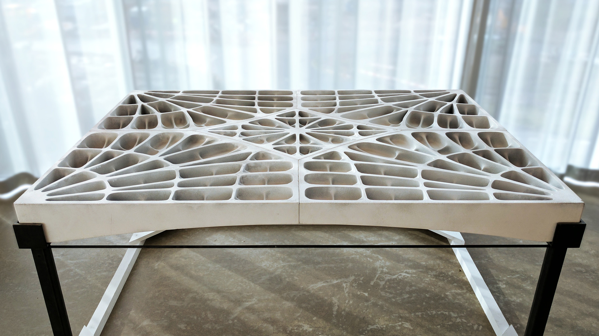
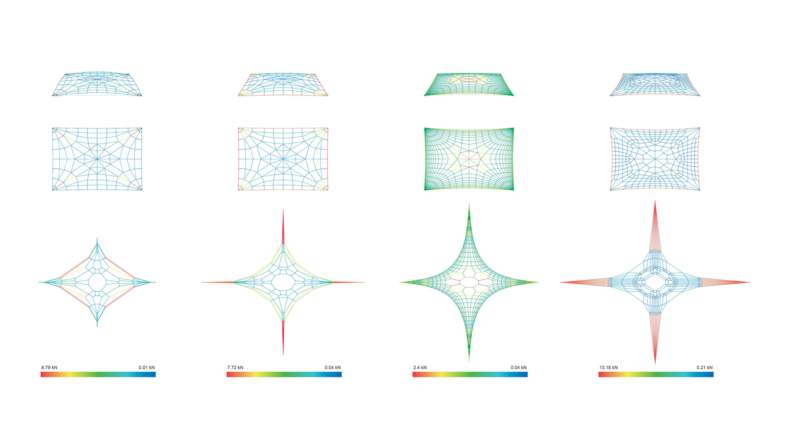
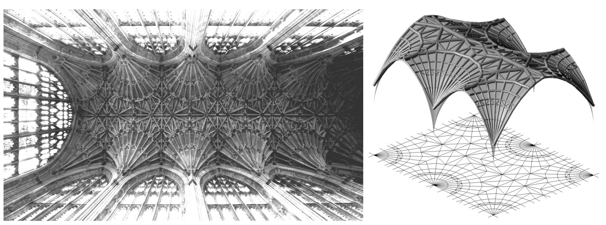
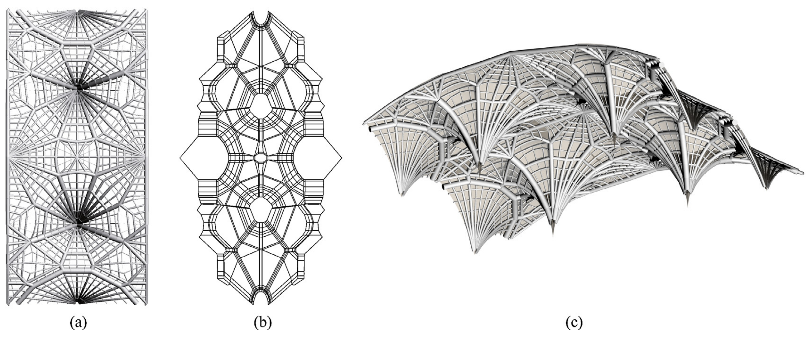
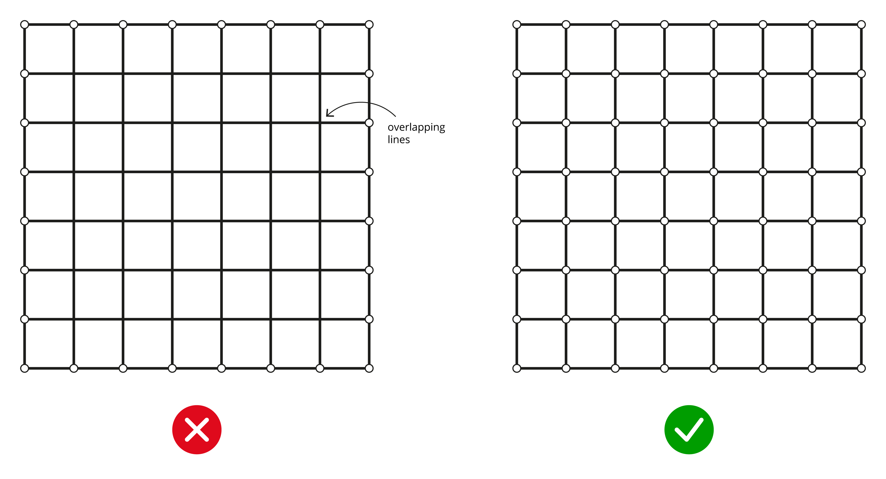
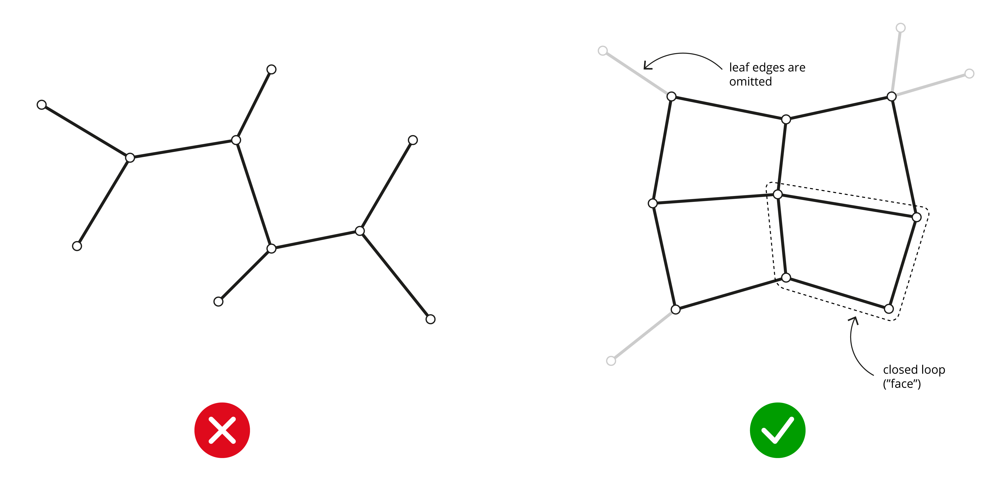
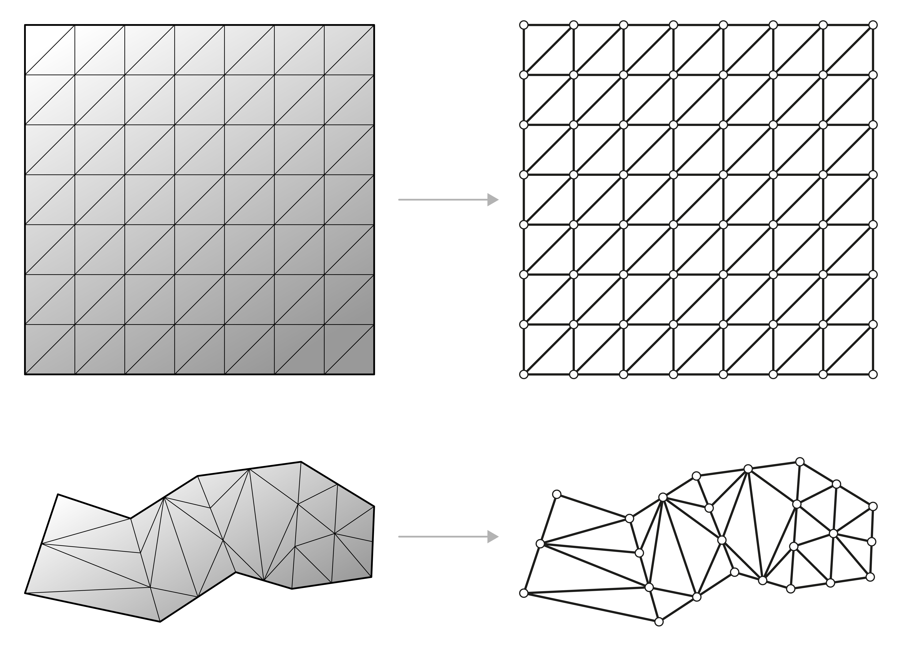
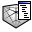

# 1. Pattern

The first step of the workflow is to generate the topology of the `FormDiagram`, which is called the `Pattern` in RhinoVAULT. A `Pattern` is a collection of vertices interconnected by lines, represented by the COMPAS [mesh datastructure](https://compas-dev.github.io/main/api/compas.datastructures.html#meshes).

RhinoVAULT offers several methods for generating a `Pattern`. Each method has a direct influence not only on the topology of the eventual shell structure, but also the type of application and interaction that is desired during the design process.&#x20;

## 1a. Create Pattern

|                                                                           |                                                                          |                                                                                                               |
| ------------------------------------------------------------------------- | ------------------------------------------------------------------------ | ------------------------------------------------------------------------------------------------------------- |
|  | 
<strong>Rhino command name</strong>

<code>RV_pattern</code>
 | 
<strong>source file</strong>

<a href="../../plugin/RV_pattern.py"><code>RV_pattern.py</code></a>
 |

There are many ways to generate a topological pattern. Each method has pros and cons, and the desired design or workflow will help determine which method is more appropriate.

In the case of the rib layout variations for the [rib-stiffened funicular floor system](https://block.arch.ethz.ch/brg/research/rib-stiffened-funicular-floor-system), the boundary remains fixed (the footprint and depth of the floor). However, depending on the topology of the form diagram, the distribution and flow of forces change drastically.&#x20;

<figure><figcaption>
3D-printed floor system (Block Research Group)
</figcaption></figure>

<figure><figcaption>
Different patterns for the same floor geometry have significantly different force distributions
</figcaption></figure>

In RhinoVAULT, three types of Rhino geometries can be used to generate a `Pattern :` Lines, Mesh and Surfaces. These pattern generation features would be particularly useful when there is already an existing structure with a geometry that one would like to recreate the pattern for.

<figure><figcaption>
Three-dimensional equilibrium analysis of gothic masonry vaults" (Block and Lachauer, 2014)
</figcaption></figure>

<figure><figcaption>
(a) Primal grid, directly using the rib layout and stereotomy of the vaults; (b) the resulting best-fit reciprocal (force) grid; and (c) axonometry of the target surface, constructed from documentation, and the best-fit thrust network with pipes proportional to the axial forces in the branches.
</figcaption></figure>

Photographs and diagrams of different rose windows with complex mullion geometries, showing from left to right an outside picture, the equilibrated and piped form diagram, and the reciprocal force diagram.

<figure><figcaption>
 (a) Notre Dame de Mantes, France; (b) Notre Dame de Chartres, France (Photo by Holly Hayes); (c) Durham Cathedral, England (Photo by Carcharoth on Wikipedia); (d) Notre Dame de Paris, France (Photo by Ellen Brown); (e) Bisshop’s Eye of Lincoln Cathedral, England (Photo from Cornell University Library); (f) Sainte-Chapelle Paris, France.
</figcaption></figure>


`Pattern` is a COMPAS [mesh](https://compas-dev.github.io/main/api/generated/compas.datastructures.Mesh.html#compas.datastructures.Mesh) object. A mesh datastructure is network of faces, where the connectivities of the faces are defined by halfedge adjacencies.&#x20;



### RhinoLines

One of the simplest, and the most manual, way to make the Pattern is to draw the edges of the `Pattern` as Rhino lines. Each edge of the Pattern should be an individual line; all lines should be broken at all line intersections. In other words, these lines may not be overlapping.&#x20;

<figure><figcaption></figcaption></figure>

The input set of lines must consist of closed loops of lines representing the faces of the `Pattern.` If there are closed loops of lines, a `Pattern` will be generated and all lines that do not form a closed loop, such as the "leaf" edges will be omitted.

<figure><figcaption></figcaption></figure>

### RhinoMesh

A Rhino mesh object can be used to create a `Pattern`. Since a Pattern is also a mesh object, the vertices and edges can be directly used to create the vertices and edges of the `Pattern`.

<figure><figcaption></figcaption></figure>

### RhinoSurface

A non-trimmed Rhino surface object can be used to create a Pattern, using subdivision values for U and V.

<figure><figcaption></figcaption></figure>

### MeshGrid

This function automatically generates a mesh grid using number and size of the grid in x and y directions.

### Triangulation

Not implemented.

***

## 1b. Modify Pattern

|                                                                                  |                                                                    |                                                                                                                |
| -------------------------------------------------------------------------------- | ------------------------------------------------------------------ | -------------------------------------------------------------------------------------------------------------- |
|  | 
<strong>Rhino command name</strong>

RV_pattern_modify
 | 
<strong>source file</strong>

<a href="../../plugin/RV_pattern_modify.py">RV_pattern_modify.py</a>
 |

### VertexAttributes

* **All**: all vertices
* **Boundary**: all boundary vertices
* **Degree**: selects vertices based on a defined _vertex degree_ (number of edges that are connected to that vertex)
* **EdgeLoop**: selects all vertices along the edge loop of the selected edge
* EdgeStrip: selects all vertices on the edge strip of a selected edge
* **Manual**: manually select vertices

* is\_fixed
* is\_support
* x
* y
* z

### EdgeAttributes

* **All**: all vertices
* **Boundary**: all boundary vertices
* **EdgeLoop**: selects all vertices along the edge loop of the selected edge
* EdgeStrip: selects all vertices on the edge strip of a selected edge
* **Manual**: manually select vertices

* lmax
* lmin
* q
