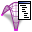

# 7c. Modify ThrustDiagram

## Modify ThrustDiagram

|                                                                                        |                                                                                |                                                                                                                           |
| -------------------------------------------------------------------------------------- | ------------------------------------------------------------------------------ | ------------------------------------------------------------------------------------------------------------------------- |
|  | 
<strong>Rhino command name</strong>

<code>RV_thrust_modify</code>
 | 
<strong>source file</strong>

<a href="../../plugin/RV_thrust_modify.py"><code>RV_thrust_modify.py</code></a>
 |

`RV_thrust_modify` allows users to make modifications to the ThrustDiagram.

***

## Sub commands

The following sub-commands are built into `RV_thrust_modify` .&#x20;

### VertexAttributes

The following vertex attributes of the `ThrustDiagram` can be modified.

* **is\_fixed** - If set to `True`, the corresponding vertex of the `FormDiagram` will remain fixed during any force-density-based relaxation. This is set to `False` by default.
* **is\_support** - if set to `True`, the vertex will become a support in the `ThrustDiagram` and remain fixed during `RV_tna_vertical`. This is set to `False` by default.
* **px** - The x component of an additional load to be applied at the vertex. This value is set to 0.0 by default.
* **py** - The y component of an additional load to be applied at the vertex. This value is set to 0.0 by default.
* **pz** - The z component of an additional load to be applied at the vertex. This value is set to 0.0 by default.
* **t** - The thickness of the `ThrustDiagram` at the vertex. This value in combination with the tributary area of the vertex determines the self-weight at that vertex. This value is set to 1.0 by default.
* **x** - Current x-coordinate of the vertex. This value is automatically computed, although can be changed manually to re-locate vertices to specific positions.
* **y** - Current y-coordinate of the vertex. This value is automatically computed, although can be changed manually to re-locate vertices to specific positions.
* **z** - Current z-coordinate of the vertex. This value is automatically computed, although can be changed manually to re-locate vertices to specific positions.

### EdgeAttributes

### FaceAttributes

### MoveSupports

### ScaleForces

