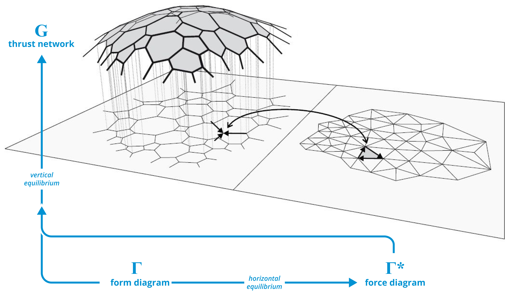
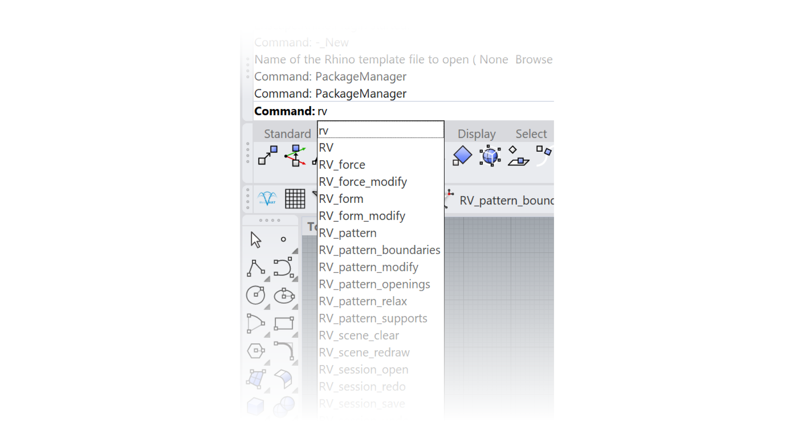
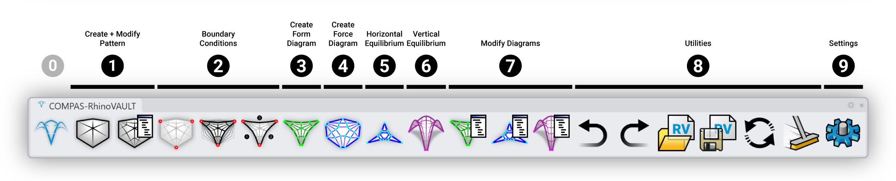

# Workflow & UI

## TNA workflow

<figure><figcaption>
Thrust Network Analysis (Block, 2009)
</figcaption></figure>

The relationship between: the compression equilibrium shape, the thrust network or the "thrust diagram" (G); its planar projection (primal grid Γ, or the "form diagram"); and the reciprocal diagram (dual grid Γ\*, or the "force diagram" ).

***

## RhinoVAULT workflow

The workflow of RhinoVAULT is based on the theoretical framework and workflow of TNA, which can be broken down into 7 main steps, and 2 auxiliary steps.

<figure><figcaption>
RhinoVAULT workflow
</figcaption></figure>

### 1. Create and Modify Pattern

A `Pattern` describes the topology of the `formdiagram`. A `pattern` is a collection of vertices interconnected by lines or "edges".  RhinoVAULT provides several methods for generating a `Pattern` and various mechanisms to modify and refine its geometry.

### 2. Define Boundary Conditions

In this step, additional information is added to the `Pattern`, such as identification of the support vertices and refinement of the geometry of the unsupported boundaries.

### 3. Create Form Diagram

Once the support vertices have been defined and the boundaries have been properly modified, the `FormDiagram` can be created from the `pattern`.

### 4. Create Force Diagram

Once the `FormDiagram` has been successfully created, the `ForceDiagram` can be created. In its initial state, the `ForceDiagram` is the topological dual of the `FormDiagram`; the two diagrams are not yet reciprocal. &#x20;

### 5. Horizontal Equilibrium

In order for the `FormDiagram` and the `ForceDiagram` to be reciprocal, the edges of one diagram needs to be perpendicular to the corresponding edge in the other diagram. Horizontal equilibrium solver iteratively repositions the vertices of the `FormDiagram` and/or `ForceDiagram` until the perpendicularity criteria (within desired angle tolerance) is met.

### 6. Vertical Equilibrium

Once the `FormDiagram` and `ForceDiagram` are reciprocal (in other words, in horizontal equilibrium), the geometry of the `ThrustDiagram` can be computed. The `ThrustDiagram` is equivalent to the `FormDiagram` with the updated z coordinates of its vertices (therefore updated self-weight at each vertex).&#x20;

Given a desired target height of the eventual `ThrustDiagram`, vertical equilibrium solver iteratively re-scales the `ThrustDiagram` in the z-axis, until the highest vertex of the `ThrustDigram` lies at the desired target height.

### 7. Modify Diagrams

Once the vertical equilibrium has been computed, the three diagrams can be interactively modified by the user to continue form finding explorations.

### 8. Utilities

There are several utility functions povided by RhinoVAULT: opening and saving RhinoVAULT session files; redo and undo; redraw scene; and clear scene.

### 9. Settings

Settings allows you to modify various parameters for the solving algorithms and display options.

***

## RhinoVAULT UI

There are two ways of accessing the functions and features of RhinoVAULT:

* Using the Rhino command lines
* RhionVAULT toolbar

### Command

COMPAS RhinoVAULT includes the following Rhino commands:

* `RV`
* `RV_pattern`
* `RV_pattern_modify`
* `RV_pattern_relax`
* `RV_pattern_supports`
* `RV_pattern_boundaries`
* `RV_form`
* `RV_force`
* `RV_tna_horizontal`
* `RV_tna_vertical`
* `RV_form_modify`
* `RV_force_modify`
* `RV_thrust_modify`
* `RV_scene_clear`
* `RV_scene_redraw`
* `RV_session_undo`
* `RV_session_redo`
* `RV_session_open`
* `RV_session_save`
* `RV_settings`

These commands can be executed at the Rhino Command Prompt (simply start typing the command name), or using the RhinoVAULT toolbar.

<figure><figcaption>
Accessing RhinoVAULT commands from the command line.
</figcaption></figure>

### Toolbar

The RhinoVAULT toolbar is organized in the sequential order (0, 1, 2, 3... 9, from left to right) of the steps of the [RhinoVAULT workflow](user-interface.md#rhinovault-workflow). The RhinoVAULT toolbar gives the user a quick access to all the key features of RV2.

<figure><figcaption>
RhinoVAULT toolbar
</figcaption></figure>
