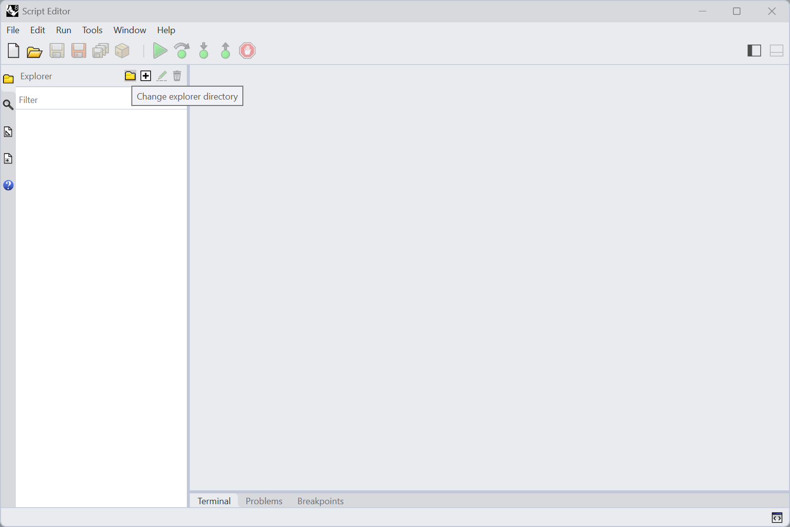

# Materialization

## Aim

<figure><figcaption></figcaption></figure>

The aim of this tutorial is to convert a RhinoVault session (a JSON file with a scene data structure) into solid geometry to facilitate the creation of simple physical models. This step is often used for teaching purposes when building models or small prototypes. The tutorial uses the Rhino ScriptEditor Python interface to extract data from a RhinoVault session file, attached below. Multiple mesh-based operations are then used to transform the geometry into solid blocks with shear keys and indices.



## Pattern from RhinoVault Session

Before you start create a folder on your computer where you will store the `rhinovault_session.json` file as well as python example files. Then open Rhino Script Editor by command `ScriptEditor`. And copy-paste the code below that extracts the mesh pattern from the session file.

The session file employs the compas.scene data structure for storing: Pattern, FormDiagram, ThrustDiagram, and ForceDiagram. It also stores general settings for drawing and thrust-network analysis. We will use two attributes: Pattern and ThrustDiagram for mesh transformation into solid blocks. The scene also helps to visualize COMPAS items (geometry & data structures).

The first three comments are specific to Python in Rhino, indicating: a) python3 specifies the language used, b) the code is written in the brg-csd environment, and c) compas_rv is a library requirement that must be installable from the Python Package Index (PyPI).


<figure><figcaption></figcaption></figure>


```python
#! python3
# venv: brg-csd
# r: compas_rv

import pathlib
import compas
from compas.scene import Scene

# =============================================================================
# Load data
# =============================================================================
IFILE = pathlib.Path(__file__).parent.parent / "data" / "rhinovault_session.json"
rv_session = compas.json_load(IFILE)
rv_scene: Scene = rv_session["scene"]
pattern = rv_scene.find_by_name("Pattern").mesh

# =============================================================================
# Visualisation
# =============================================================================
scene = Scene()
scene.clear_context()
scene.add(rv_scene.find_by_name("Pattern").mesh)
scene.draw()
```

## RhinoVault Session - ThrustDiagram

In this step we will extract thrust-diagram.