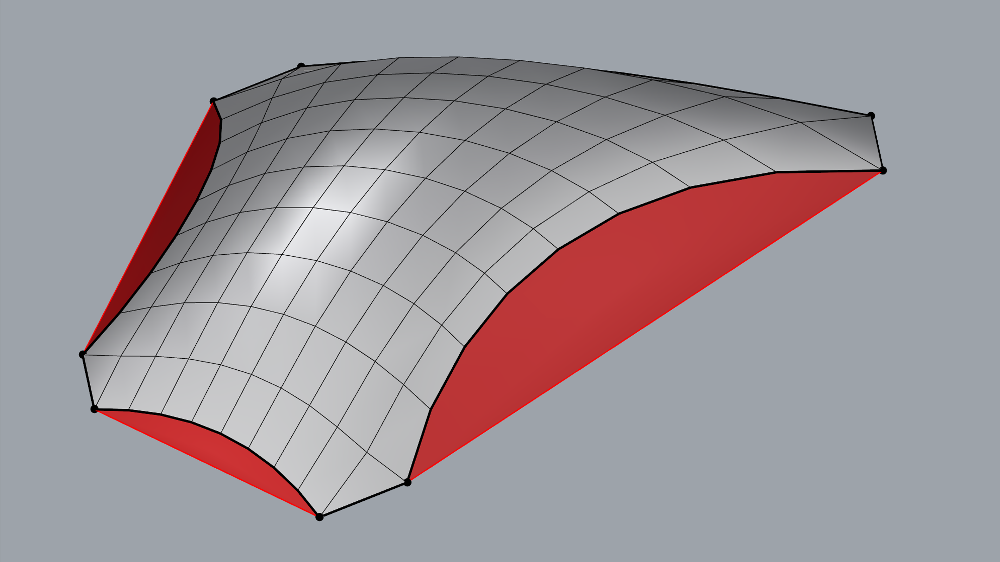

# Materialization

## Aim

<figure><figcaption></figcaption></figure>

The aim of this tutorial is to convert a RhinoVault session (a JSON file with a scene data structure) into solid geometry to facilitate the creation of simple physical models. This step is often used for teaching purposes when building models or small prototypes. The tutorial uses the Rhino ScriptEditor Python interface to extract data from a RhinoVault session file, attached below. Multiple mesh-based operations are then used to transform the geometry into solid blocks with shear keys and indices.



## Pattern from RhinoVault Session

<figure><figcaption></figcaption></figure>

Before you start create a folder on your computer where you will store the `rhinovault_session.json` file as well as python example files. Then open Rhino Script Editor by command `ScriptEditor`. Add a new python file by clicking on the plus sign named `000.pattern.py`. Then copy-paste the code below that extracts the mesh pattern from the session file.

The session file employs the compas.scene data structure for storing: Pattern, FormDiagram, ThrustDiagram, and ForceDiagram. It also stores general settings for drawing and thrust-network analysis. We will use two attributes: Pattern and ThrustDiagram for mesh transformation into solid blocks. The scene also helps to visualize COMPAS items (geometry & data structures).

The first three comments are specific to Python in Rhino, indicating: a) `python3` specifies the language used, b) the code is written in the `brg-csd` environment, and c) `compas_rv` is a library requirement that must be installable from the Python Package Index (PyPI).


```python
#! python3
# venv: brg-csd
# r: compas_rv

import pathlib
import compas
from compas.scene import Scene

# =============================================================================
# Load data
# =============================================================================
IFILE = pathlib.Path(__file__).parent.parent / "data" / "rhinovault_session.json"
rv_session = compas.json_load(IFILE)
rv_scene: Scene = rv_session["scene"]
pattern = rv_scene.find_by_name("Pattern").mesh

# =============================================================================
# Visualisation
# =============================================================================
scene = Scene()
scene.clear_context()
scene.add(rv_scene.find_by_name("Pattern").mesh)
scene.draw()
```

## Mesh from Thrust Diagram

<figure><figcaption></figcaption></figure>

Let's create file called `001_thrust_diagram.py` in the script editor. The thrust diagram's mesh attribute is used as the base mesh for materialization. We need to delete mesh faces with the attribute `_is_loaded==False`, marked in red. After deletion, we will split the list of boundary vertices by support vertices and store them in the `borders` attribute. We will also store support points in the `supports` attribute. Be aware that the script does not handle multiple boundaries, and you may need to make your own modifications for other cases if the mesh topology is different. Finally, the mesh is serialized into JSON file called `001_mesh.json`.

In this step we will extract thrust-diagram.

```python
#! python3
# venv: brg-csd
# r: compas_rv

import pathlib

import compas
from compas.datastructures import Mesh
from compas.scene import Scene
from compas_tna.diagrams import FormDiagram
from compas import json_dump
from compas.itertools import pairwise


def break_boundary(mesh: Mesh, breakpoints: list[int]) -> tuple[list[list[int]], list[int]]:

    # Get the list of vertices on the boundary (first boundary from the mesh)
    boundary: list[int] = mesh.vertices_on_boundaries()[0]
    
    # If the first and last vertices in the boundary are the same, remove the last vertex (close loop)
    if boundary[0] == boundary[-1]:
        del boundary[-1]

    # Sort the breakpoints based on their index in the boundary
    breakpoints = sorted(breakpoints, key=lambda s: boundary.index(s))

    # Find the starting point in the boundary for the first breakpoint
    start = boundary.index(breakpoints[0])
    
    # Rearrange the boundary to start from the first breakpoint
    boundary = boundary[start:] + boundary[:start]

    # Iterate over pairs of breakpoints and create sub-boundaries from the main boundary
    borders = []
    
    for a, b in pairwise(breakpoints):
        start = boundary.index(a)  # Find index of the first breakpoint in the boundary
        end = boundary.index(b)    # Find index of the second breakpoint in the boundary
        borders.append(boundary[start : end + 1])  # Add the sub-boundary from start to end

    # Add the last segment from the last breakpoint to the first one to close the loop
    borders.append(boundary[end:] + boundary[:1])

    # Return the sub-boundaries and the breakpoints
    return borders, breakpoints


# =============================================================================
# Load data
# =============================================================================

IFILE = pathlib.Path(__file__).parent / "rhinovault_session.json"

rv_session = compas.json_load(IFILE)
rv_scene: Scene = rv_session["scene"]

thrustobject = rv_scene.find_by_name("ThrustDiagram")
thrustdiagram: FormDiagram = thrustobject.mesh

# =============================================================================
# Mesh
#
# - make a copy of the thrustdiagram
# - remove the "TNA" faces cooresponding to boundary openings
# - compute the average edge length for remeshing
# =============================================================================

mesh: Mesh = thrustdiagram.copy(cls=Mesh)

# for face in list(mesh.faces_where(_is_loaded=False)):
#     mesh.delete_face(face)

# =============================================================================
# Mesh: Borders
# =============================================================================

supports = list(mesh.vertices_where(is_support=True))
borders, supports = break_boundary(mesh, supports)
print(borders)
print(supports)

mesh.attributes["supports"] = supports
mesh.attributes["borders"] = borders

# =============================================================================
# Serialize
# =============================================================================

json_dump(mesh, pathlib.Path(__file__).parent / "001_mesh.json")

# =============================================================================
# Visualisation
# =============================================================================

scene = Scene()
# scene.clear_context()
scene.add(mesh)
scene.draw()
```