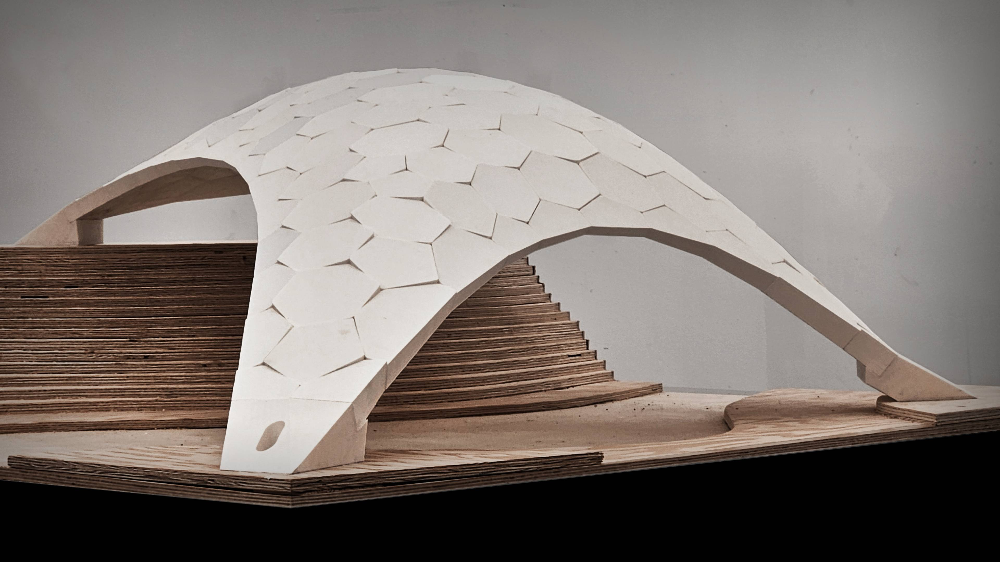
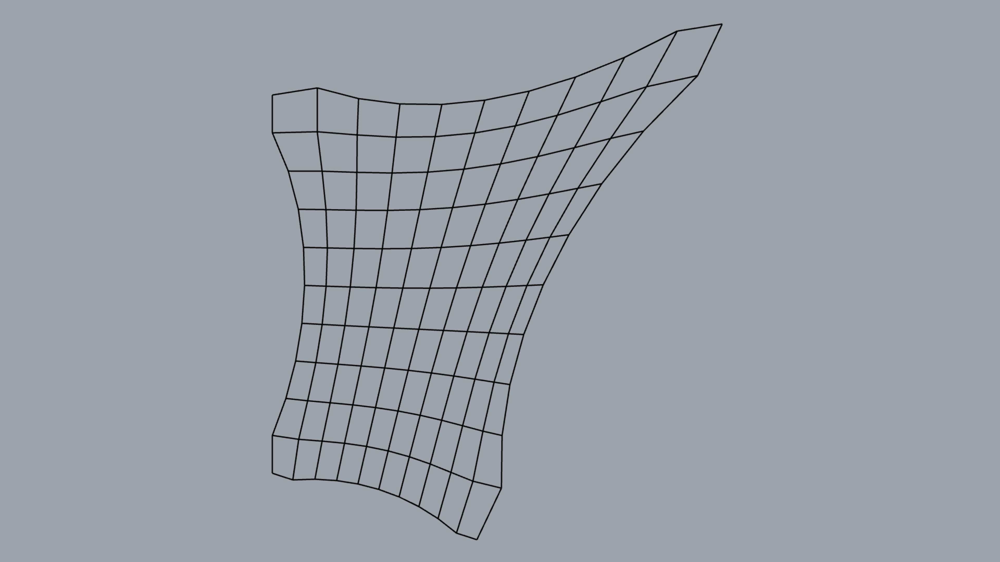

# Materialization

## Aim

<figure><figcaption></figcaption></figure>

The aim of this tutorial is to convert RhinoVault data into solid geometry to facilitate the creation of simple physical models. Most often, this step is used for teaching purposes when models or small prototypes are built. The tutorial uses the Rhino ScriptEditor Python interface to extract data from a RhinoVault session file. Multiple mesh-based operations are then used to transform the geometry into solid blocks with shear keys and indices. Run the code below sequentially one-by-one because each step is serialized into a JSON file that is used as a starting point in the consecutive step.



## RhinoVault Session

The session file is a JSON file of compas.scene with the following items: `Pattern`, `FormDiagram`, `ThrustDiagram`, `ForceDiagram`. It also stores general settings for drawing and thrust-network-analysis. We will use two attributes: `Pattern` and `ThrustDiagram` for mesh transformation into solid blocks.

There first three comments is specific to Python in Rhino indication a) `python3` language is used, b) code is written `brg-csd` environment, and c) `compas_rv` library must be installable from the python package index (PyPI).

The `scene` is used both for storing and visualising COMPAS items (geometry & datastructures).

<figure><figcaption></figcaption></figure>


```python
#! python3
# venv: brg-csd
# r: compas_rv

import pathlib
import compas
from compas.scene import Scene

# =============================================================================
# Load data
# =============================================================================
IFILE = pathlib.Path(__file__).parent.parent / "data" / "shell_final.json"
rv_session = compas.json_load(IFILE)
rv_scene: Scene = rv_session["scene"]
pattern = rv_scene.find_by_name("Pattern").mesh

# =============================================================================
# Visualisation
# =============================================================================
scene = Scene()
scene.clear_context()
scene.add(rv_scene.find_by_name("Pattern").mesh)
scene.draw()

