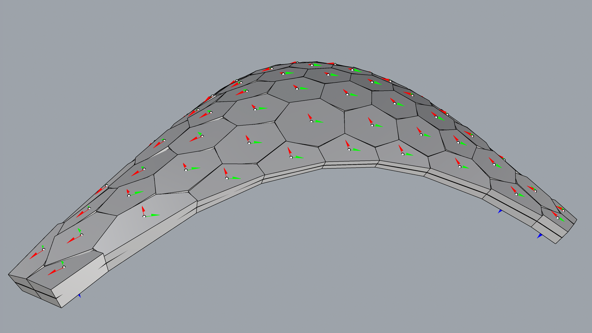

# Materialization

<figure><figcaption></figcaption></figure>

The aim of this tutorial is to convert a RhinoVault session (a JSON file with a scene data structure) into solid geometry to facilitate the creation of simple physical models. This step is often used for teaching purposes when building models or small prototypes. The tutorial uses the Rhino ScriptEditor Python interface to extract data from a RhinoVault session file, attached below. Multiple mesh-based operations are then used to transform the geometry into solid blocks with shear keys and indices.



If you want to directly run all scripts of this page, you can download them from here:



## Rhino Script Editor and RhinoVault Session 

<figure><figcaption></figcaption></figure>

Create a folder where you will store the `rhinovault_session.json` file as well as python example files. Then open Rhino Script Editor. Add a new python file named `000.pattern.py`. Then run the code below that extracts the 2D mesh pattern from the session file.

The session file employs the compas.scene data structure for storing: Pattern, FormDiagram, ThrustDiagram, and ForceDiagram. It also stores general settings for drawing and thrust-network analysis. We will use two attributes: Pattern and ThrustDiagram for mesh transformation into solid blocks. The scene also helps to visualize COMPAS items (geometry & data structures).

The first three comments are specific to Python in Rhino, indicating: a) `python3` specifies the language used, b) the code is written in the `brg-csd` environment, and c) `compas_rv` is a library requirement that must be installable from the Python Package Index (PyPI).


```python
#! python3
# venv: brg-csd
# r: compas_rv

import pathlib
import compas
from compas.scene import Scene

# =============================================================================
# Load data
# =============================================================================
IFILE = pathlib.Path(__file__).parent / "rhinovault_session.json"
rv_session = compas.json_load(IFILE)
rv_scene: Scene = rv_session["scene"]
pattern = rv_scene.find_by_name("Pattern").mesh

# =============================================================================
# Visualisation
# =============================================================================
scene = Scene()
scene.clear_context()
scene.add(rv_scene.find_by_name("Pattern").mesh)
scene.draw()
```

## 1. Mesh from Thrust Diagram

<figure><figcaption></figcaption></figure>

Let's create file called `001_thrust_diagram.py` in the script editor. The thrust diagram's mesh attribute is used as the base mesh for materialization. We need to delete mesh faces with the attribute `_is_loaded==False`, marked in red. After deletion, we will split the list of boundary vertices by support vertices and store them in the `borders` attribute. We will also store support points in the `supports` attribute. Be aware that the script does not handle multiple boundaries, and you may need to make your own modifications for other cases if the mesh topology is different. Finally, the mesh is serialized into JSON file called `001_mesh.json`.

In this step we will extract thrust-diagram.

```python
#! python3
# venv: brg-csd
# r: compas_rv

import pathlib

import compas
from compas.datastructures import Mesh
from compas.scene import Scene
from compas_tna.diagrams import FormDiagram
from compas import json_dump
from compas.itertools import pairwise


def break_boundary(mesh: Mesh, breakpoints: list[int]) -> tuple[list[list[int]], list[int]]:

    # Get the list of vertices on the boundary (first boundary from the mesh)
    # If the first and last vertices in the boundary are the same, remove the last vertex (close loop)
    boundary: list[int] = mesh.vertices_on_boundaries()[0]
    
    if boundary[0] == boundary[-1]:
        del boundary[-1]

    # Sort the breakpoints based on their index in the boundary
    # Find the starting point in the boundary for the first breakpoint
    # Rearrange the boundary to start from the first breakpoint
    breakpoints = sorted(breakpoints, key=lambda s: boundary.index(s))
    start = boundary.index(breakpoints[0])
    boundary = boundary[start:] + boundary[:start]

    # Iterate over pairs of breakpoints and create sub-boundaries from the main boundary
    borders = []
    
    for a, b in pairwise(breakpoints):
        start = boundary.index(a)  # Find index of the first breakpoint in the boundary
        end = boundary.index(b)    # Find index of the second breakpoint in the boundary
        borders.append(boundary[start : end + 1])  # Add the sub-boundary from start to end

    # Add the last segment from the last breakpoint to the first one to close the loop
    borders.append(boundary[end:] + boundary[:1])

    # Return the sub-boundaries and the breakpoints
    return borders, breakpoints


# =============================================================================
# Load data
# =============================================================================

IFILE = pathlib.Path(__file__).parent / "rhinovault_session.json"

rv_session = compas.json_load(IFILE)
rv_scene: Scene = rv_session["scene"]

thrustobject = rv_scene.find_by_name("ThrustDiagram")
thrustdiagram: FormDiagram = thrustobject.mesh

# =============================================================================
# Mesh
#
# - make a copy of the thrustdiagram
# - remove the "TNA" faces cooresponding to boundary openings
# - compute the average edge length for remeshing
# =============================================================================

mesh: Mesh = thrustdiagram.copy(cls=Mesh)

for face in list(mesh.faces_where(_is_loaded=False)):
    mesh.delete_face(face)

# =============================================================================
# Mesh: Borders
# =============================================================================

supports = list(mesh.vertices_where(is_support=True))
borders, supports = break_boundary(mesh, supports)
print(borders)
print(supports)

mesh.attributes["supports"] = supports
mesh.attributes["borders"] = borders

# =============================================================================
# Serialize
# =============================================================================

json_dump(mesh, pathlib.Path(__file__).parent / "001_mesh.json")

# =============================================================================
# Visualisation
# =============================================================================

scene = Scene()
# scene.clear_context()
scene.add(mesh)
scene.draw()
```

## 2. Remesh

<figure><figcaption></figcaption></figure>

The thrust mesh is remeshed to achieve a uniform triangulated topology and obtain a 3-valence mesh for the dual. If we were to create a dual mesh from the original quad mesh, the result would be a quad mesh, which is unsuitable for our chosen fabrication method. Three-valence meshes are easier to assemble and may have fewer tolerance issues when multiple blocks meet at the same edge or corner. Originally the mesh was remeshed using CGAL library in Visual Studio Code, but for the purpose of demonstration we are using COMPAS remesh method in Rhino ScripEditor.


```python
#! python3
# venv: brg-csd
# r: compas_rv

import pathlib

import compas
from compas.datastructures import Mesh
from compas.scene import Scene
from compas import json_dump
from compas.datastructures.mesh.remesh import trimesh_remesh
from compas.geometry import Line
from compas.geometry import normal_triangle
from compas.geometry import KDTree
from compas_model.geometry import intersection_ray_triangle

# =============================================================================
# Load data
# =============================================================================

IFILE = pathlib.Path(__file__).parent / "001_mesh.json"
mesh = compas.json_load(IFILE)

# =============================================================================
# Trimesh
#
# - convert a copy of the mesh to a trimesh using "quads to triangles"
# - note that this doesn't work for other patterns
# =============================================================================

trimesh: Mesh = mesh.copy()
trimesh.quads_to_triangles()

# =============================================================================
# Trimesh: Remeshing
#
# - remesh using CGAL
# - use a percentage of the average edge length of the original mesh as target length
# =============================================================================


length = sum(mesh.edge_length(edge) for edge in mesh.edges()) / mesh.number_of_edges()

def project(mesh: Mesh, k, args):
    for vertex in mesh.vertices():
        if mesh.is_vertex_on_boundary(vertex):
            continue
        point = mesh.vertex_point(vertex)
        _, nbr, _ = tree.nearest_neighbor(point)
        triangles = vertex_triangles[nbr]
        for triangle in triangles:
            normal = normal_triangle(triangle)
            ray = Line.from_point_direction_length(point, normal, 10)
            result = intersection_ray_triangle(ray, triangle)
            if result:
                mesh.vertex_attributes(vertex, "xyz", result)
                break

vertex_index = {vertex: index for index, vertex in enumerate(trimesh.vertices())}
vertex_triangles = {vertex_index[vertex]: [trimesh.face_points(face) for face in trimesh.vertex_faces(vertex)] for vertex in trimesh.vertices()}
vertices = trimesh.vertices_attributes("xyz")
tree = KDTree(vertices)

fixed = list(trimesh.vertices_on_boundary())
free = set(list(trimesh.vertices())) - set(fixed)

trimesh_remesh(trimesh, length, kmax=300, tol=0.1, allow_boundary_split=False, callback=project)


# =============================================================================
# Serialize
# =============================================================================

json_dump(trimesh, pathlib.Path(__file__).parent / "002_mesh.json")

# =============================================================================
# Visualisation
# =============================================================================

scene = Scene()
scene.clear_context()
scene.add(trimesh)
scene.draw()

```

## 3. Dual

<figure><figcaption></figcaption></figure>

The dual is created from a triangular mesh. Note the boundary faces with an additional 2-valence boundary vertex. This vertex is removed in the next step to achieve cleaner polygonal blocks.

```python
#! python3
# venv: brg-csd
# r: compas_rv

import pathlib

import compas
from compas.datastructures import Mesh
from compas.scene import Scene
from compas import json_dump

# =============================================================================
# Load data
# =============================================================================

IFILE = pathlib.Path(__file__).parent / "002_mesh.json"
trimesh = compas.json_load(IFILE)

# =============================================================================
# Dual
#
# - construct a dual
# - update default attributes
# - flip the cycles because a dual has opposite cycles compared to the original
# =============================================================================

dual: Mesh = trimesh.dual(include_boundary=True)

dual.update_default_edge_attributes(is_support=False)
dual.update_default_face_attributes(number=None, batch=None)
dual.update_default_vertex_attributes(thickness=0, is_corner=False, is_support=False)

dual.flip_cycles()


# =============================================================================
# Serialize
# =============================================================================

json_dump(dual, pathlib.Path(__file__).parent / "003_mesh.json")

# =============================================================================
# Visualisation
# =============================================================================

scene = Scene()
scene.clear_context()
scene.add(dual, show_vertices=True)
scene.draw()
```

## 4. Dual Corners

<figure><figcaption></figcaption></figure>

To improve the structure of the dual mesh, a process is carried out to reconnect its corners. First, a KD tree is constructed to efficiently search for the nearest neighbors. Then, the closest vertices in the dual mesh to the supports of the original mesh are identified. These vertices are then adjusted to match the exact locations of the supports. Finally, the corresponding vertices are marked as "corners" to maintain structural integrity. This ensures a more stable and precise dual mesh.

```python
#! python3
# venv: brg-csd
# r: compas_rv

import pathlib

import compas
from compas.scene import Scene
from compas import json_dump
from compas.geometry import KDTree
from compas.geometry import Sphere

# =============================================================================
# Load data
# =============================================================================

IFILE = pathlib.Path(__file__).parent / "003_mesh.json"
dual = compas.json_load(IFILE)

IFILE = pathlib.Path(__file__).parent / "001_mesh.json"
mesh = compas.json_load(IFILE)

# =============================================================================
# Dual: Reconnect corners
#
# - construct a KD tree for nearest neighbour search
# - find the nearest neighbours in the dual to the supports of the original
# - snap the dual vertices to the location of the supports
# - mark the corresponding vertices as "corners"
# =============================================================================

vertices = dual.vertices_attributes("xyz")
vertex_index = {vertex: index for index, vertex in enumerate(dual.vertices())}
index_vertex = {index: vertex for index, vertex in enumerate(dual.vertices())}
tree = KDTree(vertices)

spheres = []
for vertex in mesh.vertices_where(is_support=True):
    point = mesh.vertex_point(vertex)
    closest, nnbr, distance = tree.nearest_neighbor(point)
    dual_vertex = index_vertex[nnbr]
    if distance > 5:
        dual.vertex_attributes(dual_vertex, names="xyz", values=point)
    dual.vertex_attribute(dual_vertex, name="is_corner", value=True)
    spheres.append(Sphere(10, point=point))


# =============================================================================
# Serialize
# =============================================================================

json_dump(dual, pathlib.Path(__file__).parent / "004_mesh.json")

# =============================================================================
# Visualisation
# =============================================================================

scene = Scene()
scene.clear_context()
scene.add(dual, show_vertices=True)
for sphere in spheres:
    scene.add(sphere)
scene.draw()

```

## 5. Dual Simplification

<figure><figcaption></figcaption></figure>

This script processes a dual mesh by identifying and collapsing unnecessary 2-valent boundary edges. It iterates through the boundary vertices, checking if they have exactly two neighbors. If the angle between the two edges is close to 180°, the vertex is removed, merging the edges while ensuring that any "corner" attributes are preserved. 


```python

#! python3
# venv: brg-csd
# r: compas_rv

import pathlib

import compas
from compas.scene import Scene
from compas import json_dump

# =============================================================================
# Load data
# =============================================================================

IFILE = pathlib.Path(__file__).parent / "004_mesh.json"
dual = compas.json_load(IFILE)

# =============================================================================
# Dual: Collapse 2-valent boundary edges
# =============================================================================

tofix = []

for vertex in dual.vertices_on_boundary():
    if dual.vertex_degree(vertex) > 2:
        continue
    tofix.append(vertex)

for vertex in tofix:
    nbrs = dual.vertex_neighbors(vertex)
    v0 = dual.edge_vector((vertex, nbrs[0]))
    v1 = dual.edge_vector((vertex, nbrs[1]))
    angle = v0.angle(v1, degrees=True)

    if abs(angle - 180) > 30:
        continue

    if dual.has_edge((vertex, nbrs[0])):
        is_corner = dual.vertex_attribute(nbrs[0], name="is_corner")
        dual.collapse_edge((vertex, nbrs[0]), t=1, allow_boundary=True)
    else:
        is_corner = dual.vertex_attribute(nbrs[1], name="is_corner")
        dual.collapse_edge((vertex, nbrs[1]), t=1, allow_boundary=True)

    if is_corner:
        dual.vertex_attribute(vertex, name="is_corner", value=True)

# =============================================================================
# Serialize
# =============================================================================

json_dump(dual, pathlib.Path(__file__).parent / "005_mesh.json")

# =============================================================================
# Visualisation
# =============================================================================

scene = Scene()
scene.clear_context()
scene.add(dual, show_vertices=True)
scene.draw()

```

## 6. Dual Boundary Smoothing

<figure><figcaption></figcaption></figure>

This script performs boundary smoothing on a dual mesh. It begins by loading the original (001_mesh.json) and dual (005_mesh.json) meshes. It then identifies corner vertices and segments the boundary into separate borders. For each border, a NURBS curve is generated using interpolation to create a smoother boundary shape. The script then adjusts the positions of boundary vertices by snapping them to the closest points on their respective curves.


```python

#! python3
# venv: brg-csd
# r: compas_rv

import pathlib

import compas
from compas.datastructures import Mesh
from compas.geometry import NurbsCurve
from compas.itertools import pairwise
from compas.scene import Scene
from compas import json_dump


def break_boundary(mesh: Mesh, breakpoints: list[int]) -> tuple[list[list[int]], list[int]]:
    boundary: list[int] = mesh.vertices_on_boundaries()[0]
    if boundary[0] == boundary[-1]:
        del boundary[-1]

    breakpoints = sorted(breakpoints, key=lambda s: boundary.index(s))

    start = boundary.index(breakpoints[0])
    boundary = boundary[start:] + boundary[:start]

    borders = []
    for a, b in pairwise(breakpoints):
        start = boundary.index(a)
        end = boundary.index(b)
        borders.append(boundary[start : end + 1])
    borders.append(boundary[end:] + boundary[:1])

    return borders, breakpoints


# =============================================================================
# Load data
# =============================================================================


IFILE = pathlib.Path(__file__).parent / "001_mesh.json"
mesh = compas.json_load(IFILE)

IFILE = pathlib.Path(__file__).parent / "005_mesh.json"
dual = compas.json_load(IFILE)


# =============================================================================
# Dual: Boundary smoothing
# =============================================================================

corners = list(dual.vertices_where(is_corner=True))
borders, corners = break_boundary(dual, corners)

curves: list[NurbsCurve] = []
for border in borders:
    vertices = border[::2] if len(border) > 4 else border
    points = dual.vertices_points(vertices=vertices)
    curve: NurbsCurve = NurbsCurve.from_interpolation(points, precision=1)
    curves.append(curve)

for border, curve in zip(borders, curves):
    for vertex in border[1:-1]:
        nbrs = dual.vertex_neighbors(vertex)
        for nbr in nbrs:
            if nbr not in border:
                point = dual.vertex_point(nbr)
                closest = curve.closest_point(point)
                dual.vertex_attributes(vertex, "xyz", closest)
                break

# =============================================================================
# Serialize
# =============================================================================

json_dump(dual, pathlib.Path(__file__).parent / "006_mesh.json")

# =============================================================================
# Visualisation
# =============================================================================

scene = Scene()
scene.clear_context()
scene.add(dual)
scene.draw()


```


## 7. Dual Edge Collapse

<figure><figcaption></figcaption></figure>

This script performs edge collapse operations on a dual mesh to simplify its boundary. It identifies boundary edges that are not connected to corner vertices and checks if they belong to quadrilateral faces. If so, it selects pairs of opposite edges for collapse. The selected edges are collapsed, reducing the number of boundary edges while maintaining the mesh structure. 


```python

#! python3
# venv: brg-csd
# r: compas_rv

import pathlib

import compas
from compas.datastructures import Mesh
from compas.itertools import pairwise
from compas.scene import Scene
from compas import json_dump
from compas.geometry import Line


def break_boundary(mesh: Mesh, breakpoints: list[int]) -> tuple[list[list[int]], list[int]]:
    boundary: list[int] = mesh.vertices_on_boundaries()[0]
    if boundary[0] == boundary[-1]:
        del boundary[-1]

    breakpoints = sorted(breakpoints, key=lambda s: boundary.index(s))

    start = boundary.index(breakpoints[0])
    boundary = boundary[start:] + boundary[:start]

    borders = []
    for a, b in pairwise(breakpoints):
        start = boundary.index(a)
        end = boundary.index(b)
        borders.append(boundary[start : end + 1])
    borders.append(boundary[end:] + boundary[:1])

    return borders, breakpoints


# =============================================================================
# Load data
# =============================================================================


IFILE = pathlib.Path(__file__).parent / "006_mesh.json"
dual = compas.json_load(IFILE)

# =============================================================================
# Dual: Edge collapse
# =============================================================================

tocollapse = []
lines = []

for u, v in dual.edges_on_boundary():
    if dual.vertex_attribute(u, "is_corner") or dual.vertex_attribute(v, "is_corner"):
        continue
    face = dual.halfedge_face((v, u))
    vertices = dual.face_vertices(face)
    if len(vertices) == 4:
        vv = dual.face_vertex_ancestor(face, v)
        uu = dual.face_vertex_descendant(face, u)
        tocollapse.append((u, v))
        tocollapse.append((uu, vv))

for u, v in tocollapse:
    lines.append(Line(dual.vertex_coordinates(u), dual.vertex_coordinates(v)))
    dual.collapse_edge((u, v), allow_boundary=True)

# =============================================================================
# Serialize
# =============================================================================

json_dump(dual, pathlib.Path(__file__).parent / "007_mesh.json")

# =============================================================================
# Visualisation
# =============================================================================

scene = Scene()
scene.clear_context()
scene.add(dual)
for line in lines:
    scene.add(line)
scene.draw()


```

## 8. Dual Borders

<figure><figcaption></figcaption></figure>

This script processes the borders of a dual mesh by identifying and marking support edges. It detects corner vertices to segment the boundary into smaller borders. If a border has fewer than five vertices, its vertices and edges are marked as "supports." The identified support edges are visualized as green cylinders in the scene.


```python

#! python3
# venv: brg-csd
# r: compas_rv

import pathlib

import compas
from compas.datastructures import Mesh
from compas.itertools import pairwise
from compas.geometry import Cylinder, Frame, Plane
from compas.scene import Scene
from compas import json_dump


def break_boundary(mesh: Mesh, breakpoints: list[int]) -> tuple[list[list[int]], list[int]]:
    boundary: list[int] = mesh.vertices_on_boundaries()[0]
    if boundary[0] == boundary[-1]:
        del boundary[-1]

    breakpoints = sorted(breakpoints, key=lambda s: boundary.index(s))

    start = boundary.index(breakpoints[0])
    boundary = boundary[start:] + boundary[:start]

    borders = []
    for a, b in pairwise(breakpoints):
        start = boundary.index(a)
        end = boundary.index(b)
        borders.append(boundary[start : end + 1])
    borders.append(boundary[end:] + boundary[:1])

    return borders, breakpoints


# =============================================================================
# Load data
# =============================================================================


IFILE = pathlib.Path(__file__).parent / "007_mesh.json"
dual = compas.json_load(IFILE)

# =============================================================================
# Dual: Borders
# =============================================================================

corners = list(dual.vertices_where(is_corner=True))
borders, corners = break_boundary(dual, corners)

lines = []
for border in borders:
    if len(border) < 5:
        dual.vertices_attribute(name="is_support", value=True)
        for edge in pairwise(border):
            dual.edge_attribute(edge, name="is_support", value=True)
            lines.append(dual.edge_line(edge))


# =============================================================================
# Serialize
# =============================================================================

json_dump(dual, pathlib.Path(__file__).parent / "008_mesh.json")

# =============================================================================
# Visualisation
# =============================================================================

scene = Scene()
scene.clear_context()
scene.add(dual)
for line in lines:
    plane = Plane(line.midpoint, line.direction)
    frame = Frame.from_plane(plane)
    cylinder = Cylinder(10, line.length, frame)
    scene.add(cylinder, color=(0, 255, 0))
scene.draw()


```

## 9. Dual Thickness Data

<figure><figcaption></figcaption></figure>

This script interpolates and assigns thickness values to a dual mesh using a grid-based method. It starts by loading the original (001_mesh.json) and dual (008_mesh.json) meshes. Key support points and midspan vertices are identified based on height, with predefined thickness values assigned to them. Using SciPy's griddata, thickness values are interpolated for all dual mesh vertices. The updated thickness values are stored in the mesh, and the result is visualized with red spheres representing the assigned thickness at each vertex.


```python

#! python3
# venv: brg-csd
# r: compas_rv

import pathlib

import compas
from compas.scene import Scene
from scipy.interpolate import griddata
from compas import json_dump
from compas.geometry import Sphere

# =============================================================================
# Load data
# =============================================================================

IFILE = pathlib.Path(__file__).parent / "001_mesh.json"
mesh = compas.json_load(IFILE)

IFILE = pathlib.Path(__file__).parent / "008_mesh.json"
dual = compas.json_load(IFILE)

# =============================================================================
# Blocks: Thickness interpolation griddata
# =============================================================================

points = []
values = []

supports_by_height = sorted(mesh.attributes["supports"], key=lambda v: mesh.vertex_attribute(v, "z"))

for support in supports_by_height[:4]:
    points.append(mesh.vertex_attributes(support, "xy"))
    values.append(30)

for support in supports_by_height[4:]:
    points.append(mesh.vertex_attributes(support, "xy"))
    values.append(20)

for border in mesh.attributes["borders"]:
    if len(border) > 4:
        midspan = border[len(border) // 2]
        points.append(mesh.vertex_attributes(midspan, "xy"))
        values.append(15)

vertices_by_height = sorted(mesh.vertices(), key=lambda v: mesh.vertex_attribute(v, "z"))

for vertex in vertices_by_height[-5:]:
    points.append(mesh.vertex_attributes(vertex, "xy"))
    values.append(10)

# =============================================================================
# Blocks: Thickness interpolation sampling
# =============================================================================

samples = dual.vertices_attributes("xy")
thickness = griddata(points, values, samples)

points = []
weights = []
for vertex, t in zip(dual.vertices(), thickness):
    dual.vertex_attribute(vertex, "thickness", t)
    points.append(dual.vertex_point(vertex))
    weights.append(t)


# =============================================================================
# Serialize
# =============================================================================

json_dump(dual, pathlib.Path(__file__).parent / "009_mesh.json")

# =============================================================================
# Visualisation
# =============================================================================

scene = Scene()
scene.clear_context()
scene.add(dual)
for idx, point in enumerate(points):
    print(weights[idx] / 2)
    sphere = Sphere(point=point, radius=weights[idx] / 2)
    scene.add(sphere, color=(255, 0, 0))
scene.draw()


```

## 10. Blocks

<figure><figcaption></figcaption></figure>

This script generates 3D block representations of a dual mesh by extruding its faces based on thickness values. It iterates through its faces to construct block geometries. For each face, vertex normals and thickness values are used to create bottom and top surfaces, with the top surface adjusted to fit a best-fit plane. The sides of the block are then generated to enclose the volume. Support attributes are assigned to relevant faces, and top and bottom frames are computed for each block. The blocks are visualized with color-coded support faces and frame markers.


```python

#! python3
# venv: brg-csd
# r: compas_rv

import pathlib

import compas
from compas.colors import Color
from compas.datastructures import Mesh
from compas.geometry import Line
from compas.geometry import Plane
from compas.geometry import Polygon
from compas.geometry import Frame
from compas.geometry import bestfit_plane_numpy
from compas.itertools import pairwise
from compas.scene import Scene
from compas import json_dump

# =============================================================================
# Load data
# =============================================================================


IFILE = pathlib.Path(__file__).parent / "009_mesh.json"
dual = compas.json_load(IFILE)

# =============================================================================
# Blocks
# =============================================================================

blocks = []

for face in dual.faces():
    vertices = dual.face_vertices(face)
    normals = [dual.vertex_normal(vertex) for vertex in vertices]
    thickness = dual.vertices_attribute("thickness", keys=vertices)

    middle = dual.face_polygon(face)
    bottom = [point - vector * (0.5 * t) for point, vector, t in zip(middle, normals, thickness)]
    top = [point + vector * (0.5 * t) for point, vector, t in zip(middle, normals, thickness)]

    plane = Plane(*bestfit_plane_numpy(top))

    flattop = []
    for a, b in zip(bottom, top):
        b = plane.intersection_with_line(Line(a, b))
        flattop.append(b)

    sides = []
    for (a, b), (aa, bb) in zip(pairwise(bottom + bottom[:1]), pairwise(flattop + flattop[:1])):
        sides.append([a, b, bb, aa])

    polygons = [bottom[::-1]] + [flattop] + sides

    block = Mesh.from_polygons(polygons)
    block.update_default_face_attributes(is_support=False, is_interface=False)

    for index, (u, v) in enumerate(pairwise(vertices + vertices[:1])):
        is_support = dual.edge_attribute((u, v), name="is_support")
        if is_support:
            block.face_attribute(2 + index, "is_support", True)

    blocks.append(block)
    dual.face_attribute(face, "block", block)

    top_frame = Frame.from_plane(Plane.from_points(flattop))
    top_frame.flip()
    dual.face_attribute(face, "top_frame", top_frame)

    bottom_frame = Frame.from_plane(Plane.from_points(bottom))
    bottom_frame.flip()
    dual.face_attribute(face, "bottom_frame", bottom_frame)


# =============================================================================
# Serialize
# =============================================================================

json_dump(dual, pathlib.Path(__file__).parent / "010_mesh.json")

# =============================================================================
# Visualisation
# =============================================================================

scene = Scene()
scene.clear_context()
scene.add(dual)
for block in blocks:
    scene.add(block, facecolor={face: Color.red() for face in block.faces_where(is_support=True)})
for face in dual.faces():
    scene.add(dual.face_attribute(face, "top_frame"), scale=20)
    scene.add(dual.face_attribute(face, "bottom_frame"), scale=20)
scene.draw()


```

## 11. Chamfer

<figure><figcaption></figcaption></figure>

This script applies chamfering to the edges of a dual mesh to refine its geometry. It iterates through internal vertices, identifying neighboring edges and checking their angles. If the angle between adjacent edges is below a set threshold (145°), a chamfering operation is applied using a cutting plane offset by 2 units. The modified blocks replace the original ones. The final result is visualized, displaying the adjusted blocks.


```python

#! python3
# venv: brg-csd
# r: compas_rv

import pathlib

import compas
from compas.datastructures import Mesh
from compas.geometry import Plane
from compas.scene import Scene
from compas import json_dump

# =============================================================================
# Load data
# =============================================================================

IFILE = pathlib.Path(__file__).parent / "010_mesh.json"
dual = compas.json_load(IFILE)

# =============================================================================
# Chamfering
# =============================================================================

MAX_CHAMFER_ANGLE = 145
CHAMFER_OFFSET = 2

face_block = {face: dual.face_attribute(face, "block").copy() for face in dual.faces()}

for vertex in dual.vertices():
    if dual.is_vertex_on_boundary(vertex):
        continue

    point = dual.vertex_point(vertex)
    normal = dual.vertex_normal(vertex)
    plane = Plane(point, normal)

    nbrs = dual.vertex_neighbors(vertex, ordered=True)

    for index, nbr in enumerate(nbrs):
        ancestor = nbrs[index - 1]
        left = plane.projected_point(dual.vertex_point(ancestor))
        right = plane.projected_point(dual.vertex_point(nbr))
        v1 = (left - plane.point).unitized()
        v2 = (right - plane.point).unitized()
        if v1.angle(v2, degrees=True) > MAX_CHAMFER_ANGLE:
            continue

        direction = (v1 + v2).unitized()
        cutter = Plane(plane.point, direction).offset(CHAMFER_OFFSET)

        face = dual.halfedge_face((vertex, nbr))
        temp: Mesh = face_block[face]
        a, b = temp.slice(cutter)
        face_block[face] = a

for face in dual.faces():
    dual.face_attribute(face, "block", face_block[face])

# =============================================================================
# Serialize
# =============================================================================

json_dump(dual, pathlib.Path(__file__).parent / "011_mesh.json")

# =============================================================================
# Visualisation
# =============================================================================

scene = Scene()
scene.clear_context()
for block in face_block.values():
    scene.add(block)
scene.draw()


```


## 12. Shear Keys

<figure><figcaption></figcaption></figure>

This script modifies a dual mesh by adding spherical joinery at edge intersections between adjacent blocks. It first converts each face block into a Brep for more stable Boolean operations. Then, for each edge shared by two faces, it creates two spheres along the edge at 30% and 70% of its length. The first set of spheres (2.5 radius) is subtracted from one block, while a slightly smaller set (2.3 radius) is added to the other, forming a complementary joinery system. Finally, the updated blocks are visualized along with the dual mesh.

```python

#! python3
# venv: brg-csd
# r: compas_rv

import pathlib

import compas
from compas.datastructures import Mesh
from compas.geometry import Frame, Sphere, Brep
from compas.scene import Scene

# =============================================================================
# Load data
# =============================================================================

IFILE = pathlib.Path(__file__).parent / "011_mesh.json"
dual: Mesh = compas.json_load(IFILE)

block_breps = {face: Brep.from_mesh(dual.face_attribute(face, "block")) for face in dual.faces()}


# =============================================================================
# Making Sphere Joinery
# =============================================================================

for edge in dual.edges():
    face1, face2 = dual.edge_faces(edge)
    if face1 is not None and face2 is not None:
        line = dual.edge_line(edge)
        z_axis = line.direction
        x_axis = dual.vertex_normal(edge[0]) + dual.vertex_normal(edge[1])
        y_axis = x_axis.cross(z_axis)

        # Create frames at 0.3 and 0.7 along the edge
        p1 = line.point_at(0.3)
        p2 = line.point_at(0.7)

        sphere1a = Sphere(2.5, point=p1)
        sphere1b = Sphere(2.5, point=p2)

        sphere2a = Sphere(2.3, point=p1)
        sphere2b = Sphere(2.3, point=p2)

        block1 = block_breps[face1]
        block2 = block_breps[face2]

        # make two spheres along the edge
        block1 = block1 - sphere1a.to_brep()
        block1 = block1 - sphere1b.to_brep()
        block2 = block2 + sphere2a.to_brep()
        block2 = block2 + sphere2b.to_brep()

        block_breps[face1] = block1
        block_breps[face2] = block2

# =============================================================================
# Visualisation
# =============================================================================

scene = Scene()
scene.clear_context()
scene.add(dual)
for block in block_breps.values():
    scene.add(block)
scene.draw()


```

## 13. Index and Packing

<figure><figcaption></figcaption></figure>

This script generates 3D index labels for each block, displaying their positions directly in Rhino. Additionally, it packs the blocks into a grid layout, making them easier to visualize, organize, and manufacture. The result is a structured, fabrication-ready representation of the geometry. The joinery is regenerated in this script because serialization to a JSON file is not currently supported for BRep—only the STEP format allows it.

```python

#! python3
# venv: brg-csd
# r: compas_rv

import pathlib

import compas
from compas.datastructures import Mesh
from compas.geometry import Frame, Sphere, Brep, Transformation
from compas_rhino.conversions import frame_to_rhino_plane
from compas.scene import Scene
import rhinoscriptsyntax as rs
import Rhino.Geometry as rg
import scriptcontext as sc


scene = Scene()
scene.clear_context()

# =============================================================================
# Load data
# =============================================================================

IFILE = pathlib.Path(__file__).parent / "011_mesh.json"
dual: Mesh = compas.json_load(IFILE)

block_breps = {face: Brep.from_mesh(dual.face_attribute(face, "block")) for face in dual.faces()}


# =============================================================================
# Making Sphere Joinery
# =============================================================================

for edge in dual.edges():
    face1, face2 = dual.edge_faces(edge)
    if face1 is not None and face2 is not None:
        line = dual.edge_line(edge)
        z_axis = line.direction
        x_axis = dual.vertex_normal(edge[0]) + dual.vertex_normal(edge[1])
        y_axis = x_axis.cross(z_axis)

        # Create frames at 0.3 and 0.7 along the edge
        p1 = line.point_at(0.3)
        p2 = line.point_at(0.7)

        sphere1a = Sphere(2.5, point=p1)
        sphere1b = Sphere(2.5, point=p2)

        sphere2a = Sphere(2.3, point=p1)
        sphere2b = Sphere(2.3, point=p2)

        block1 = block_breps[face1]
        block2 = block_breps[face2]

        # make two spheres along the edge
        block1 = block1 - sphere1a.to_brep()
        block1 = block1 - sphere1b.to_brep()
        block2 = block2 + sphere2a.to_brep()
        block2 = block2 + sphere2b.to_brep()

        block_breps[face1] = block1
        block_breps[face2] = block2

# =============================================================================
# Create Index Texts
# =============================================================================


def create_3d_text(text, plane, group_name, height=8.0, extrusion_distance=0.5):
    """Create 3D text geometry in Rhino and add it to a group.

    Args:
        text (str): The text to create
        plane: Rhino plane for text placement
        group_name (str): Name of the group to add text objects to
        height (float): Text height
        extrusion_distance (float): Depth of the 3D text

    Returns:
        list: List of COMPAS Brep objects representing the 3D text
    """
    # Create 2D text
    text_obj = rs.AddText(text, plane, height, justification=2)

    # Explode text into curves
    text_curves = rs.ExplodeText(text_obj, True)

    # Create surfaces from the curves
    text_surfaces = rs.AddPlanarSrf(text_curves)

    # Convert surfaces to Rhino geometry
    rhino_surfaces = [rs.coercesurface(srf) for srf in text_surfaces]

    # Create extruded 3D text
    text_3d = []

    for srf in rhino_surfaces:
        brep = rg.Brep.CreateFromOffsetFace(srf, extrusion_distance, 0.01, True, True)
        text_3d.append(sc.doc.Objects.AddBrep(brep))

    # Clean up temporary objects
    rs.DeleteObjects(text_curves + text_surfaces + [text_obj])

    # Group the 3D text objects
    rs.AddObjectsToGroup(text_3d, group_name)


rs.AddGroup("index_in_place")
for i, face in enumerate(dual.faces()):
    top_frame = dual.face_attribute(face, "top_frame").copy()
    top_frame.flip()
    plane = frame_to_rhino_plane(top_frame)
    create_3d_text(str(i), plane, "index_in_place")

# =============================================================================
# Packing
# =============================================================================

# Create a grid layout for the blocks
grid_size = 120  # spacing between blocks
blocks_per_row = int(len(block_breps) ** 0.5) + 1  # approximate square grid

rs.AddGroup("index_packed")

blocks_transformed = []
for i, face in enumerate(dual.faces()):

    block = block_breps[face]

    top_face_frame = dual.face_attribute(face, "top_frame")

    # Calculate grid position
    row = i // blocks_per_row
    col = i % blocks_per_row

    # Create target frame with Z pointing up (top face will be down)
    target_point = [col * grid_size + 1200, row * grid_size, 0]
    target_frame = Frame.worldXY()
    target_frame.point = target_point

    T = Transformation.from_frame_to_frame(top_face_frame, target_frame)
    blocks_transformed.append(block.transformed(T))

    # Add index text
    bottom_frame = dual.face_attribute(face, "bottom_frame")
    bottom_frame_packed = bottom_frame.transformed(T)
    plane = frame_to_rhino_plane(bottom_frame_packed)
    create_3d_text(str(i), plane, "index_packed")


# =============================================================================
# Visualisation
# =============================================================================

for block in block_breps.values():
    scene.add(block)

for block in blocks_transformed:
    scene.add(block)

scene.draw()


```


## 14. Scaffolding Mesh

<figure><figcaption></figcaption></figure>

This script demonstrates how to extract the bottom mesh using the mesh vertex thickness attribute. The extracted bottom mesh can then be used to generate scaffolding for assembling the structure.

```python

#! python3
# venv: brg-csd
# r: compas_rv

import pathlib

import compas
from compas.datastructures import Mesh
from compas.geometry import Vector
from compas.scene import Scene

# =============================================================================
# Load data
# =============================================================================

IFILE = pathlib.Path(__file__).parent / "009_mesh.json"
dual = compas.json_load(IFILE)

# =============================================================================
# Bottom mesh for scaffolding.
# =============================================================================

vertices, faces = dual.to_vertices_and_faces()

bottom_points = []
for vertex in dual.vertices():
    point = dual.vertex_point(vertex)
    thickness = dual.vertex_attribute(vertex, "thickness") * 0.5
    normal = Vector(*dual.vertex_normal(vertex))
    bottom_point  = point -  thickness * normal
    bottom_points.append(bottom_point)

bottom_mesh = Mesh.from_vertices_and_faces(bottom_points, faces)

# =============================================================================
# Visualisation
# =============================================================================

scene = Scene()
scene.add(bottom_mesh, color=(255,0,0))
scene.draw()

```