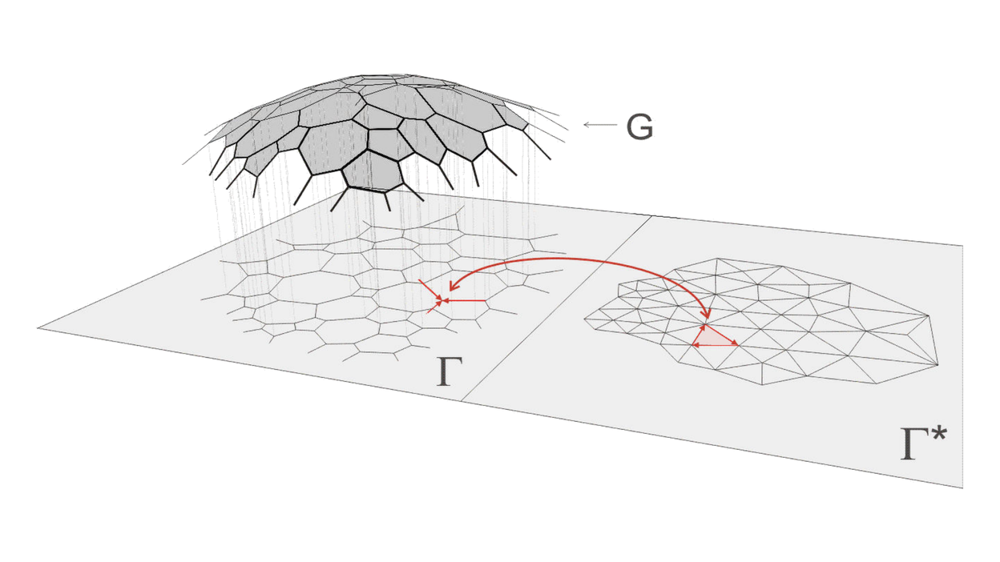

# Thrust Network Analysis

<figure><figcaption></figcaption></figure>

**Thrust Network Analysis (TNA)**, a methodology for generating compression-only vaulted surfaces and networks was developed by Prof. Philippe Block as part of his PhD (2009) at MIT, under the guidance of Prof. John Ochsendorf. The method finds possible funicular solutions under gravitational loading within a defined envelope. Using projective geometry, duality theory and linear optimization, it provides a graphical and intuitive method, adopting the same advantages of techniques such as graphic statics, but offering a viable extension to fully three-dimensional problems.‌

***

### References 

* Block P. and Ochsendorf J. [Thrust Network Analysis: A new methodology for three-dimensional equilibrium](https://block.arch.ethz.ch/brg/content/publication/thrust-network-analysis-a-new-methodology-for-three-dimensional-equilibrium), _Journal of the International Association for Shell and Spatial Structures_, 48(3): 167-173, 2007.‌
* Block P. [Thrust Network Analysis: Exploring Three-dimensional Equilibrium](https://block.arch.ethz.ch/brg/publications/361), PhD dissertation, Massachusetts Institute of Technology, Cambridge, MA, USA, 2009.
