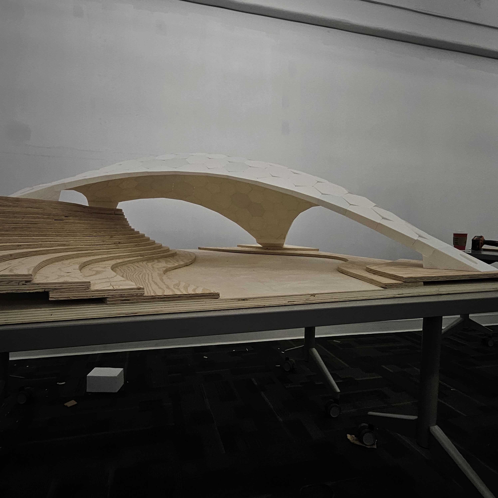
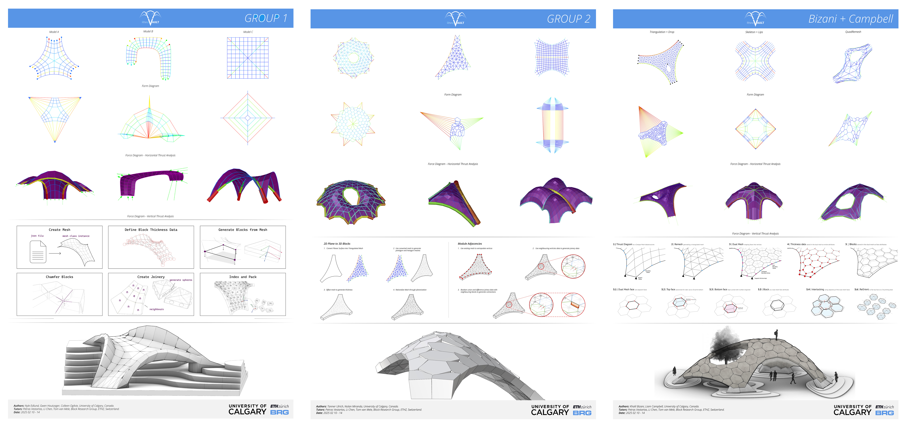
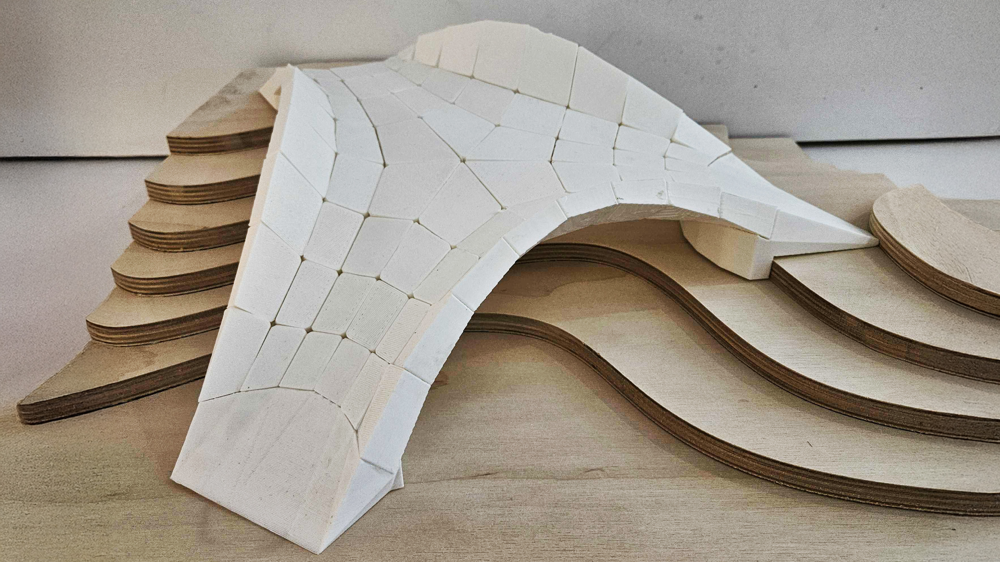
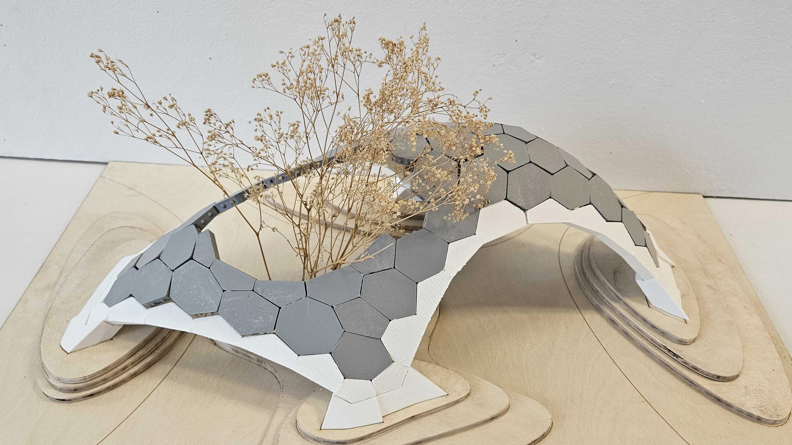
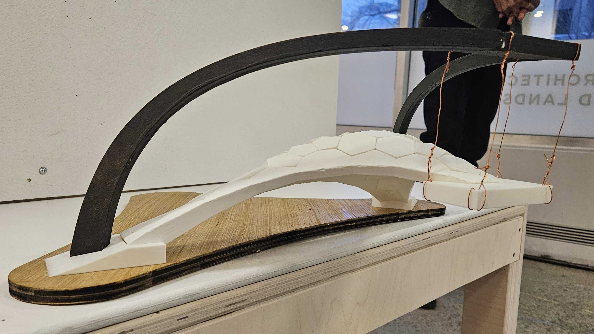
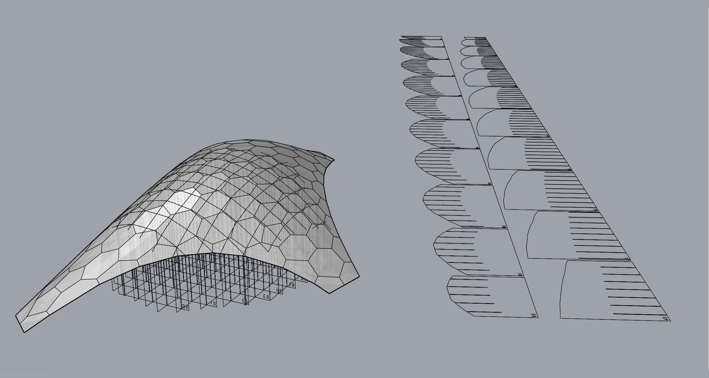

# Calgary 2025

<figure><figcaption></figcaption></figure>

The workshop was held in Calgary, Canada, during an event called Block Week, where up to six different workshops take place simultaneously for architecture students. The aim of the workshop was to introduce the COMPAS framework, the RhinoVault form-finding plugin, and the fabrication of small-scale 3D-printed shells. The workshop lasted five days. Tutorials were conducted in the morning sessions, followed by practical work in the afternoons. The main shell was prepared in advance, while students were tasked with designing support and landscape elements. Each group, consisting of 2–3 students, had to submit a poster, and those who wished could 3D print and assemble small-scale models. The poster template is attached below.



## Student Projects

In total, seven students were divided into three groups. Below is the final delivery, showcasing the RhinoVault workflow and COMPAS materialization, where mesh geometry is transformed into solid blocks with shear keys and indices, ready for 3D printing. Each group also produced small-scale 3D-printed models, contributing to the main shell's production, including landscape, supports, scaffolding, and assembly.

<figure><figcaption></figcaption></figure>
<figure><figcaption></figcaption></figure>
<figure><figcaption></figcaption></figure>
<figure><figcaption></figcaption></figure>

## Scaffolding

<figure><figcaption></figcaption></figure>

In this workshop, we used scaffolding made from cardboard to assemble the shells. The script for generating the scaffolding is attached below. The script requires the following inputs:
a) the lower mesh of the shell,
b) a closed 2D polyline defining the area where the scaffolding is generated, and
c) a line that provides the direction of the grid.

