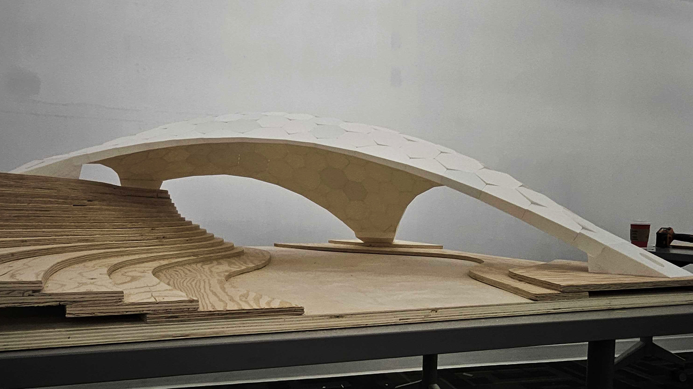

# Calgary 2025

The workshop was held in Calgary, Canada, during an event called Block Week, where up to six different workshops take place simultaneously for architecture students. The aim of the workshop was to introduce the COMPAS framework, the RhinoVault form-finding plugin, and the fabrication of small-scale 3D-printed shells. The workshop lasted five days. Tutorials were conducted in the morning sessions, followed by practical work in the afternoons. The main shell was prepared in advance, while students were tasked with designing support and landscape elements. Each group, consisting of 2–3 students, had to submit a poster, and those who wished could 3D print and assemble small-scale models. The poster template is attached below.



In total, there were seven students divided into three groups. Below is the final delivery, showcasing the RhinoVault workflow and COMPAS materialization when mesh geometry is turned into solid blocks with shear keys and indices, ready for 3D printing.

<figure><figcaption></figcaption></figure>





[Next →](#slide2)

## Slide 2 

[← Previous](#slide1) | [Next →](#slide3)

## Slide 3 

[← Previous](#slide2)
